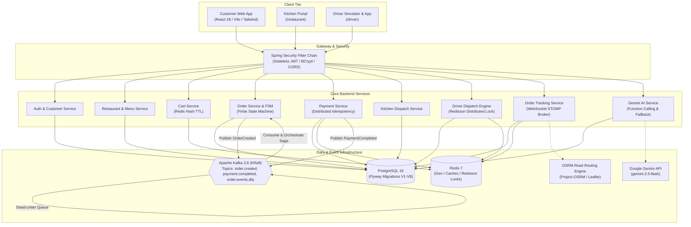
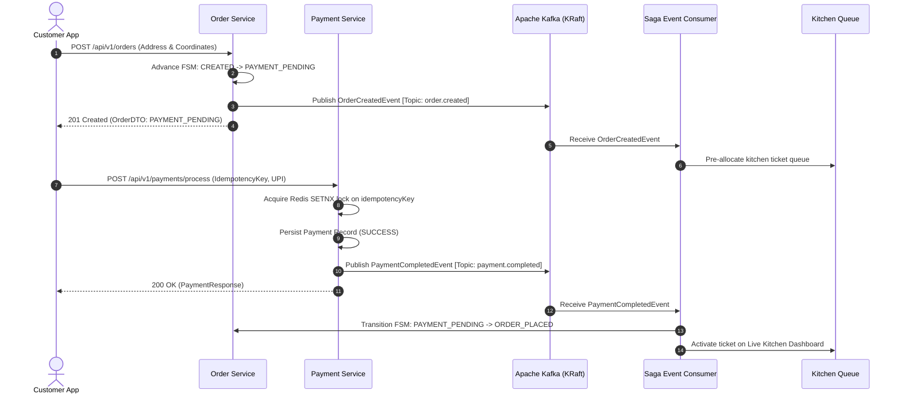

# 🛵 Distributed Food Delivery Platform (Swiggy / Zomato Architecture)

[](https://openjdk.org/projects/jdk/17/)
[](https://spring.io/projects/spring-boot)
[](https://www.postgresql.org/)
[](https://redis.io/)
[-black.svg)](https://kafka.apache.org/)
[](https://redisson.org/)
[](https://react.dev/)
[](https://tailwindcss.com/)
[](https://leafletjs.com/)
[](https://ai.google.dev/)
[](https://www.docker.com/)

An enterprise-grade, event-driven distributed food delivery platform inspired by **Swiggy** and **Zomato**. Engineered to demonstrate production-grade distributed systems patterns: **Choreographed Saga Pattern** with Apache Kafka, **Order Finite State Machines**, **Redis Geospatial Indexing**, **Redisson Distributed Locks** to eliminate driver dispatch race conditions, **Real-Time Live Driver GPS Tracking** via STOMP WebSockets and OSRM turn-by-turn road interpolation, and an intelligent **AI Support Concierge** powered by **Google Gemini 2.5 Flash Function Calling**.

> **Dual-City Localization**: Exclusively engineered for **Noida** (Sector 18, 62, 29) and **Dehradun** (Rajpur Road, Paltan Bazaar, Jakhan, Dakpatti) with all catalog pricing strictly denominated in **Indian Rupees (₹)**.

---

## 🗺️ System Topology & Architecture



---

## ⚡ Core Engineering Highlights

### 1. Distributed Saga Choreography (Apache Kafka 3.8 KRaft)
- Replaces brittle 2-Phase Commit (2PC) with asynchronous, choreographed event-driven Sagas.
- **Topics**: `order.created`, `payment.completed`, `payment.failed`, and `order.events.dlq`.
- Emits events with partition keys on `orderId` guaranteeing in-order processing per customer order.
- Features resilient consumer error handling with Spring Kafka `DeadLetterPublishingRecoverer` routing corrupted payloads to the Dead-Letter Queue (DLQ).



### 2. High-Concurrency Driver Dispatch (Redisson Distributed Locks & Redis Geo)
- Driver positions are continuously indexed in Redis via `GEOADD drivers:geo <lng> <lat> <driverId>`.
- Orders in `READY_FOR_PICKUP` discover available drivers within a 5.0–10.0 km radius via Redis `GEOSEARCH` in sub-millisecond O(N+log(M)) time.
- **Race Condition Immunity**: When multiple drivers tap "Accept Delivery" simultaneously, the service acquires a Redisson distributed reentrant lock (`lock:order:dispatch:{orderId}`).
- **Zero Double-Assignment**: Exactly **1 driver wins (200 OK)** while losing drivers instantly receive **409 Conflict** with zero double-dispatch bugs. Verified under multi-threaded concurrency testing.

### 3. Real-Time Driver Movement & OSRM Road Routing
- Real-time communication powered by **Spring WebSocket STOMP Broker** over `/ws-delivery` and `/topic/orders/{orderId}/tracking`.
- Uses **Leaflet**, **OpenStreetMap tiles**, and **Project-OSRM** to query authentic street road geometry between restaurant and customer dropoff.
- Features **Sub-Step Polyline Interpolation**: As the driver simulator moves between GPS updates, the delivery bike marker interpolates along actual street geometry rather than straight line coordinates.
- Built-in **Proximity Separation Guard** guarantees at least 1.2 km of separation between restaurant and dropoff, eliminating 0-meter frozen-marker bugs.

### 4. Google Gemini AI Support Concierge & Function Calling
- Powered by `gemini-2.5-flash` with native **Function Calling**:
  - `getOrderStatus(orderId)`: Retrieves real-time status, ETA, and assigned driver details.
  - `recommendDishes(city, cuisine, maxPrice)`: Grounded menu search filtered by Noida/Dehradun and budget in INR (₹).
  - `cancelOrder(orderId)`: Validates order state machine eligibility and processes instant cancellations.
- **High-Availability Fallback Engine**: If the Gemini API is offline or unconfigured, an in-memory rule and regex engine transparently handles queries against PostgreSQL with zero customer disruption.

### 5. Production Testing Suite (10/10 Green Integration Tests)
- Automated Spring Boot Integration Test Suite (`@ActiveProfiles("test")`) testing directly against live Docker containers (`localhost:5433`, `localhost:6379`, `localhost:9092`).
- Uses `Awaitility 4.2.2` for resilient asynchronous polling of Kafka Saga events.
- **10/10 Tests Passed**:
  - `OrderSagaIntegrationTest`: Full Cart $\to$ Order $\to$ Payment $\to$ Kafka Saga $\to$ `ORDER_PLACED`, plus payment idempotency.
  - `DriverDispatchConcurrencyIntegrationTest`: Redis `GEOSEARCH` distance ordering and 4-thread Redisson lock race condition.
  - `KitchenAndDeliveryIntegrationTest`: Full 6-step lifecycle (`ORDER_PLACED` $\to$ `DELIVERED`), FSM illegal transition rejection (400 Bad Request), and kitchen ticket rejection.
  - `AiAssistantIntegrationTest`: Model status, live order inquiry, and database-grounded dish recommendations under budget in ₹.

---

## 📅 14-Day Roadmap Completed

| Day | Milestone | Key Deliverables & Systems Built | Status |
| :---: | :--- | :--- | :---: |
| **Day 1** | **Infrastructure & Docker Environment** | Multi-container Docker Compose with PostgreSQL 16, Redis 7, Kafka 3.8 KRaft, and Kafka UI. | ✅ Complete |
| **Day 2** | **Project Scaffolding & Database Schema** | Multi-module Maven setup (`common-dto`, `food-delivery-api`), Flyway migrations V1–V3. | ✅ Complete |
| **Day 3** | **Restaurant & Menu Catalog + Web UI** | High-performance catalog APIs with pagination, full-stack React 18 + Vite customer frontend. | ✅ Complete |
| **Day 4** | **Customer Accounts & Stateless Security** | Stateless JWT authentication, BCrypt password hashing, Spring Security 6 filter chain. | ✅ Complete |
| **Day 5** | **Redis-Backed Shopping Cart Engine** | Sub-millisecond cart caching using Redis Hashes, TTL expiry, and single-restaurant validation. | ✅ Complete |
| **Day 6** | **Finite State Machine Order Engine** | Deterministic order lifecycle FSM enforcing legal state transitions and audit trails. | ✅ Complete |
| **Day 7** | **Payment Service & Distributed Idempotency** | Multi-method payments (UPI, Cards, COD) with Redis `SETNX` idempotency locks. | ✅ Complete |
| **Day 8** | **Apache Kafka Event-Driven Saga** | Distributed Saga choreography with Kafka topics, partitioned consumers, and DLQ retries. | ✅ Complete |
| **Day 9** | **Kitchen Portal & Order Prep Ladder** | Dedicated kitchen staff dashboard (`/restaurant`) with sound chimes and prep controls. | ✅ Complete |
| **Day 10** | **Redis Geospatial & Driver Dispatch** | Driver dispatch engine with Redis `GEOSEARCH` and Redisson distributed locking. | ✅ Complete |
| **Day 11** | **Live Order Tracking Map & WebSockets** | WebSocket STOMP broker, Leaflet/OSRM road movement, and live driver GPS tracking. | ✅ Complete |
| **Day 12** | **Gemini AI Support Bot & Recommender** | Gemini 2.5 Flash function calling, dual-city INR dish recommendation, and fallback engine. | ✅ Complete |
| **Day 13** | **End-to-End System Integration Testing** | 10 comprehensive integration tests validating Sagas, concurrency, and state machines. | ✅ Complete |
| **Day 14** | **Architecture Documentation & Showcase** | Production README, detailed architecture whitepaper, and interview talking points. | ✅ Complete |

---

## 🛠️ Tech Stack

| Layer | Technology | Description |
| :--- | :--- | :--- |
| **Backend Core** | Java 17 / 21 LTS, Spring Boot 3.3.3 | Enterprise microservice backend with Spring Web, Data JPA, Security, and Validation |
| **Distributed Messaging** | Apache Kafka 3.8.0 (KRaft) | High-throughput distributed event streaming without Zookeeper dependency |
| **In-Memory & Locks** | Redis 7 (Alpine), Redisson 3.35.0 | Redis Hashes (Cart), Redis Geo (`GEOADD`/`GEOSEARCH`), and Redisson distributed locks |
| **Relational Database** | PostgreSQL 16 (Alpine), Flyway | ACID relational persistence with versioned schema migrations (V1–V8) |
| **Frontend UI** | React 18, Vite 5, Tailwind CSS | High-performance SPA with Lucide icons, Dark mode, and responsive views |
| **Maps & Routing** | Leaflet 1.9, OpenStreetMap, OSRM | Real-world map rendering, tile caching, and turn-by-turn road geometry interpolation |
| **Real-Time Streaming** | Spring WebSocket, STOMP, SockJS | Bi-directional messaging for driver GPS updates and order status push |
| **Artificial Intelligence** | Google Gemini 2.5 Flash API | Conversational AI concierge with Function Calling and smart local fallback |
| **Testing & CI** | JUnit 5, MockMvc, Awaitility 4.2.2 | Automated integration test suite validating real broker and DB interactions |

---

## 🚀 Quick Start Guide

### Prerequisites
- [Docker Desktop](https://www.docker.com/products/docker-desktop/) (running with WSL2 backend on Windows or native Linux/macOS)
- [Java 17 or 21 JDK](https://adoptium.net/)
- [Node.js 18+](https://nodejs.org/) & `npm`
- [Maven 3.8+](https://maven.apache.org/)

### 1. Launch Docker Infrastructure
```bash
# Start PostgreSQL, Redis, Apache Kafka, and Kafka UI
docker compose up -d

# Verify all containers are healthy
docker compose ps
```

| Service | Port | Dashboard / Tool |
| :--- | :--- | :--- |
| **PostgreSQL 16** | `5433` (external) $\to$ `5432` | `psql -h localhost -p 5433 -U postgres -d food_delivery_db` |
| **Redis 7** | `6379` | `redis-cli -p 6379` |
| **Apache Kafka** | `9092` | Kafka Broker (KRaft mode) |
| **Kafka UI** | `8085` | [http://localhost:8085](http://localhost:8085) |

### 2. Start the Backend API
```bash
cd food-delivery-api

# Build and run the Spring Boot service
mvn clean package -DskipTests
java -jar target/food-delivery-api-1.0.0-SNAPSHOT.jar
```
Backend API will be live at [http://localhost:8080](http://localhost:8080) with Swagger UI at [http://localhost:8080/swagger-ui.html](http://localhost:8080/swagger-ui.html).

### 3. Start the Frontend Application
```bash
cd food-delivery-frontend

# Install dependencies and start Vite dev server
npm install
npm run dev -- --host 0.0.0.0 --port 5173
```
Frontend Web Portal will be live at [http://localhost:5173](http://localhost:5173).

---

## 🔑 Demo Credentials & Portals

| Role | Portal URL | Demo Account | Password | Description |
| :--- | :--- | :--- | :--- | :--- |
| **Customer** | [http://localhost:5173](http://localhost:5173) | `customer@swiggy.com` | `password123` | Browse catalog in Noida/Dehradun, build cart, checkout in ₹, track orders live. |
| **Kitchen Staff** | [http://localhost:5173/restaurant](http://localhost:5173/restaurant) | *No login needed* | N/A | View incoming order tickets, sound chimes, Accept $\to$ Cook $\to$ Food Ready. |
| **Delivery Driver** | [http://localhost:5173/driver](http://localhost:5173/driver) | *No login needed* | N/A | Discover nearby delivery runs, claim orders with Redisson locks, drive live GPS route. |
| **API Docs** | [http://localhost:8080/swagger-ui.html](http://localhost:8080/swagger-ui.html) | *Open API* | N/A | Interactive Swagger UI documentation with all REST endpoints. |
| **Kafka Dashboard**| [http://localhost:8085](http://localhost:8085) | *Open UI* | N/A | Monitor topics, consumer lag, and partition distributions. |

---

## 📋 Comprehensive API Matrix

| Module | Method | Endpoint | Description |
| :--- | :---: | :--- | :--- |
| **Auth** | `POST` | `/api/v1/auth/register` | Register customer account with BCrypt password hashing. |
| **Auth** | `POST` | `/api/v1/auth/login` | Authenticate customer credentials and return stateless JWT. |
| **Restaurants**| `GET` | `/api/v1/restaurants` | List restaurants filtered by city (`Noida`, `Dehradun`) and cuisine. |
| **Restaurants**| `GET` | `/api/v1/restaurants/{id}/menu` | Retrieve menu items categorized by Appetizers, Mains, Biryani, Desserts. |
| **Cart** | `GET` | `/api/v1/cart` | Fetch user's active Redis cart with subtotals and TTL. |
| **Cart** | `POST` | `/api/v1/cart/items` | Add item to cart (enforces single-restaurant policy). |
| **Cart** | `DELETE`| `/api/v1/cart` | Clear active cart. |
| **Orders** | `POST` | `/api/v1/orders` | Create order with delivery address, GPS coordinates, and special instructions. |
| **Orders** | `GET` | `/api/v1/orders/{id}` | Get detailed order status, items, restaurant info, and timestamps. |
| **Payments** | `POST` | `/api/v1/payments/process` | Process idempotent payment (UPI, Card, COD) and emit Kafka event. |
| **Kitchen** | `GET` | `/api/v1/kitchen/restaurants/{id}/orders` | Fetch active kitchen tickets (`ORDER_PLACED`, `PREPARING`, etc.). |
| **Kitchen** | `PATCH`| `/api/v1/kitchen/orders/{id}/accept` | Kitchen accepts incoming ticket (`RESTAURANT_ACCEPTED`). |
| **Kitchen** | `PATCH`| `/api/v1/kitchen/orders/{id}/start-cooking` | Kitchen begins food preparation (`PREPARING`). |
| **Kitchen** | `PATCH`| `/api/v1/kitchen/orders/{id}/food-ready` | Kitchen marks order ready for driver pickup (`READY_FOR_PICKUP`). |
| **Drivers** | `GET` | `/api/v1/drivers/nearby` | Discover nearby drivers via Redis `GEOSEARCH` within given radius. |
| **Drivers** | `POST` | `/api/v1/drivers/{id}/orders/{orderId}/accept`| Claim delivery run with Redisson distributed lock. |
| **Drivers** | `PATCH`| `/api/v1/drivers/{id}/orders/{orderId}/pickup`| Driver picks up food from restaurant (`OUT_FOR_DELIVERY`). |
| **Drivers** | `PATCH`| `/api/v1/drivers/{id}/orders/{orderId}/deliver`| Driver completes delivery to customer (`DELIVERED`). |
| **Tracking** | `GET` | `/api/v1/tracking/orders/{id}` | Fetch current live tracking state, driver coordinates, and progress. |
| **AI Bot** | `POST` | `/api/v1/ai/chat` | Chat with Gemini AI Concierge with Function Calling & smart fallback. |
| **AI Bot** | `GET` | `/api/v1/ai/status` | Retrieve AI service health, model name, and supported capabilities. |

---

## 💡 System Design Interview Talking Points

When presenting this project in Senior / Staff Software Engineering interviews:

1. **Why Choreographed Saga instead of Orchestrated Saga?**
   - *Answer*: For a food delivery workflow, choreographed event emission across Kafka decouples services cleanly. Order Service publishes `OrderCreated`; Payment Service independently consumes and processes; Payment publishes `PaymentCompleted`; Kitchen and Driver Dispatch react autonomously. This avoids a single point of failure in an orchestrator service while preserving scalability.

2. **How does the system eliminate race conditions in Driver Dispatch?**
   - *Answer*: If 10 drivers tap "Accept" on the same order within milliseconds, simple database updates cause race conditions. We implement a **Redisson Distributed Lock** keyed on `lock:order:dispatch:{orderId}` with an acquisition timeout of 3s and lease time of 8s. Exactly one thread acquires the lock, checks `deliveryPartnerId == null`, assigns the driver, updates the driver's status to `BUSY`, and commits. The remaining 9 threads fail lock acquisition or see the order already claimed, returning `HTTP 409 Conflict`.

3. **How is Payment Idempotency guaranteed?**
   - *Answer*: Clients generate a unique `idempotencyKey` per checkout session. On payment submission, the backend executes an atomic Redis `SETNX` with a 5-minute TTL. If the key exists, it checks PostgreSQL for an existing transaction with that key and returns the cached receipt. If a request is in flight, it prevents double deductions.

4. **How do you handle Kafka Consumer Failures and Message Replays?**
   - *Answer*: Consumers use `ErrorHandlingDeserializer` and configure a `DeadLetterPublishingRecoverer` to route bad or un-processable messages to `order.events.dlq` after exponential backoff retries, preventing head-of-line blocking while preserving poison-pill messages for debugging.

5. **How does the Live Tracking avoid 0-meter routing and frozen markers?**
   - *Answer*: Many map applications place customer dropoff on top of the restaurant pin when precise GPS isn't provided. We engineered an automatic **Proximity Separation Guard** (minimum 1.2 km separation between restaurant and dropoff), query OSRM for real 55-point turn geometry, and interpolate driver positions along the actual road polyline over STOMP WebSockets.

---

## 🧪 Automated Testing Verification

Execute the complete end-to-end integration test suite:
```bash
cd food-delivery-api
mvn test -Dtest=*IntegrationTest
```

Expected output:
```
[INFO] Running com.fooddelivery.integration.AiAssistantIntegrationTest
[INFO] Tests run: 3, Failures: 0, Errors: 0, Skipped: 0
[INFO] Running com.fooddelivery.integration.DriverDispatchConcurrencyIntegrationTest
[INFO] Tests run: 2, Failures: 0, Errors: 0, Skipped: 0
[INFO] Running com.fooddelivery.integration.KitchenAndDeliveryIntegrationTest
[INFO] Tests run: 3, Failures: 0, Errors: 0, Skipped: 0
[INFO] Running com.fooddelivery.integration.OrderSagaIntegrationTest
[INFO] Tests run: 2, Failures: 0, Errors: 0, Skipped: 0
[INFO] Results:
[INFO] Tests run: 10, Failures: 0, Errors: 0, Skipped: 0
[INFO] BUILD SUCCESS
```

---

## 📄 Documentation Links
- [Detailed System Architecture Whitepaper](docs/ARCHITECTURE.md)
- [Multi-Day Project Implementation Roadmap](multi_day_plan.md)
- [System Walkthrough & Verification Logs](walkthrough.md)

---

## 👨‍💻 Author & Contributions
Built by **Tanish Chahal** as an enterprise-grade demonstration of distributed systems engineering, high-concurrency event-driven architecture, and modern full-stack web applications.
