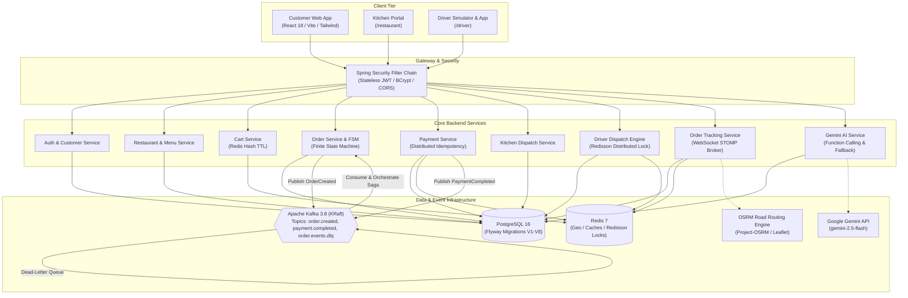
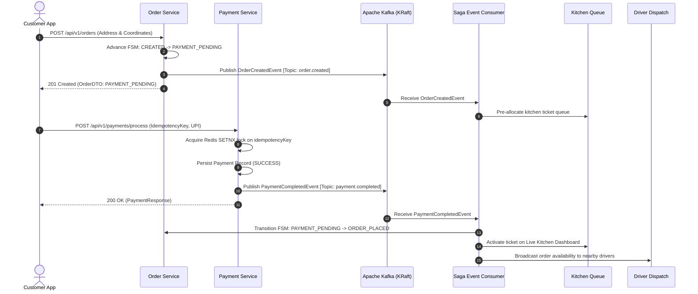
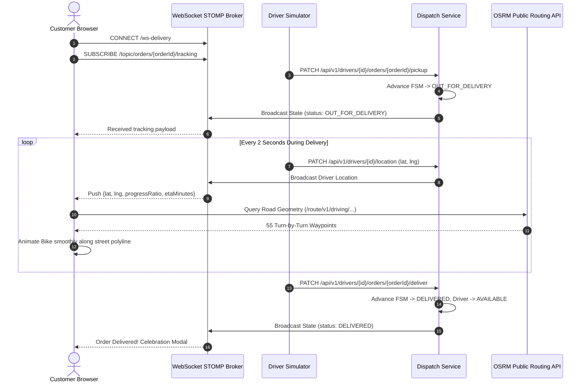

# Architecture & System Design Whitepaper: Distributed Food Delivery Platform

## Executive Summary
This document provides an in-depth architectural breakdown of the **Distributed Food Delivery Platform**, an enterprise-grade, event-driven distributed system inspired by Swiggy and Zomato. The platform is engineered to handle high-throughput food ordering, real-time geospatial driver dispatch, idempotent multi-method financial transactions, live GPS delivery tracking via WebSockets and OSRM, and conversational AI assistance powered by Google Gemini.

---

## 1. System Topology & Component Model



---

## 2. Database Schema & Flyway Migration Strategy

The system relies on PostgreSQL 16 managed by Flyway version-controlled migrations:

| Version | Migration Script | Purpose |
| :--- | :--- | :--- |
| **V1** | `V1__init_schema.sql` | Core schema: `customers`, `restaurants`, `menu_items`, `orders`, `order_items`, `payments`. |
| **V2** | `V2__seed_noida_dehradun_data.sql` | Initial authentic restaurants & menus in Noida and Dehradun with INR (₹) pricing. |
| **V3** | `V3__add_performance_indexes.sql` | High-cardinality B-tree and partial indexes on customer emails, restaurant city, order status, and timestamps. |
| **V4** | `V4__add_delivery_partners.sql` | `delivery_partners` table for driver dispatch, vehicle numbers, phone, active ratings, and status. |
| **V5** | `V5__seed_delivery_partners.sql` | Initial seed of 6 delivery partners located in Noida and Dehradun corridors. |
| **V6** | `V6__add_delivery_partner_id_to_orders.sql` | Foreign key referencing assigned driver on active order tickets. |
| **V7** | `V7__add_idempotency_to_payments.sql` | Unique constraint and index on `payments.idempotency_key` preventing double debits. |
| **V8** | `V8__add_delivery_coordinates_to_orders.sql` | Dedicated high-precision columns `delivery_latitude` and `delivery_longitude` (`DECIMAL(10, 7)`) for live routing. |

---

## 3. Distributed Order Saga Choreography

The platform implements the **Choreographed Saga Pattern** to ensure eventual consistency across Order, Payment, Inventory/Kitchen, and Driver subsystems without distributed 2PC locks.



### Saga Failure & Dead-Letter Queue (DLQ) Semantics
If payment processing fails or is declined:
1. `PaymentFailedEvent` is emitted to `payment.failed`.
2. Saga consumer triggers compensating transaction: transitions order to `PAYMENT_FAILED` or `CANCELLED`.
3. Erroneous messages that fail deserialization or trigger unhandled exceptions after 3 retry attempts are automatically routed to `order.events.dlq` with diagnostic headers:
   - `x-original-topic`
   - `x-exception-message`
   - `x-exception-stacktrace`

---

## 4. Concurrency Control: Redisson Distributed Locks & Redis Geo

### 4.1 Redis Geospatial Discovery
- Delivery driver GPS positions are indexed in Redis using `GEOADD drivers:geo <longitude> <latitude> <driverId>`.
- When an order enters `READY_FOR_PICKUP`, the dispatch engine queries drivers within a 5.0–10.0 km radius via Redis `GEOSEARCH`:
  ```text
  GEOSEARCH drivers:geo FROMLONLAT 77.3219 28.5708 BYRADIUS 10 km ASC WITHDIST WITHCOORD
  ```
- O(N+log(M)) lookup latency ensures sub-millisecond retrieval of the closest candidate drivers.

### 4.2 Race Condition Prevention via Redisson Distributed Lock
When multiple drivers attempt to claim the same order concurrently:
1. The backend acquires a Redisson distributed reentrant lock keyed on `lock:order:dispatch:{orderId}`:
   ```java
   RLock lock = redissonClient.getLock("lock:order:dispatch:" + orderId);
   boolean acquired = lock.tryLock(3, 8, TimeUnit.SECONDS);
   ```
2. **Lock Winner**:
   - Checks `order.getDeliveryPartnerId() == null`.
   - Binds `order.setDeliveryPartnerId(driverId)`.
   - Transitions driver status to `BUSY`.
   - Releases lock and returns `200 OK`.
3. **Lock Losers**:
   - Subsequent threads fail lock acquisition or observe `deliveryPartnerId != null`.
   - Immediately rejected with `409 Conflict` (`"Order has already been claimed by another driver"`).
   - Zero double-dispatch anomalies under high concurrency.

---

## 5. Real-Time Order Tracking & Road Routing Engine



### Proximity Guard & Dual-City Routing
To eliminate 0-meter route bugs when restaurants and customers share nominal coordinates:
- The system enforces a **1.2 km minimum geographic separation** between restaurant and customer dropoff.
- In **Noida**, orders automatically route across realistic traffic corridors (Sector 18 $\leftrightarrow$ Sector 29 $\leftrightarrow$ Sector 62).
- In **Dehradun**, orders navigate the historic foothill roads (Rajpur Road $\leftrightarrow$ Paltan Bazaar $\leftrightarrow$ Jakhan $\leftrightarrow$ Dakpatti).

---

## 6. Gemini AI Architecture & Function Calling

The AI Concierge integrates **Google Gemini 2.5 Flash** with native Function Calling:

```json
{
  "tools": [
    {
      "function_declarations": [
        {
          "name": "getOrderStatus",
          "description": "Retrieve live order state, driver details, and ETA",
          "parameters": {
            "type": "object",
            "properties": { "orderId": { "type": "integer" } },
            "required": ["orderId"]
          }
        },
        {
          "name": "recommendDishes",
          "description": "Recommend dishes filtered by city, keyword, and budget in INR (₹)",
          "parameters": {
            "type": "object",
            "properties": {
              "city": { "type": "string" },
              "cuisine": { "type": "string" },
              "maxPrice": { "type": "number" }
            }
          }
        }
      ]
    }
  ]
}
```

### High-Availability Fallback Engine
If the external Gemini API is unreachable, unconfigured, or rate-limited:
- The platform automatically falls back to an **in-memory intelligent rule engine**.
- Parses regex patterns for order tracking, cancellations, and city/budget queries (`"under 350"` $\to$ `maxPrice = 350.0`).
- Directly executes database queries against `MenuItemRepository` and `OrderRepository`, ensuring zero user disruption.
