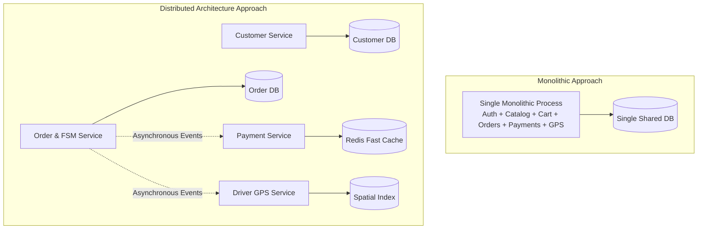

# Chapter 1: The Monolith Breakdown & System Topology
## Architecting Scalable Systems: From First Principles to Production

---

## 1. The Real-World Disaster Scenario: The Friday 8:00 PM Meltdown

Imagine this scenario: It is 8:00 PM on a rainy Friday evening in Noida. Inside thousands of households, hungry customers open their food delivery app to order dinner. Simultaneously:
- **12,000 customers** are browsing menus, comparing prices, and adding Garlic Naan and Butter Chicken to their digital carts.
- **450 restaurant kitchens** are staring at order tablets, confirming tickets, and marking dishes as "Preparing".
- **1,800 delivery drivers** on motorbikes are darting through city traffic, their smartphones transmitting continuous GPS coordinates every 2 seconds to calculate real-time ETAs.
- **800 simultaneous payments** are hitting payment gateways via UPI, credit cards, and digital wallets.

In a traditional **Monolithic Architecture**, all of these features—the customer catalog, the shopping cart, the payment engine, the kitchen portal, and the driver GPS tracking stream—run inside **a single massive Java application process** connected to a single central database.

```
                  ┌─────────────────────────────────────────────────────────┐
                  │                 THE MONOLITHIC CRASH                    │
                  │                                                         │
Browsing Menu ───►│  [Menu Catalog]   [Shopping Cart]   [Payment Gateway]  │
                  │                                                         │
Cooking Food  ───►│  [Kitchen Queue]  [Driver GPS Stream (HEAVY LOAD)]     │
                  │                           │                             │
Live GPS Pings───►│                           ▼                             │
                  │             1,800 Drivers x 1 Ping/sec                  │
                  │             = Memory Leak / CPU 100%                    │
                  │                           │                             │
                  │                           ▼                             │
                  │       💥 ENTIRE JVM PROCESS DIES OUT OF MEMORY          │
                  └─────────────────────────────────────────────────────────┘
                                              │
                      ┌───────────────────────┴───────────────────────┐
                      ▼                                               ▼
           Customers can't browse                          Payments freeze mid-charge
           Kitchens don't get orders                       Drivers lose their route
```

### The Single Point of Failure (SPOF)
At 8:03 PM, the driver GPS tracking component experiences an unexpected surge. Perhaps drivers are passing through cellular dead zones in Sector 62, causing their phones to buffer 50 GPS location updates each and flush them in massive bursts. 

The server's memory pool fills up handling these millions of spatial coordinates. Thread pools become exhausted. A garbage collection freeze triggers a fatal `java.lang.OutOfMemoryError`.

Because everything is packaged into one monolithic executable, **the entire company grinds to a halt**:
1. Customers attempting to pay for food see endless loading spinners; some have their bank accounts debited without an order being created.
2. Kitchens cannot see which food to prepare.
3. The catalog crashes, preventing any new revenue from entering the platform.

A bug in a non-critical feature (live driver map rendering) has assassinated the mission-critical feature (taking customer money and placing orders).

This is why modern, mission-critical platforms like **Swiggy**, **Zomato**, and **Uber** abandon monolithic designs in favor of **Distributed Systems**.

---

## 2. First-Principles Theory: What is a Distributed System?

Before diving into code, let us break down the foundational concepts with zero assumptions.

### 2.1 Monolith vs. Distributed Microservices
- **Monolith**: A software application where all functional domains (Authentication, Orders, Billing, Inventory, Routing) are compiled into a single executable binary that runs in a single memory space.
  - *Pros*: Easy to write initially, simple single-database transactions, zero network latency between components.
  - *Cons*: Difficult to scale selectively, massive blast radius for failures, long deployment cycles, tight coupling.
- **Distributed Architecture**: An architecture where functional domains are split into distinct, independently deployable services that communicate across a local or cloud network.
  - *Pros*: Fault isolation (if driver tracking crashes, order placement still functions), selective scaling (give 16 CPU cores to the GPS service and only 2 to Authentication), technology flexibility.
  - *Cons*: Network latency, complex distributed transactions, partial failures, data consistency challenges.



### 2.2 Synchronous (REST) vs. Asynchronous (Event-Driven)
When Service A needs to interact with Service B in a distributed system, there are two fundamental communication paradigms:

1. **Synchronous Request-Response (e.g., HTTP REST / gRPC)**:
   - Service A calls Service B over the network and **blocks its thread**, waiting for Service B to calculate and return an answer.
   - *The Danger of Cascading Latency*: If Service A calls B, B calls C, and C calls D, the total response time is $Time(A) + Time(B) + Time(C) + Time(D)$. If Service D experiences a 3-second network hiccup, Service A stalls for 3 seconds, exhausting Tomcat's thread pool and collapsing the frontend.
2. **Asynchronous Event-Driven Pub/Sub (e.g., Apache Kafka)**:
   - When an order is placed, Service A writes an immutable fact called an **Event** (`OrderCreatedEvent`) into an append-only log (Kafka Topic) and immediately returns a confirmation to the customer in **15 milliseconds**.
   - Service B (Payments), Service C (Kitchen), and Service D (Driver Dispatch) independently consume this event from Kafka at their own pace. If Service D is offline for maintenance, the event waits safely on the Kafka disk. When Service D restarts, it resumes reading where it left off. **Zero cascading failures.**

### 2.3 The CAP Theorem: The Immutable Law of Distributed Systems
Formulated by computer scientist Eric Brewer, the **CAP Theorem** states that in any asynchronous network subject to partitions (hardware failures, cable cuts, network latency), a distributed data store can guarantee at most **two** of the following three properties:

- **C (Consistency)**: Every read receives the most recent write or an error (all nodes see the exact same data simultaneously).
- **A (Availability)**: Every non-failing node returns a successful response for every request, without guaranteeing it contains the absolute latest write.
- **P (Partition Tolerance)**: The system continues to operate despite an arbitrary number of messages being dropped or delayed by the network between nodes.

> **Crucial Insight**: In physical reality, network partitions cannot be prevented (cables fail, routers glitch, cloud availability zones drop packets). Therefore, **Partition Tolerance (P) is mandatory**. 
> 
> You must choose between **CP** (give up availability to ensure perfect consistency) and **AP** (give up strict immediate consistency to ensure the platform stays online).

#### What Does Food Delivery Choose?
- **For Cart & Menu Browsing**: We choose **AP (Availability)**. If a customer sees a dish price that was updated 200 milliseconds ago, that is acceptable; the app must never show a crash screen.
- **For Payment Authorization & Driver Dispatch**: We enforce strict **CP (Consistency)** using **Redis Distributed Locks (`RLock`)** and database unique constraints. Two drivers must **never** be assigned to the same meal, and a customer must **never** be charged twice.

---

## 3. Platform Topology: The Dual-City Architecture

To ground our system in concrete reality rather than abstract mock data, our platform is engineered from the ground up for two authentic Indian metropolitan hubs:
1. **Noida, Uttar Pradesh** (High-density corporate & residential tech hub: Sector 18, Sector 62, Sector 29).
2. **Dehradun, Uttarakhand** (Hilly terrain, historic commercial markets: Rajpur Road, Paltan Bazaar, Jakhan, Dakpatti).

All pricing across the platform is denominated strictly in **Indian Rupees (₹)**, with catalog item prices matching authentic street-food and restaurant economics (e.g., ₹249 for a Double Chicken Kathi Roll, ₹380 for Kadhai Paneer).

### The Complete System Topology

```mermaid
graph TB
    subgraph "Client Layer (Single Page Applications)"
        WEB["Customer Web Portal<br/>(React 18 / Vite / Tailwind)"]
        KITCH["Kitchen Dashboard<br/>(/restaurant)"]
        DRIVER["Driver GPS Simulator<br/>(/driver)"]
    end

    subgraph "Edge Gateway & Security Layer"
        GATEWAY["Spring Security Filter Chain<br/>(Stateless JWT / BCrypt / CORS Filter)"]
    end

    subgraph "Core Business Logic Services"
        AUTH_SVC["Auth & Identity Service"]
        CATALOG_SVC["Restaurant & Menu Service"]
        CART_SVC["Cart Management Service<br/>(Redis Hash Storage)"]
        ORDER_SVC["Order Service & State Machine<br/>(FSM Validation)"]
        PAY_SVC["Payment Service<br/>(Distributed Idempotency)"]
        KITCH_SVC["Kitchen Dispatch Service"]
        DISPATCH_SVC["Driver Dispatch Engine<br/>(Redisson Distributed Lock)"]
        TRACK_SVC["Order Tracking Service<br/>(STOMP WebSocket Broker)"]
        AI_SVC["Google Gemini 2.5 Flash AI<br/>(Function Calling & Fallback)"]
    end

    subgraph "Storage & Streaming Infrastructure"
        POSTGRES[("PostgreSQL 16 Engine<br/>Relational ACID Storage")]
        REDIS[("Redis 7 In-Memory Engine<br/>Cart Hashes, GeoIndex, Locks")]
        KAFKA{{"Apache Kafka 3.8 Broker (KRaft)<br/>order.created, payment.completed, order.events.dlq"}}
        OSRM["Project-OSRM Engine<br/>Street Routing & Geometry"]
    end

    subgraph "Observability & Tracing Layer"
        PROM["Prometheus TSDB<br/>(Scraping /actuator/prometheus)"]
        GRAF["Grafana 11 Dashboard<br/>(10 Visual Metrics Panels)"]
        ZIPKIN["OpenZipkin Tracing<br/>(Waterfall Spans & TraceIDs)"]
    end

    WEB --> GATEWAY
    KITCH --> GATEWAY
    DRIVER --> GATEWAY

    GATEWAY --> AUTH_SVC
    GATEWAY --> CATALOG_SVC
    GATEWAY --> CART_SVC
    GATEWAY --> ORDER_SVC
    GATEWAY --> PAY_SVC
    GATEWAY --> KITCH_SVC
    GATEWAY --> DISPATCH_SVC
    GATEWAY --> TRACK_SVC
    GATEWAY --> AI_SVC

    AUTH_SVC --> POSTGRES
    CATALOG_SVC --> POSTGRES
    CART_SVC --> REDIS
    ORDER_SVC --> POSTGRES
    PAY_SVC --> POSTGRES
    PAY_SVC --> REDIS
    DISPATCH_SVC --> REDIS
    DISPATCH_SVC --> POSTGRES
    TRACK_SVC --> REDIS
    TRACK_SVC -.-> OSRM

    ORDER_SVC -->|Publish OrderCreatedEvent| KAFKA
    PAY_SVC -->|Publish PaymentCompletedEvent| KAFKA
    KAFKA -->|Consume & Advance Lifecycle| ORDER_SVC
    KAFKA -->|Dispatch Active Ticket| KITCH_SVC

    ORDER_SVC -.-> PROM
    ORDER_SVC -.-> ZIPKIN
    PROM --> GRAF
```



---

## 4. Production Code Anatomy: Multi-Module Engineering

In an enterprise codebase, how do you organize code so that multiple services can communicate cleanly without duplicating Data Transfer Objects (DTOs)?

If Service A creates an `OrderDTO` with fields `orderId` and `totalAmount`, and Service B writes its own copy of `OrderDTO`, any rename in Service A will silently cause Service B to deserialize null values at runtime.

To eliminate this class of bugs, our repository uses a **Multi-Module Maven Reactor Architecture**:

```
distributed-food-delivery/               <-- Parent POM (Project Object Model)
├── pom.xml                             <-- Root Orchestration & Dependency Management
├── common-dto/                         <-- Module 1: Shared Immutable Data Contracts
│   ├── pom.xml
│   └── src/main/java/com/fooddelivery/common/
│       ├── dto/                        <-- OrderDTO, CartDTO, PaymentRequest, etc.
│       ├── enums/                      <-- OrderStatus, PaymentStatus, etc.
│       └── event/                      <-- OrderCreatedEvent, PaymentCompletedEvent
├── food-delivery-api/                  <-- Module 2: Core Spring Boot Application
│   ├── pom.xml                         <-- Imports common-dto as a compiled dependency
│   └── src/main/java/com/fooddelivery/
│       ├── config/                     <-- Security, Kafka, Redis, WebSocket, Metrics
│       ├── controller/                 <-- REST Endpoints (/api/v1/orders, etc.)
│       ├── entity/                     <-- JPA Database Entities (PostgreSQL)
│       ├── repository/                 <-- Spring Data JPA Data Access Objects
│       ├── service/                    <-- Core Business Logic & State Machines
│       └── kafka/                      <-- Saga Producers, Consumers & DLQs
└── food-delivery-frontend/             <-- Module 3: Modern React 18 SPA (Vite + Tailwind)
```

Let us examine the exact configuration files that bind this together.

### 4.1 The Root Orchestration: Parent `pom.xml`

The parent `pom.xml` acts as the single source of truth for versions across all sub-modules. It declares `<packaging>pom</packaging>` and imports the **Spring Boot Dependencies Bill of Materials (BOM)**.

```xml
<?xml version="1.0" encoding="UTF-8"?>
<project xmlns="http://maven.apache.org/POM/4.0.0"
         xmlns:xsi="http://www.w3.org/2001/XMLSchema-instance"
         xsi:schemaLocation="http://maven.apache.org/POM/4.0.0 
                             http://maven.apache.org/xsd/maven-4.0.0.xsd">
    <modelVersion>4.0.0</modelVersion>

    <groupId>com.fooddelivery</groupId>
    <artifactId>distributed-food-delivery</artifactId>
    <version>1.0.0-SNAPSHOT</version>
    <packaging>pom</packaging>

    <name>distributed-food-delivery</name>
    <description>Enterprise Distributed Food Delivery Backend</description>

    <!-- Sub-modules registered in the Maven Reactor build tree -->
    <modules>
        <module>common-dto</module>
        <module>food-delivery-api</module>
    </modules>

    <properties>
        <java.version>17</java.version>
        <maven.compiler.source>17</maven.compiler.source>
        <maven.compiler.target>17</maven.compiler.target>
        <project.build.sourceEncoding>UTF-8</project.build.sourceEncoding>
        <spring.boot.version>3.3.3</spring.boot.version>
        <springdoc.version>2.6.0</springdoc.version>
        <lombok.version>1.18.34</lombok.version>
        <jjwt.version>0.12.6</jjwt.version>
        <flyway.version>10.17.2</flyway.version>
    </properties>

    <dependencyManagement>
        <dependencies>
            <!-- Spring Boot BOM ensures compatible transitive dependencies -->
            <dependency>
                <groupId>org.springframework.boot</groupId>
                <artifactId>spring-boot-dependencies</artifactId>
                <version>${spring.boot.version}</version>
                <type>pom</type>
                <scope>import</scope>
            </dependency>

            <!-- Internal Sub-Module Reference -->
            <dependency>
                <groupId>com.fooddelivery</groupId>
                <artifactId>common-dto</artifactId>
                <version>${project.version}</version>
            </dependency>
        </dependencies>
    </dependencyManagement>
</project>
```

#### Why `<dependencyManagement>` Matters:
In Maven, `<dependencies>` immediately downloads and attaches libraries to the current project. In contrast, `<dependencyManagement>` is a **version catalog**. It dictates: *"If any child module asks for Spring Boot Starter Web or `common-dto`, use these exact harmonized version numbers."* This completely prevents the dreaded "JAR Hell" where Module A uses Jackson 2.14 and Module B uses Jackson 2.17.

### 4.2 The Immutable Contract Module: `common-dto/pom.xml`

The `common-dto` module contains zero Spring framework baggage, zero database drivers, and zero web servers. It is a pure, lightweight Java library:

```xml
<?xml version="1.0" encoding="UTF-8"?>
<project xmlns="http://maven.apache.org/POM/4.0.0"
         xmlns:xsi="http://www.w3.org/2001/XMLSchema-instance"
         xsi:schemaLocation="http://maven.apache.org/POM/4.0.0 
                             http://maven.apache.org/xsd/maven-4.0.0.xsd">
    <modelVersion>4.0.0</modelVersion>

    <parent>
        <groupId>com.fooddelivery</groupId>
        <artifactId>distributed-food-delivery</artifactId>
        <version>1.0.0-SNAPSHOT</version>
    </parent>

    <artifactId>common-dto</artifactId>
    <packaging>jar</packaging>

    <dependencies>
        <!-- Lombok generates getters, setters, builders at compile time -->
        <dependency>
            <groupId>org.projectlombok</groupId>
            <artifactId>lombok</artifactId>
            <scope>provided</scope>
        </dependency>
        <!-- Validation annotations (@NotNull, @Positive, @Email) -->
        <dependency>
            <groupId>jakarta.validation</groupId>
            <artifactId>jakarta.validation-api</artifactId>
        </dependency>
        <!-- JSON annotations (@JsonProperty) -->
        <dependency>
            <groupId>com.fasterxml.jackson.core</groupId>
            <artifactId>jackson-annotations</artifactId>
        </dependency>
    </dependencies>
</project>
```

### 4.3 The Application Module: `food-delivery-api/pom.xml`

Now, `food-delivery-api` can cleanly declare a dependency on `common-dto`. Because both are declared in the parent reactor, Maven automatically compiles `common-dto` first and links its compiled JAR into the classpath of `food-delivery-api`:

```xml
        <!-- Common Data Contracts -->
        <dependency>
            <groupId>com.fooddelivery</groupId>
            <artifactId>common-dto</artifactId>
        </dependency>

        <!-- Spring Boot Starters -->
        <dependency>
            <groupId>org.springframework.boot</groupId>
            <artifactId>spring-boot-starter-web</artifactId>
        </dependency>
        <dependency>
            <groupId>org.springframework.boot</groupId>
            <artifactId>spring-boot-starter-data-jpa</artifactId>
        </dependency>
        <dependency>
            <groupId>org.springframework.boot</groupId>
            <artifactId>spring-boot-starter-data-redis</artifactId>
        </dependency>
        <dependency>
            <groupId>org.springframework.kafka</groupId>
            <artifactId>spring-kafka</artifactId>
        </dependency>
```

---

## 5. War Stories & Real Debugging Logs

Building distributed systems is never clean on the first compile. In our actual development session, we encountered two significant structural engineering challenges:

### War Story 1: The Maven Reactor Order Failure
- **The Symptom**: When running `mvn clean compile` inside the `food-delivery-api/` directory on a fresh clone, the build immediately crashed with:
  ```
  [ERROR] Failed to execute goal on project food-delivery-api: 
  Could not resolve dependencies for project com.fooddelivery:food-delivery-api:jar:1.0.0-SNAPSHOT: 
  The following artifacts could not be resolved: com.fooddelivery:common-dto:jar:1.0.0-SNAPSHOT
  ```
- **The Root Cause**: Because `food-delivery-api` depends on `common-dto`, invoking Maven inside `food-delivery-api/` caused Maven to look for `common-dto.jar` in the public internet (Maven Central) and the user's local `~/.m2/repository/` cache. Because `common-dto` had never been installed locally, it could not be found.
- **The Architectural Fix**: In a multi-module Maven project, builds must always be executed from the **root directory** (`distributed-food-delivery/`). When executed from the root, Maven constructs an internal dependency graph called the **Reactor Build Order**:
  ```
  [INFO] Reactor Build Order:
  [INFO]   distributed-food-delivery (Root POM)                    [1/3]
  [INFO]   common-dto (Data Contracts)                            [2/3]
  [INFO]   food-delivery-api (Core Spring Boot Executable)         [3/3]
  ```
  Maven compiles `common-dto` first, stores its in-memory bytecode in the reactor cache, and immediately provides it to `food-delivery-api` without needing an external upload.

### War Story 2: The Serialization Deserialization (SerDe) Drift
- **The Symptom**: When testing the order submission endpoint, the frontend submitted `{ deliveryAddress: "Sector 62, Noida", contactPhone: "+919876543210" }`. The backend threw an immediate deserialization warning and stored a null phone number.
- **The Root Cause**: The backend DTO had originally declared `phoneNumber`, whereas the React form emitted `contactPhone`.
- **The Architectural Fix**: By introducing unified Jackson naming strategies and placing `@JsonProperty("contactPhone")` inside `CreateOrderRequest.java` in `common-dto`, both the Java Kafka event producer and the React frontend locked onto a strict immutable schema contract.

---

## 6. Senior Engineering Interview Cheat-Sheet

When presenting this architecture in high-level system design interviews, these are the exact questions senior interviewers ask—and how to answer them:

### Q1: "Why did you split your food delivery backend into an event-driven architecture rather than a monolithic REST API?"
> **Strong Answer**: 
> *"A food delivery platform exhibits fundamentally asymmetric traffic and availability characteristics. Browsing menus is read-heavy and requires high availability (AP), whereas order placement and driver dispatch require strict consistency (CP) and high concurrency protection. 
> 
> In a monolithic REST API, a spike in real-time driver GPS telemetry or a third-party payment gateway slowdown can exhaust the server's thread pool, causing catastrophic cascading failures for browsing customers. By utilizing an event-driven model powered by Apache Kafka and Redis, order creation is decoupled from kitchen ticket generation and driver dispatch. The order service publishes an immutable `OrderCreatedEvent` in sub-15ms and immediately returns an HTTP 201 to the customer, isolating downstream workloads into independent consumer pipelines."*

### Q2: "How does your multi-module Maven layout improve team velocity and release safety?"
> **Strong Answer**: 
> *"By extracting all data transfer contracts, status enums, and event schemas into an isolated `common-dto` module with zero web or database dependencies, we create an immutable shared contract between producers and consumers. This eliminates contract drift between asynchronous Kafka producers and consumer groups. 
> 
> Furthermore, using the parent POM's `<dependencyManagement>` Bill of Materials (BOM), we enforce strict version alignment across Spring Boot 3.3, Flyway, and Kafka client libraries across all sub-services, preventing transitive classpath incompatibilities."*

### Q3: "How does your system address the CAP theorem during high-volume lunch/dinner surges?"
> **Strong Answer**: 
> *"We enforce a hybrid CAP strategy based on business domain criticality:
> 1. **Menu Browsing & Shopping Cart**: Operates on an **Availability-focused (AP)** model. Active carts are stored in Redis Hashes with a 24-hour TTL, prioritizing sub-millisecond read/write speeds over immediate cross-region ACID guarantees.
> 2. **Financial Transactions & Dispatch**: Operates on a **Consistency-focused (CP)** model. Payment requests use distributed idempotency keys backed by atomic Redis `SETNX` mutex locks and PostgreSQL unique constraints. Driver acceptance is guarded by Redisson distributed reentrant locks (`RLock`), guaranteeing that exactly one driver claims a delivery run under high concurrent competition."*

---

### 📌 Chapter 1 Key Takeaways Checklist
- [x] Monoliths fail during traffic surges because non-critical telemetry crashes critical payment/order threads.
- [x] Distributed systems isolate failures, allowing specialized storage engines (PostgreSQL for financial records, Redis for in-memory carts, Kafka for durable event logs).
- [x] Asynchronous event streams eliminate blocking request cascades.
- [x] The parent Maven POM coordinates multi-module reactor builds, and `common-dto` prevents cross-service contract drift.
- [x] Dual-city constraints (Noida & Dehradun) ground the platform with realistic geospatial coordinates and authentic Indian Rupee (₹) pricing.
