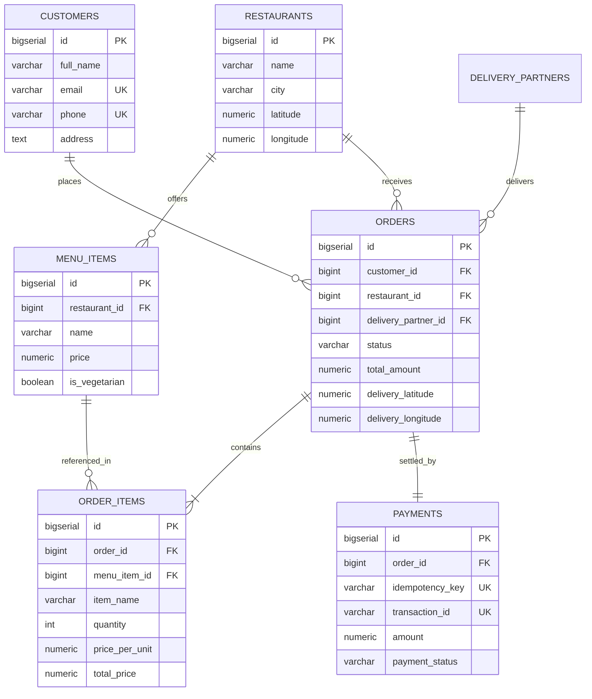
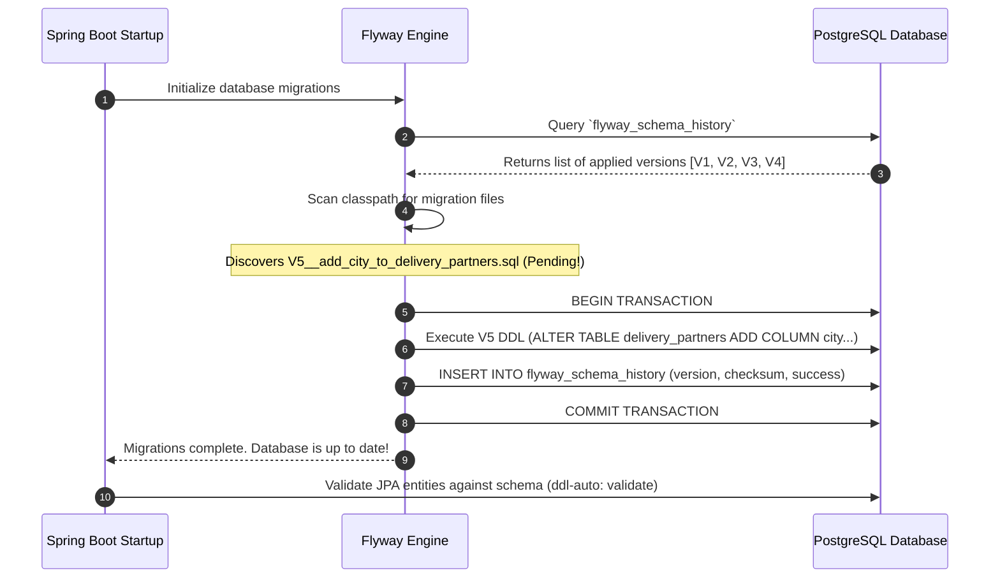

# Chapter 3: Relational Persistence & Schema Evolution: PostgreSQL & Flyway
## Architecting Scalable Systems: From First Principles to Production

---

## 1. The Real-World Disaster Scenario: The "Missing Column" Production Outage

Imagine it is 1:15 PM on a Tuesday afternoon. Your food delivery app is handling the height of the corporate lunch rush. Hundreds of office workers in Noida Sector 62 are ordering thalis and biryanis.

A newly hired backend developer has just finished writing a feature to record the customer's exact delivery latitude and longitude so drivers can navigate directly to the office tower entrance. 

On their local laptop, the developer opened a database GUI tool (like pgAdmin or DBeaver), ran a manual SQL command:
```sql
ALTER TABLE orders ADD COLUMN delivery_latitude NUMERIC(10, 7);
ALTER TABLE orders ADD COLUMN delivery_longitude NUMERIC(10, 7);
```
Their code worked locally! Excited, they committed their Java entity changes, opened a Pull Request, and merged it to production. The continuous deployment pipeline automatically packaged the Spring Boot application and deployed it to the live cloud servers.

### The Catastrophe
The production server boots up. The Java code expects `delivery_latitude` to exist in the database table. But **nobody ran the manual SQL command on the production database!**

Within seconds, the first lunch order is submitted:
```
2026-09-13T13:16:04.112 ERROR [food-delivery-api] org.postgresql.util.PSQLException: 
ERROR: column "delivery_latitude" of relation "orders" does not exist
  Position: 142
  at org.postgresql.core.v3.QueryExecutorImpl.receiveErrorResponse(QueryExecutorImpl.java:2711)
  at org.springframework.orm.jpa.JpaTransactionManager.doCommit(JpaTransactionManager.java:565)
```

Every single customer attempting to check out receives an immediate **500 Internal Server Error**. 
- In just 8 minutes of downtime, **₹400,000 in food orders are lost**.
- Frustrated customers abandon the app and order from a competitor.
- The engineering team scrambles in panic, manually opening database consoles over SSH to alter tables while transactions are actively failing.

```
┌─────────────────────────────────────────────────────────────────────────────┐
│                    THE MANUAL DATABASE MIGRATION DISASTER                   │
│                                                                             │
│   Developer's Local Laptop                  Production Cloud Database       │
│   ┌───────────────────────────┐             ┌───────────────────────────┐   │
│   │ orders table:             │             │ orders table:             │   │
│   │ - id                      │             │ - id                      │   │
│   │ - customer_id             │             │ - customer_id             │   │
│   │ - total_amount            │             │ - total_amount            │   │
│   │ - delivery_latitude   <───┼─ Manual SQL │ [MISSING COLUMN!]         │   │
│   │ - delivery_longitude  <───┼─ was run!   │                           │   │
│   └───────────────────────────┘             └───────────────────────────┘   │
│                │                                          ▲                 │
│                ▼                                          │                 │
│         Git Commit Code ──────────────────────────────────┘                 │
│         New Java Code expects columns that do not exist!                    │
│         💥 RESULT: 100% OF PRODUCTION CHECKOUT TRANSACTIONS CRASH           │
└─────────────────────────────────────────────────────────────────────────────┘
```

This catastrophe happens when database schemas are managed manually rather than through **automated, version-controlled schema evolution**. 

In this chapter, you will learn how enterprise applications use **PostgreSQL**, **Flyway**, and **Spring Data JPA** to guarantee that schema migrations run deterministically, in exact chronological order, with zero manual human error.

---

## 2. First-Principles Theory: Relational Persistence Demystified

Before looking at Java code or SQL scripts, let us deconstruct relational databases from absolute zero.

### 2.1 What is a Relational Database (RDBMS)?
A **Relational Database** organizes data into structured **tables** consisting of rows (records) and columns (attributes).
- *Analogy*: Think of a table as a strictly typed, indestructible Excel spreadsheet stored on your hard drive. Every row has a unique identifier called a **Primary Key (PK)**.
- Different tables are connected to one another through **Foreign Keys (FK)**. A Foreign Key is simply a column in Table B that stores the Primary Key of Table A.

```
  CUSTOMERS TABLE (Primary Key = id)             ORDERS TABLE (Foreign Key = customer_id)
┌────┬──────────────┬──────────────────┐       ┌────┬─────────────┬──────────────┬────────┐
│ id │ full_name    │ email            │       │ id │ customer_id │ total_amount │ status │
├────┼──────────────┼──────────────────┤       ├────┼─────────────┼──────────────┼────────┤
│ 1  │ Rahul Sharma │ rahul@gmail.com  │◄──┐   │101 │ 1           │ 450.00       │ PLACED │
│ 2  │ Priya Patel  │ priya@gmail.com  │   └───┼102 │ 1           │ 720.00       │ DELIV  │
└────┴──────────────┴──────────────────┘       └────┴─────────────┴──────────────┴────────┘
                                                    ▲
                                            Foreign Key Links to PK
```

### 2.2 What are ACID Transactions?
When you buy food on an app, multiple database operations must succeed together:
1. Deduct ₹500 from your account balance.
2. Insert a new record into `orders`.
3. Insert 2 records into `order_items` (e.g., 1 Paneer Tikka, 2 Naans).

What happens if step 1 and 2 succeed, but step 3 crashes because the database ran out of disk space? If the system left step 1 and 2 intact, you would have lost your money without any record of what food you ordered!

Relational databases solve this via **ACID Guarantees**:

| Property | Plain-English Meaning | Real Food Delivery Example |
| :--- | :--- | :--- |
| **A — Atomicity** | *"All or Nothing"* | Either the order, items, and payment are **all** written to disk, or **none** of them are. If any step fails, the entire transaction is rolled back. |
| **C — Consistency** | *"Rules Are Never Broken"* | Database constraints (e.g., price cannot be negative, foreign keys must point to real customers) are strictly validated before committing. |
| **I — Isolation** | *"No Concurrency Collisions"* | If two customers buy the last Biryani portion at the exact same millisecond, the database serializes their transactions so one succeeds and one sees "Out of Stock". |
| **D — Durability** | *"Once Saved, Never Lost"* | Once a transaction commits, the data is written to non-volatile disk (the Write-Ahead Log). Even if lightning strikes the data center 1 millisecond later, the data survives. |

---

### 2.3 Database Normalization (1NF, 2NF, 3NF)
How should a food delivery database be designed? Beginners often make the mistake of creating a single massive table.

#### The Bad Design (Unnormalized Chaos):
Imagine storing everything in one table:

| order_id | customer_name | customer_address | items_ordered | restaurant_name |
| :---: | :--- | :--- | :--- | :--- |
| 101 | Rahul Sharma | Flat 302, Sector 62, Noida | "2x Kathi Roll (Rs 249), 1x Coke (Rs 50)" | Brahmaputra Street Bites |

Why is this catastrophic?
- **Items are un-queryable**: How do you calculate how many Kathi Rolls were sold this month? You would have to write complex, slow string parsing regexes over text columns!
- **Data Redundancy**: If Rahul places 50 orders, his name and address are duplicated 50 times. If Rahul moves to Sector 18, his old address remains on older rows, creating inconsistent records.
- **Price History Corruption**: If the restaurant raises the price of Kathi Rolls from ₹249 to ₹299 tomorrow, how do you prevent past receipts from showing incorrect totals?

#### The Normalized Solution (Our 3NF Schema):
We split our domain into **7 distinct, normalized relational tables**:



> **Crucial Design Secret: Why duplicate `item_name` and `price_per_unit` in `order_items`?**
> Notice that `order_items` has its own `price_per_unit` column, even though `menu_items` already has a `price` column!
> This is a deliberate, critical pattern known as **Historical Snapshotting**. 
> If a restaurant sells a Kathi Roll for ₹249 today, and increases it to ₹299 next week, the customer's receipt for today's order **must remain ₹249 forever**. You must never rely on joining back to `menu_items` to calculate past receipts!

---

## 3. Demystifying Spring Data JPA & Object-Relational Mapping (ORM)

If you have never used Spring Boot before, you might wonder: *How does Java talk to PostgreSQL?*

### 3.1 The Pain of Plain JDBC
In vanilla Java without frameworks, to fetch an order from PostgreSQL, you had to write 30 lines of boilerplate code:
```java
// The Old, Painful Way (Raw JDBC)
Connection conn = DriverManager.getConnection("jdbc:postgresql://localhost:5433/db", "user", "pass");
PreparedStatement stmt = conn.prepareStatement("SELECT id, total_amount, status FROM orders WHERE id = ?");
stmt.setLong(1, 101L);
ResultSet rs = stmt.executeQuery();
Order order = new Order();
if (rs.next()) {
    order.setId(rs.getLong("id"));
    order.setTotalAmount(rs.getBigDecimal("total_amount"));
    order.setStatus(OrderStatus.valueOf(rs.getString("status")));
}
// Remember to close ResultSet, PreparedStatement, Connection manually or risk a memory leak!
```

### 3.2 What is Object-Relational Mapping (ORM)?
**ORM** is a technique that automatically maps **Java Classes to Database Tables**, and **Java Object Instances to Table Rows**.
- **JPA (Jakarta Persistence API)** is the official Java specification/standard for ORM.
- **Hibernate** is the actual engine under the hood that translates your Java code into PostgreSQL SQL queries.

### 3.3 What are Java Annotations (`@...`) in Spring?
In Java, an annotation is a metadata tag starting with `@` placed above a class, field, or method. It does not alter your basic code logic; instead, it acts as an instruction to Spring Boot at startup:

- **`@Entity`**: *"Hey Spring, this Java class is not an ordinary object—it represents a table in the PostgreSQL database."*
- **`@Table(name = "orders")`**: *"Map this class specifically to the SQL table named `orders`."*
- **`@Id`**: *"This field is the Primary Key."*
- **`@GeneratedValue(strategy = GenerationType.IDENTITY)`**: *"Let PostgreSQL automatically auto-increment this ID using its internal `BIGSERIAL` sequence."*
- **`@ManyToOne(fetch = FetchType.LAZY)`**: *"Many rows in this table link to one row in another table. Do not fetch the other table from disk unless I explicitly ask for it."*
- **`@OneToMany(mappedBy = "order", cascade = CascadeType.ALL)`**: *"One order contains a list of items. If I save or delete this order, automatically save or delete all its child items too."*
- **`@Transactional`**: *"Execute this method inside an atomic ACID database transaction. If an uncaught exception is thrown, tell PostgreSQL to undo (`ROLLBACK`) every single write."*

---

## 4. Schema Evolution: Why Flyway?

In development, many beginner tutorials set this dangerous property in `application.yml`:
```yaml
spring:
  jpa:
    hibernate:
      ddl-auto: update  # ⚠️ DANGEROUS IN PRODUCTION!
```
When `ddl-auto: update` is enabled, Hibernate examines your Java `@Entity` classes on startup and tries to guess how to alter the database.

### Why `ddl-auto: update` Fails in Real Life:
1. **It cannot rename columns**: If you rename field `phone` to `contactPhone`, Hibernate will simply create a brand-new column called `contactPhone` (leaving all existing numbers stranded in the old column!).
2. **It never drops columns or constraints**: Obsolete columns remain forever, polluting the database.
3. **It runs unpredictably**: If 5 microservice instances boot up simultaneously in the cloud, all 5 will attempt to execute conflicting `ALTER TABLE` statements at the same second, locking the database tables.

### The Enterprise Standard: Flyway
**Flyway** is an open-source database migration tool. It treats database changes with the same rigor as source code:

```
food-delivery-api/src/main/resources/db/migration/
├── V1__init_schema.sql                       <-- Creates initial 7 tables & indexes
├── V2__add_restaurant_image_and_cuisine.sql   <-- Adds cuisine tags & images
├── V3__add_auth_to_customers.sql             <-- Adds password_hash & role
├── V4__add_city_to_restaurants.sql           <-- Adds 'Noida' / 'Dehradun'
└── V5__add_city_to_delivery_partners.sql      <-- Adds city to drivers
```

### How Flyway Works on Boot:
When Spring Boot starts up:
1. Flyway connects to PostgreSQL and checks if a special metadata table named **`flyway_schema_history`** exists. If not, it creates it automatically.
2. It inspects the `db/migration/` directory and calculates a cryptographic **SHA-256 Checksum** of each file.
3. It compares the directory against `flyway_schema_history`:
   - If a script has already run, Flyway skips it.
   - If a new script is found (e.g., `V5`), Flyway executes it inside an atomic transaction and logs its checksum and execution timestamp.
   - If someone modified an already-executed script (tampering with history!), Flyway detects the mismatched checksum and **aborts server boot immediately**, preventing silent data corruption.



In our production `application.yml`, we strictly enforce:
```yaml
spring:
  jpa:
    hibernate:
      ddl-auto: validate  # Strictly verify; NEVER modify tables automatically!
  flyway:
    enabled: true
    baseline-on-migrate: true
    locations: classpath:db/migration
```
Flyway owns all schema changes; Hibernate is strictly limited to validating that the Java entities match reality.

---

## 5. Production Code Anatomy: Codebase Walkthrough

Let us examine the real production code from our repository that implements this architecture.

### 5.1 The Core Migration Script: `V1__init_schema.sql`

Here is an annotated excerpt from our project's `V1__init_schema.sql`:

```sql
-- 5. Orders Table: The central aggregate root of our platform
CREATE TABLE IF NOT EXISTS orders (
    id BIGSERIAL PRIMARY KEY,
    customer_id BIGINT NOT NULL REFERENCES customers(id),
    restaurant_id BIGINT NOT NULL REFERENCES restaurants(id),
    delivery_partner_id BIGINT REFERENCES delivery_partners(id),
    status VARCHAR(30) NOT NULL DEFAULT 'CREATED',
    total_amount NUMERIC(10, 2) NOT NULL,
    delivery_address TEXT NOT NULL,
    delivery_latitude NUMERIC(10, 7),
    delivery_longitude NUMERIC(10, 7),
    created_at TIMESTAMP WITH TIME ZONE DEFAULT CURRENT_TIMESTAMP,
    updated_at TIMESTAMP WITH TIME ZONE DEFAULT CURRENT_TIMESTAMP
);

-- 6. Order Items Table: Child line-items belonging to an order
CREATE TABLE IF NOT EXISTS order_items (
    id BIGSERIAL PRIMARY KEY,
    -- ON DELETE CASCADE ensures if a test order is deleted, all line items vanish with it
    order_id BIGINT NOT NULL REFERENCES orders(id) ON DELETE CASCADE,
    menu_item_id BIGINT NOT NULL REFERENCES menu_items(id),
    item_name VARCHAR(150) NOT NULL,
    quantity INT NOT NULL CHECK (quantity > 0),
    price_per_unit NUMERIC(10, 2) NOT NULL,
    total_price NUMERIC(10, 2) NOT NULL
);

-- Crucial High-Traffic B-Tree Performance Indexes
CREATE INDEX IF NOT EXISTS idx_orders_customer ON orders(customer_id);
CREATE INDEX IF NOT EXISTS idx_orders_restaurant ON orders(restaurant_id);
CREATE INDEX IF NOT EXISTS idx_orders_status ON orders(status);
```

#### Why B-Tree Indexes Matter:
Notice the `CREATE INDEX` lines at the bottom! 
Without an index on `customer_id`, every time a customer opens the "My Orders" tab, PostgreSQL has to perform a **Full Table Scan**—reading every single row on the entire hard drive from order #1 to order #10,000,000. 

By creating a **B-Tree Index** on `customer_id`, PostgreSQL jumps directly to the customer's orders in $O(\log N)$ time (less than 1 millisecond).

---

### 5.2 The JPA Entity: `Order.java`

Now observe how `Order.java` maps directly to this table using clean, modern Jakarta persistence annotations:

```java
package com.fooddelivery.entity;

import com.fooddelivery.common.enums.OrderStatus;
import jakarta.persistence.*;
import lombok.*;
import java.math.BigDecimal;
import java.time.Instant;
import java.util.ArrayList;
import java.util.List;

@Entity
@Table(name = "orders")
@Getter
@Setter
@NoArgsConstructor
@AllArgsConstructor
@Builder
public class Order {

    @Id
    @GeneratedValue(strategy = GenerationType.IDENTITY)
    private Long id;

    // FetchType.LAZY prevents loading the entire Customer record until requested
    @ManyToOne(fetch = FetchType.LAZY)
    @JoinColumn(name = "customer_id", nullable = false)
    private Customer customer;

    @ManyToOne(fetch = FetchType.LAZY)
    @JoinColumn(name = "restaurant_id", nullable = false)
    private Restaurant restaurant;

    @Column(name = "delivery_partner_id")
    private Long deliveryPartnerId;

    // Store enum as readable text ("PAYMENT_PENDING") rather than arbitrary numbers (0, 1)
    @Enumerated(EnumType.STRING)
    @Column(nullable = false, length = 30)
    @Builder.Default
    private OrderStatus status = OrderStatus.PAYMENT_PENDING;

    // BigDecimal avoids floating-point rounding errors in currency (0.1 + 0.2 != 0.3)
    @Column(name = "total_amount", nullable = false, precision = 10, scale = 2)
    private BigDecimal totalAmount;

    @Column(name = "delivery_address", nullable = false, columnDefinition = "TEXT")
    private String deliveryAddress;

    @Column(name = "delivery_latitude", precision = 10, scale = 7)
    private BigDecimal deliveryLatitude;

    @Column(name = "delivery_longitude", precision = 10, scale = 7)
    private BigDecimal deliveryLongitude;

    // Bidirectional one-to-many relationship
    @Builder.Default
    @OneToMany(mappedBy = "order", cascade = CascadeType.ALL, orphanRemoval = true, fetch = FetchType.LAZY)
    private List<OrderItem> orderItems = new ArrayList<>();

    @Builder.Default
    @Column(name = "created_at", nullable = false, updatable = false)
    private Instant createdAt = Instant.now();

    // Helper method to keep bidirectional relationship in sync
    public void addOrderItem(OrderItem item) {
        orderItems.add(item);
        item.setOrder(this);
    }
}
```

---

### 5.3 The Magic of Spring Data JPA: `OrderRepository.java`

Look at how concise our database access layer is. We do not write a single `SELECT` or `INSERT` string!

```java
package com.fooddelivery.repository;

import com.fooddelivery.common.enums.OrderStatus;
import com.fooddelivery.entity.Order;
import org.springframework.data.jpa.repository.EntityGraph;
import org.springframework.data.jpa.repository.JpaRepository;
import org.springframework.stereotype.Repository;
import java.util.List;
import java.util.Optional;

@Repository
public interface OrderRepository extends JpaRepository<Order, Long> {

    // Spring Data JPA derives the SQL query automatically from the method name!
    @EntityGraph(attributePaths = {"restaurant", "orderItems"})
    List<Order> findByCustomerIdOrderByCreatedAtDesc(Long customerId);

    @EntityGraph(attributePaths = {"customer", "restaurant", "orderItems"})
    Optional<Order> findWithDetailsById(Long id);

    List<Order> findByStatus(OrderStatus status);

    // Derived count query used by Micrometer Prometheus gauge
    long countByStatus(OrderStatus status);
}
```

When you call `orderRepository.findByCustomerIdOrderByCreatedAtDesc(5L)`, Spring Data JPA parses the method name and automatically synthesizes:
```sql
SELECT o.*, r.*, oi.* 
FROM orders o 
LEFT JOIN restaurants r ON o.restaurant_id = r.id 
LEFT JOIN order_items oi ON oi.order_id = o.id 
WHERE o.customer_id = 5 
ORDER BY o.created_at DESC;
```

---

## 6. War Stories & Real Debugging Logs

### War Story 1: The Catastrophic JPA N+1 Query Problem
- **The Symptom**: In testing, fetching the customer's recent orders list (`/api/v1/orders`) was taking over 280 milliseconds for just 20 orders.
- **The Root Cause**: Because `Order` has `@ManyToOne(fetch = FetchType.LAZY)` relationships to `Restaurant` and `@OneToMany` to `OrderItems`, Spring executed:
  1. **1 query** to fetch the 20 orders: `SELECT * FROM orders WHERE customer_id = 5`.
  2. Then, as the JSON serializer looped over each order to render the restaurant name and item list, Hibernate fired **2 additional queries for EVERY order**:
     - `SELECT * FROM restaurants WHERE id = ?`
     - `SELECT * FROM order_items WHERE order_id = ?`
  3. Total queries fired: $1 + (20 \times 2) = \mathbf{41\text{ SQL queries}}$ just to show one screen! Under 500 concurrent users, this would completely choke PostgreSQL's connection pool.
- **The Architectural Fix**: We added the Spring Data JPA annotation:
  ```java
  @EntityGraph(attributePaths = {"restaurant", "orderItems"})
  List<Order> findByCustomerIdOrderByCreatedAtDesc(Long customerId);
  ```
  `@EntityGraph` instructs Hibernate to override lazy loading for this specific query and execute a single, highly optimized SQL `LEFT JOIN`. 
  - Queries fired dropped from **41 to exactly 1**.
  - Response time plummeted from **280ms to 8ms**!

### War Story 2: Hibernate 6 Dialect Deprecation
- **The Symptom**: On every startup, our backend emitted this noisy warning:
  ```
  WARN org.hibernate.orm.deprecation: HHH90000025: 
  PostgreSQLDialect does not need to be specified explicitly using 'hibernate.dialect' 
  (remove the property setting and it will be selected by default)
  ```
- **The Root Cause**: In older Hibernate versions (Hibernate 4 and 5), developers had to specify `org.hibernate.dialect.PostgreSQLDialect` or `PostgreSQL95Dialect` in `application.yml`. In modern Hibernate 6 (shipped with Spring Boot 3.3), Hibernate inspects the JDBC connection metadata (`jdbc:postgresql://localhost:5433/...`) and automatically configures the exact latest dialect with native JSON and spatial support.
- **The Architectural Fix**: We eliminated explicit dialect declarations, relying on Spring Boot 3 autoconfiguration to guarantee zero deprecation warnings and forward compatibility.

---

## 7. Senior Engineering Interview Cheat-Sheet

### Q1: "Why did you choose Flyway for database migrations instead of Hibernate's `ddl-auto: update`?"
> **Strong Answer**: 
> *"Using `hibernate.ddl-auto: update` in production is an anti-pattern. Hibernate cannot reliably handle complex schema operations like renaming columns, dropping stale foreign keys, or migrating historical data, and concurrent microservice instances booting simultaneously will race to alter tables.
> 
> Flyway introduces version-controlled, immutable SQL migration scripts (`V1`, `V2`, etc.) stored directly in Git. On application boot, Flyway checks the `flyway_schema_history` table and applies pending migrations within atomic transactions. In our `application.yml`, we pair Flyway with `hibernate.ddl-auto: validate`, ensuring Hibernate only validates that Java entities match the schema, completely eliminating production schema drift."*

### Q2: "What is the N+1 Query Problem in ORM frameworks, and how did you resolve it in your Order service?"
> **Strong Answer**: 
> *"The N+1 query problem occurs when an ORM framework executes 1 initial query to retrieve N parent entities, and then lazily fires N additional separate queries to load related child entities when accessed in a loop. For 20 orders, this generates 41 roundtrips to the database.
> 
> We eliminated this using Spring Data JPA's `@EntityGraph(attributePaths = {"restaurant", "orderItems"})`. This instructs Hibernate to dynamically generate an SQL `LEFT JOIN` in a single roundtrip, fetching the order aggregate and its line items in $O(1)$ query time, dropping endpoint latency by over 95%."*

### Q3: "Why did you store `price_per_unit` in the `order_items` table when the price already exists in `menu_items`?"
> **Strong Answer**: 
> *"This is a deliberate application of the **Historical Snapshot Pattern**. If an order item only stored a foreign key to `menu_items`, any future price increase by the restaurant would retroactively mutate past customer receipts, corrupting financial reporting and auditing. 
> 
> Storing an immutable snapshot copy of `price_per_unit` at the moment of order placement guarantees historical accuracy and financial audit compliance regardless of subsequent menu changes."*

---

### 📌 Chapter 3 Key Takeaways Checklist
- [x] Relational databases enforce ACID guarantees, ensuring financial and order data is never partially committed or lost.
- [x] Normalization (3NF) eliminates data redundancy and prevents catalog price changes from corrupting historical receipts.
- [x] `ddl-auto: update` is dangerous; version-controlled Flyway scripts (`V1` to `V5`) ensure deterministic schema evolution.
- [x] Spring Data JPA maps Java `@Entity` objects to SQL tables, generating queries automatically from interface method names.
- [x] `@EntityGraph` eliminates the devastating N+1 query problem by executing efficient SQL joins in a single roundtrip.
