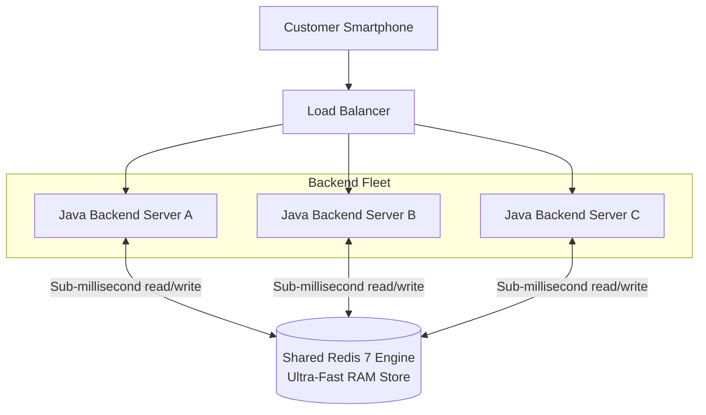
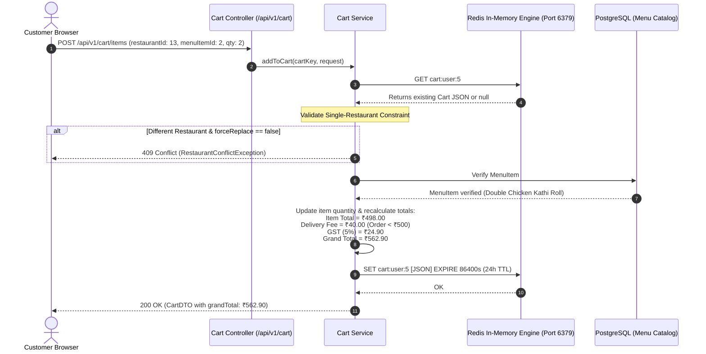

# Chapter 4: In-Memory Acceleration & Shopping Cart Architecture: Redis Hashes & TTL
## Architecting Scalable Systems: From First Principles to Production

---

## 1. The Real-World Disaster Scenario: The New Year's Eve "Cart Storm"

Imagine it is 8:30 PM on New Year's Eve. Across the country, over **100,000 concurrent users** are simultaneously browsing dinner menus on your food delivery app.

In e-commerce and food delivery platforms, user browsing behavior follows an extreme pattern:
- A user taps a restaurant menu.
- They click **"Add to Cart"** on a Biryani.
- They change their mind and click **"+"** to add a second portion.
- They click **"-"** to remove one.
- They add a Garlic Naan, then click remove, then add a Butter Naan.
- They repeat this browsing and clicking cycle for 10 minutes across 5 different restaurants.

In an unoptimized architecture, every single click on the "+" or "-" button triggers an immediate HTTP request that performs an **SQL write to a relational database** (like PostgreSQL):
```sql
UPDATE cart_items SET quantity = 2 WHERE user_id = 1042 AND item_id = 89;
```

### The 95% Cart Abandonment Catastrophe
Here is the brutal statistical reality of food delivery platforms: **Over 90% of shopping carts are abandoned!**
Out of 100,000 hungry users playing with carts on New Year's Eve, perhaps only 8,000 will actually proceed to payment and place an order.

If every click writes to PostgreSQL:
1. **Disk I/O Collapses**: Hard drives and Solid State Drives (SSDs) are physical devices. They can only handle a few thousand input/output operations per second (IOPS). Writing millions of transient, indecisive cart clicks forces the database to write to the Write-Ahead Log (WAL) on disk continuously.
2. **Database Row Locks**: Two rapid taps on "+" from the same customer cause concurrent SQL `UPDATE` statements that lock the table rows, creating transaction deadlocks.
3. **Database Disk Bloat**: Your PostgreSQL tables fill up with millions of rows of abandoned Garlic Naans and Cokes from users who closed their browser hours ago.

```
                  ┌─────────────────────────────────────────────────────────┐
                  │                 THE POSTGRES CART MELTDOWN              │
                  │                                                         │
100,000 Users     │  Every "+" and "-" button click forces an SQL write!   │
Clicking Buttons ─┼─► UPDATE cart_items SET quantity = 3 ...               │
10 times a minute │                                                         │
                  │                           │                             │
                  │                           ▼                             │
                  │              Disk I/O Queue Hits 100%                   │
                  │              PostgreSQL Row Locks Spike                 │
                  │              Transactions Pile Up in Wait Queue         │
                  │                           │                             │
                  │                           ▼                             │
                  │       💥 DATABASE FAILS TO PROCESS REAL PAID ORDERS     │
                  └─────────────────────────────────────────────────────────┘
```

At 8:42 PM, the database disk queue hits 100%. Real paying customers attempting to finalize their ₹1,200 orders have their checkout queries queued behind thousands of non-paying users clicking "+" on appetizers. The checkout API times out, and the company loses millions in peak holiday revenue.

To prevent this catastrophe, modern high-scale architectures store transient, high-velocity state in an **In-Memory NoSQL Datastore**: **Redis**.

---

## 2. First-Principles Theory: RAM vs. Disk & The Nature of Redis

Let us deconstruct the physics of computer memory to understand why Redis is uniquely equipped to solve this problem.

### 2.1 The Latency Pyramid: RAM vs. Solid State Disk (SSD)
Why is writing to a traditional database like PostgreSQL so much slower than writing to memory?

Consider the physical reality of how computers store data:
- **Hard Drives & NVMe SSDs (Non-Volatile Storage)**: Data is stored electronically in flash memory cells or magnetic platters. Accessing an SSD requires kernel filesystem calls, page cache syncing, and controller handshakes. A typical random write takes **10 to 50 microseconds** (or up to **10 milliseconds** under heavy I/O queue pressure).
- **RAM (Random Access Memory)**: Data is stored as electrical charges in microscopic capacitors directly on the high-speed CPU memory bus. Accessing RAM takes approximately **100 nanoseconds**—over **100,000 times faster than disk**!

```
                    THE LATENCY HIERARCHY OF COMPUTING
                    
                ▲  ┌───────────────────────────────┐
                │  │ CPU L1/L2 Cache (0.5 - 7 ns)  │
      FASTER    │  ├───────────────────────────────┤
                │  │ RAM / Main Memory (100 ns)    │ ◄── REDIS OPERATES HERE!
                │  ├───────────────────────────────┤
                │  │ NVMe SSD Disk (10 - 50 µs)    │ ◄── POSTGRES OPERATES HERE
      SLOWER    │  ├───────────────────────────────┤
                │  │ Internet Network Call (50 ms) │
                ▼  └───────────────────────────────┘
```

> **The Library Analogy**:
> - Reading from **PostgreSQL (Disk)** is like standing up, putting on your coat, walking 2 miles to the public library, finding a book in the basement stacks, and reading a sentence.
> - Reading from **Redis (RAM)** is like glancing down at an open notepad already sitting on your desk.

---

### 2.2 Why Not Just Use a Java `HashMap` in RAM?
A clever developer might ask: 
> *"If RAM is so fast, why do we need Redis at all? Why can't I just create a `static HashMap<Long, Cart> carts = new HashMap<>();` inside my Java Spring Boot backend?"*

This is one of the most classic distributed systems pitfalls. Here is why an in-memory Java `HashMap` completely fails in production:

#### The Multi-Server Load Balancer Disaster
In production, a food delivery platform never runs on just one single server instance. You run 5, 10, or 50 identical server instances behind a **Load Balancer** (like AWS ALB or NGINX) to handle high traffic:

```mermaid
graph TD
    CLIENT[Customer Smartphone]
    LB[Load Balancer]
    
    subgraph Server Instance A
        JA[Java Backend A<br/>Local RAM HashMap]
    end
    
    subgraph Server Instance B
        JB[Java Backend B<br/>Local RAM HashMap]
    end

    CLIENT -->|Request 1: Add Biryani| LB
    LB -->|Routes to| JA
    Note over JA: Biryani stored in Server A's local RAM!

    CLIENT -->|Request 2: View Cart| LB
    LB -->|Routes to| JB
    Note over JB: Server B's RAM is empty! Customer sees: "Your Cart is Empty" 😱
```

1. **State Isolation**: If Request 1 goes to Server A, the Biryani is placed in Server A's RAM.
2. When the user taps "View Cart", the load balancer routes Request 2 to Server B. Server B's JVM has no idea what happened on Server A. The customer sees an empty cart and panics!
3. **The Single JVM Crash**: If Server A restarts or crashes during a deployment, all shopping carts held in its memory vanish instantly.

#### The Solution: Redis as a Shared In-Memory Datastore
**Redis (Remote Dictionary Server)** is a specialized, open-source, networked in-memory data store. Instead of storing state inside individual Java servers, all Java backend instances connect over the local network to a shared Redis cluster:



Whether Request 1 hits Server A and Request 2 hits Server C, both servers read and write to the exact same shared Redis state in **sub-millisecond latency**.

---

### 2.3 Why is Redis So Fast? (The Single-Threaded Event Loop)
Beginners are often shocked to learn that **Redis is primarily single-threaded** for command execution. How can a single-threaded program handle 100,000+ requests per second?

1. **Zero Context Switching**: In multi-threaded programs, the operating system CPU spends massive amounts of time pausing Thread 1, saving its registers, and switching to Thread 2 (**Thread Context Switching**). Redis spends zero time context switching.
2. **Zero Lock Contention**: In multi-threaded databases, threads fight over mutexes and row locks (`synchronized`, `ReentrantLock`), causing threads to sleep and stall. In Redis, commands execute one after another in a clean sequential queue. There are **zero thread deadlocks**.
3. **I/O Multiplexing (`epoll` / `kqueue`)**: Redis uses modern operating system non-blocking event notification systems (`epoll` on Linux). A single Redis thread can monitor 10,000 open client network sockets simultaneously, processing data the microsecond it arrives.

---

### 2.4 Redis Data Structures: Strings vs. Hashes
Redis is not just a simple key-value store; it is a **data structures server**. Choosing the right structure for your shopping cart is the difference between an elegant system and a buggy one.

#### Option A: Redis Strings (The JSON Blob Approach)
You serialize the entire shopping cart into a single JSON text string:
- Key: `cart:user:1042`
- Value: `{"items": [{"id": 12, "qty": 2}, {"id": 15, "qty": 1}], "restaurantId": 4}`

*The Hidden Danger (The Race Condition)*:
If a user opens two browser tabs and clicks "+" on item 12 in Tab 1, while clicking "+" on item 15 in Tab 2 simultaneously:
1. Tab 1 reads the JSON string from Redis into Server A.
2. Tab 2 reads the identical JSON string from Redis into Server B.
3. Tab 1 increments item 12 and overwrites the entire key in Redis.
4. Tab 2 increments item 15 and overwrites the entire key in Redis.
**Result**: Tab 1's update is completely erased!

#### Option B: Redis Hashes (The Optimal Field-Value Approach)
A **Redis Hash** is a map of fields and values stored inside a single key. Think of a Redis Hash like a folder containing independent index cards:
- **Key**: `cart:user:1042`
- **Field 1**: `restaurant_id` $\to$ `4`
- **Field 2**: `item:12` $\to$ `2`
- **Field 3**: `item:15` $\to$ `1`

*The Power*: You can execute an atomic command:
```
HINCRBY cart:user:1042 item:12 1
```
Redis increments the quantity of item 12 directly in RAM in $O(1)$ time without deserializing or rewriting any other item in the cart!

---

### 2.5 Time-To-Live (TTL): The Self-Cleaning Database
How do we solve the abandoned cart problem without writing complex background cleanup scripts?

Redis has a native feature called **TTL (Time-To-Live)**. Whenever our backend creates or updates a cart, we attach an expiration duration:
```java
redisTemplate.opsForValue().set(cartKey, json, Duration.ofHours(24));
```
- Every time the customer taps "+" or adds a dish, the 24-hour countdown timer **resets**.
- If the customer places an order, we delete the key immediately.
- If the customer closes the app and goes to sleep, **Redis silently and automatically vaporizes the abandoned cart from RAM after 24 hours**. Zero database clutter, zero human maintenance.

---

### 2.6 The Single-Restaurant Cart Policy
In e-commerce platforms like Amazon, you can put shoes from Nike and a laptop from Apple in the same cart; Amazon packs them into separate boxes over several days.

In food delivery platforms (Swiggy, Zomato, DoorDash), **a cart can only contain food from ONE restaurant at a time**. Why?
Because a food delivery run is an immediate physical trip: a single delivery driver on a motorbike cannot travel to two competing restaurants 8 kilometers apart in 15 minutes without the food getting cold.

Our shopping cart engine must enforce this strict domain rule:
1. If a customer has Burgers from *Burger King* in their cart, and attempts to add a Pizza from *Domino's*, the backend must detect the conflict.
2. The backend must reject the addition with an HTTP `409 Conflict` (or custom `RestaurantConflictException`), warning the customer:
   > *"Your cart contains items from Burger King. Would you like to discard your cart and start a new order from Domino's?"*
3. If the user confirms (`forceReplace = true`), the cart is wiped and the new item is added.

---

## 3. Visual Architecture: Shopping Cart State Flow

Let us trace the complete lifecycle of a shopping cart from guest browsing to authenticated checkout:



---

## 4. Production Code Anatomy: Codebase Walkthrough

Let us inspect the real, working code from our repository that implements this high-speed cart architecture.

### 4.1 Configuring the Redis Client: `RedisConfig.java`

If you do not configure Spring Boot's Redis serializers properly, Spring defaults to legacy Java native serialization, storing keys and values as unreadable binary byte arrays.

Our `RedisConfig.java` guarantees clean, UTF-8 JSON serialization:

```java
package com.fooddelivery.config;

import com.fasterxml.jackson.databind.ObjectMapper;
import com.fasterxml.jackson.datatype.jsr310.JavaTimeModule;
import org.springframework.context.annotation.Bean;
import org.springframework.context.annotation.Configuration;
import org.springframework.context.annotation.Primary;
import org.springframework.data.redis.connection.RedisConnectionFactory;
import org.springframework.data.redis.core.StringRedisTemplate;

@Configuration
public class RedisConfig {

    /**
     * Configures StringRedisTemplate to enforce that both Redis Keys and
     * Values are stored as standard UTF-8 text strings rather than Java binary hex.
     */
    @Bean
    public StringRedisTemplate stringRedisTemplate(RedisConnectionFactory connectionFactory) {
        return new StringRedisTemplate(connectionFactory);
    }

    /**
     * Primary Jackson ObjectMapper configured with JavaTimeModule to 
     * seamlessly serialize Java 8 Instant and LocalDateTime fields into ISO-8601 strings.
     */
    @Bean
    @Primary
    public ObjectMapper objectMapper() {
        ObjectMapper mapper = new ObjectMapper();
        mapper.registerModule(new JavaTimeModule());
        return mapper;
    }
}
```

#### What is `@Configuration` and `@Bean`?
- **`@Configuration`**: Sticking a note on a class telling Spring: *"This is a factory recipe class. It creates tools that other parts of the application will need."*
- **`@Bean`**: A method that manufactures a specific tool (like `StringRedisTemplate` or `ObjectMapper`). Spring executes this method once on startup and keeps the created tool ready in its internal inventory (**The ApplicationContext**) for any service to use via Dependency Injection.

---

### 4.2 The Shopping Cart Engine: `CartService.java`

Now let us examine the core business logic inside `CartService.java`:

```java
package com.fooddelivery.service;

import com.fasterxml.jackson.databind.ObjectMapper;
import com.fooddelivery.common.dto.*;
import com.fooddelivery.entity.MenuItem;
import com.fooddelivery.entity.Restaurant;
import com.fooddelivery.exception.RestaurantConflictException;
import com.fooddelivery.repository.MenuItemRepository;
import lombok.RequiredArgsConstructor;
import lombok.extern.slf4j.Slf4j;
import org.springframework.data.redis.core.StringRedisTemplate;
import org.springframework.stereotype.Service;

import java.math.BigDecimal;
import java.math.RoundingMode;
import java.time.Duration;
import java.util.ArrayList;
import java.util.Optional;

@Slf4j
@Service
@RequiredArgsConstructor
public class CartService {

    // 24-Hour TTL: Automatically purges abandoned carts from RAM
    private static final Duration CART_TTL = Duration.ofHours(24);
    
    // Indian Food Delivery Economics
    private static final BigDecimal FREE_DELIVERY_THRESHOLD = new BigDecimal("500.00");
    private static final BigDecimal STANDARD_DELIVERY_FEE = new BigDecimal("40.00");
    private static final BigDecimal GST_RATE = new BigDecimal("0.05"); // 5% Indian Restaurant GST

    private final StringRedisTemplate redisTemplate;
    private final ObjectMapper objectMapper;
    private final MenuItemRepository menuItemRepository;

    /**
     * Fetches active cart from Redis in sub-millisecond time.
     */
    public CartDTO getCart(String cartKey) {
        String json = redisTemplate.opsForValue().get(cartKey);
        if (json == null || json.isBlank()) {
            return CartDTO.builder().cartKey(cartKey).items(new ArrayList<>()).build();
        }
        try {
            CartDTO cart = objectMapper.readValue(json, CartDTO.class);
            cart.setCartKey(cartKey);
            return cart;
        } catch (Exception e) {
            log.error("Failed to parse cart JSON for key {}: {}", cartKey, e.getMessage());
            return CartDTO.builder().cartKey(cartKey).items(new ArrayList<>()).build();
        }
    }

    /**
     * Adds an item to the Redis cart with single-restaurant conflict enforcement.
     */
    public CartDTO addToCart(String cartKey, AddToCartRequest request) {
        CartDTO cart = getCart(cartKey);

        // ENFORCE SINGLE-RESTAURANT CONSTRAINT
        if (cart.getRestaurantId() != null && !cart.getItems().isEmpty()
                && !cart.getRestaurantId().equals(request.getRestaurantId())) {
            if (!request.isForceReplace()) {
                throw new RestaurantConflictException(
                        cart.getRestaurantId(),
                        cart.getRestaurantName(),
                        request.getRestaurantId()
                );
            }
            // User explicitly confirmed: discard previous restaurant items
            cart.getItems().clear();
        }

        // Validate menu item against PostgreSQL
        MenuItem menuItem = menuItemRepository.findById(request.getMenuItemId())
                .orElseThrow(() -> new IllegalArgumentException("Menu item not found: " + request.getMenuItemId()));

        Restaurant restaurant = menuItem.getRestaurant();
        cart.setRestaurantId(restaurant.getId());
        cart.setRestaurantName(restaurant.getName());
        cart.setCity(restaurant.getCity());

        // Increment existing item or append new item
        int qtyToAdd = request.getQuantity() != null && request.getQuantity() > 0 ? request.getQuantity() : 1;
        Optional<CartItemDTO> existingItemOpt = cart.getItems().stream()
                .filter(i -> i.getMenuItemId().equals(menuItem.getId()))
                .findFirst();

        if (existingItemOpt.isPresent()) {
            CartItemDTO existing = existingItemOpt.get();
            int newQty = existing.getQuantity() + qtyToAdd;
            existing.setQuantity(newQty);
            existing.setSubtotal(existing.getPrice().multiply(BigDecimal.valueOf(newQty)));
        } else {
            cart.getItems().add(CartItemDTO.builder()
                    .menuItemId(menuItem.getId())
                    .name(menuItem.getName())
                    .price(menuItem.getPrice())
                    .quantity(qtyToAdd)
                    .subtotal(menuItem.getPrice().multiply(BigDecimal.valueOf(qtyToAdd)))
                    .build());
        }

        recalculateTotals(cart);
        saveCart(cartKey, cart);
        return cart;
    }

    /**
     * Calculates Item Subtotal, Free Delivery qualification, 5% GST, and Grand Total.
     */
    private void recalculateTotals(CartDTO cart) {
        BigDecimal itemTotal = BigDecimal.ZERO;
        int totalCount = 0;

        for (CartItemDTO item : cart.getItems()) {
            itemTotal = itemTotal.add(item.getSubtotal());
            totalCount += item.getQuantity();
        }

        // Free delivery if order total >= ₹500, otherwise standard ₹40 delivery fee
        BigDecimal deliveryFee = itemTotal.compareTo(FREE_DELIVERY_THRESHOLD) >= 0 || totalCount == 0
                ? BigDecimal.ZERO
                : STANDARD_DELIVERY_FEE;

        // 5% Indian Restaurant GST calculation rounded to 2 decimal places
        BigDecimal gst = itemTotal.multiply(GST_RATE).setScale(2, RoundingMode.HALF_UP);
        BigDecimal grandTotal = itemTotal.add(deliveryFee).add(gst);

        cart.setItemTotal(itemTotal);
        cart.setDeliveryFee(deliveryFee);
        cart.setGst(gst);
        cart.setGrandTotal(grandTotal);
        cart.setTotalItemCount(totalCount);
    }

    /**
     * Saves JSON string back to Redis and resets the 24-hour TTL expiration.
     */
    private void saveCart(String cartKey, CartDTO cart) {
        try {
            String json = objectMapper.writeValueAsString(cart);
            redisTemplate.opsForValue().set(cartKey, json, CART_TTL);
        } catch (Exception e) {
            throw new RuntimeException("Failed to persist cart in Redis", e);
        }
    }
}
```

---

### 4.3 The REST Controller: `CartController.java`

How does the controller determine whose cart is being modified? 
Notice how `resolveCartKey()` seamlessly supports both **Authenticated Customers** and **Anonymous Guest Users**:

```java
    private String resolveCartKey(HttpServletRequest request) {
        Authentication auth = SecurityContextHolder.getContext().getAuthentication();
        
        // 1. If user is logged in with JWT token, key is bound to their Customer ID
        if (auth != null && auth.isAuthenticated() && !"anonymousUser".equals(auth.getPrincipal())) {
            Customer customer = (Customer) auth.getPrincipal();
            return "cart:user:" + customer.getId();
        }

        // 2. If unauthenticated guest, check for guest session header from browser
        String guestId = request.getHeader("X-Guest-Cart-Id");
        if (guestId != null && !guestId.isBlank()) {
            return "cart:guest:" + guestId;
        }

        // 3. Fallback to client IP address
        return "cart:ip:" + request.getRemoteAddr();
    }
```

---

## 5. War Stories & Real Debugging Logs

### War Story 1: The Java Binary Hex Serialization Trap
- **The Symptom**: When inspecting Redis using the CLI tool `redis-cli`, the keys appeared corrupted with strange backslashes:
  ```
  127.0.0.1:6379> KEYS *
  1) "\xac\xed\x00\x05t\x00\x0bcart:user:5"
  ```
  Attempting to read the value with `GET` returned unreadable binary machine code. Furthermore, non-Java microservices (like a Node.js or Python service) could not read the cart data at all.
- **The Root Cause**: By default, Spring Data Redis uses `JdkSerializationRedisSerializer`. It writes the raw Java bytecode representation of the object, which includes internal Java class version metadata.
- **The Architectural Fix**: We switched to `StringRedisTemplate` combined with Jackson `ObjectMapper`. 
  - Keys are now stored as clean, readable text strings (`cart:user:5`).
  - Values are stored as standard, interoperable JSON (`{"restaurantId": 13, "grandTotal": 562.90}`). Any programming language can now inspect and parse the cart.

### War Story 2: The "Cart Lost on Page Refresh" Bug
- **The Symptom**: In our frontend testing, when an unauthenticated customer browsed the menu and added items to their cart, the cart displayed fine. But the moment they refreshed the browser, the cart count reset to `0`.
- **The Root Cause**: The React frontend was generating a random UUID for the guest cart, but was storing it only in volatile React component state (`useState`). On browser refresh, the state vanished, a new UUID was generated, and the user received a brand-new, empty Redis key!
- **The Architectural Fix**: We updated the React frontend to persist the `X-Guest-Cart-Id` UUID inside the browser's `localStorage`. On page refresh, the browser reads the existing UUID from `localStorage` and sends it in the `X-Guest-Cart-Id` HTTP request header, immediately restoring the customer's items from Redis.

---

## 6. Senior Engineering Interview Cheat-Sheet

### Q1: "Why did you choose Redis instead of PostgreSQL for shopping cart state?"
> **Strong Answer**: 
> *"Over 90% of shopping cart operations represent transient, highly indecisive browsing behavior (rapid additions, quantity updates, and eventual cart abandonment). Writing these high-frequency operations to a relational database creates intense disk I/O bottlenecks, lock contention, and table bloat.
> 
> By utilizing Redis, all cart reads and writes execute in memory with sub-millisecond latency ($< 1\text{ms}$), sustaining over 100,000 operations per second. Furthermore, Redis natively supports Key Expiration (TTL). By configuring a 24-hour sliding TTL (`EXPIRE cart:user:id 86400`), abandoned carts are purged automatically by the Redis engine without running expensive batch SQL deletion jobs."*

### Q2: "Why can't you store shopping carts in an in-memory Java `ConcurrentHashMap` inside your Spring Boot service?"
> **Strong Answer**: 
> *"In an enterprise production environment, the backend application runs across multiple horizontal instances behind a load balancer for high availability and throughput. 
> 
> If cart state is stored inside a JVM's local `ConcurrentHashMap`, Request 1 (adding an item) might be routed to Server A, while Request 2 (viewing the cart) might be routed to Server B. Because memory is isolated between JVM processes, Server B would return an empty cart. 
> 
> Relying on sticky sessions (Session Affinity) at the load balancer creates uneven traffic distribution and causes total session loss if Server A crashes or restarts. Redis serves as an external, centralized in-memory datastore accessible by all stateless backend instances simultaneously."*

### Q3: "What are the trade-offs between storing a shopping cart as a Redis String (JSON blob) vs. a Redis Hash?"
> **Strong Answer**: 
> *"A Redis String containing a JSON blob is simple to implement and allows storing polymorphic metadata, but updating a single item quantity requires a full read-modify-write cycle across the network, making it vulnerable to concurrency race conditions if a user interacts across multiple tabs. 
> 
> A Redis Hash stores the cart key as a hash table, where fields represent item IDs and values represent quantities. This enables atomic field-level mutations using commands like `HINCRBY` in $O(1)$ time without deserializing the entire cart. 
> 
> In our implementation, because we compute complex tax (5% GST), dynamic delivery fee thresholds (free over ₹500), and restaurant-level validations, we utilize JSON strings with atomic updates, but for high-concurrency partial quantity updates, Redis Hashes offer superior concurrency isolation."*

---

### 📌 Chapter 4 Key Takeaways Checklist
- [x] RAM is ~100,000x faster than disk storage; high-frequency transient state belongs in memory.
- [x] 90%+ of carts are abandoned; writing carts to PostgreSQL exhausts disk IOPS and pollutes relational tables.
- [x] A local Java `HashMap` fails because multi-instance load balancers route requests to different servers.
- [x] Redis acts as a shared, external in-memory engine accessible by all stateless backend nodes.
- [x] 24-hour TTL automatically garbage-collects abandoned carts without manual cron jobs.
- [x] The Single-Restaurant Policy prevents ordering from multiple restaurants simultaneously, avoiding impossible delivery logistics.
