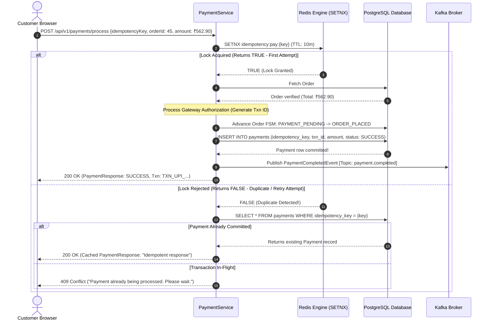

# Chapter 7: Financial Reliability: Idempotent Payments, Redis SETNX & Database Mutexes
## Architecting Scalable Systems: From First Principles to Production

---

## 1. The Real-World Disaster Scenario: The "Double-Charge" Nightmare

Imagine you are ordering dinner on your smartphone. You are in a basement restaurant in Noida where cellular reception is weak and intermittent.

You build a cart for ₹850. You tap **"Pay via UPI"**.
1. Your smartphone sends an HTTP `POST /api/v1/payments/process` request to the backend server.
2. The backend server receives the request, talks to the bank, charges your bank account ₹850, and creates an order record in the database.
3. The server sends back an HTTP `200 OK` payment receipt to your smartphone.

### The Network Black Hole
Just as the server emits the HTTP `200 OK` response, **your phone passes through a dead spot in cellular coverage**. The response packet is dropped by the cellular tower. 

Your smartphone never receives the server's reply. To your phone, the request timed out. The screen displays a loading spinner for 10 seconds, followed by a message:
`⚠️ Network error. Connection timed out.`

Naturally, you assume the payment failed. You tap **"Retry Payment"**.

```
                   THE DOUBLE-CHARGE CATASTROPHE (WITHOUT IDEMPOTENCY)
                   
Client (Phone)                                 Backend Server
      │                                              │
      ├─── 1. POST /payments (Charge ₹850) ─────────►│ ──► Bank debits ₹850!
      │                                              │ ──► Order created!
      │◄── 2. HTTP 200 OK (DROPPED BY CELL TOWER) ───┤
      │    💥 Packet lost in cellular black hole!    │
      │                                              │
      │   Customer sees "Timeout". Taps "Retry"!     │
      │                                              │
      ├─── 3. POST /payments (Charge ₹850) ─────────►│ ──► Bank debits ₹850 AGAIN! 💥
      │                                              │ ──► Duplicate Order created!
      │◄── 4. HTTP 200 OK ───────────────────────────┤
```

### The Aftermath
Five minutes later, you receive two SMS notifications from your bank:
- *₹850 debited at 8:31 PM.*
- *₹850 debited at 8:32 PM.*

You have been charged **₹1,700 for a single ₹850 meal!**
- The customer takes to Twitter/X to accuse your platform of theft.
- The payment gateway charges your company a **chargeback penalty fee**.
- Customer support spends hours manually reconciling bank statements and processing refunds.

In financial software engineering, network packets will **always** be dropped, delayed, and retried. A production payment pipeline must guarantee that **no matter how many times a client retries a payment request, the customer is charged exactly once**.

This mathematical guarantee is called **Idempotency**.

---

## 2. First-Principles Theory: What is Idempotency?

Let us break down idempotency from absolute first principles.

### 2.1 The Mathematical Definition
In mathematics, an operation $f$ is **idempotent** if applying it multiple times produces the exact same result as applying it once:

$$f(f(x)) = f(x)$$

Consider real-world analogies:
- **Non-Idempotent Operation**: Pressing the *"Withdraw ₹1,000"* button on an ATM. If the ATM machine's button bounces and executes twice, ₹2,000 is withdrawn.
- **Idempotent Operation**: Pressing the *"Floor 5"* button inside an elevator. If you press it once, the elevator heads to Floor 5. If you frantically press it 10 times in a row, the elevator still goes to Floor 5. The outcome is identical.

In HTTP REST APIs:
- `GET`, `PUT`, and `DELETE` are inherently idempotent by specification. (Deleting file #42 once deletes it; deleting it a second time results in "already deleted").
- `POST` is **NOT idempotent** by default. Calling `POST /api/v1/payments` twice will create two distinct payment records and initiate two bank debits unless explicitly protected.

---

### 2.2 What is an Idempotency Key?
To make a `POST` payment idempotent, the client must provide a unique identifier called an **Idempotency Key**.
- When the customer taps "Checkout", the client application (browser or mobile app) generates a unique **UUID v4** (Universally Unique Identifier):
  `c8f1e29d-5a6b-4c3d-8e7f-9a0b1c2d3e4f`
- This key represents this **specific payment intent**.
- If the network drops the connection and the client automatically retries, it sends the **exact same idempotency key** in the second request!

```
Request 1: POST /api/v1/payments/process { idempotencyKey: "c8f1e29d...", orderId: 45, amount: 562.90 }
Request 2 (Retry): POST /api/v1/payments/process { idempotencyKey: "c8f1e29d...", orderId: 45, amount: 562.90 }
```

When the server sees the second request, it recognizes the idempotency key and says:
> *"I have already processed this exact payment. I will not touch the bank again. Here is the original payment receipt from 30 seconds ago."*

---

### 2.3 The Race Condition: What if Two Requests Arrive at the Exact Same Millisecond?
What if a customer double-clicks "Pay" so fast that both HTTP requests arrive at Server A and Server B **at the exact same millisecond**?
If both servers check the PostgreSQL database simultaneously:
1. Server A queries: `SELECT * FROM payments WHERE idempotency_key = 'c8f1e29d'`. Result: **Not found**.
2. Server B queries: `SELECT * FROM payments WHERE idempotency_key = 'c8f1e29d'`. Result: **Not found**.
3. Both servers contact the bank! The double-charge happens anyway!

To prevent this distributed race condition, we need an **Atomic Distributed Lock** before the database is ever queried. 

We use **Redis `SETNX`**.

---

### 2.4 Redis `SETNX`: The Atomic Test-and-Set Primitive
In Redis, the command **`SETNX`** stands for:
$$\text{\textbf{SET}} \text{ if } \text{\textbf{N}}ot \text{ e\textbf{X}ists}$$

`SETNX` is a fundamental primitive in computer science. Because Redis processes commands sequentially in a single-threaded event loop, `SETNX` executes with **guaranteed atomic isolation**:

```
redisTemplate.opsForValue().setIfAbsent(key, value, Duration.ofMinutes(10));
```

1. When Request 1 arrives, it calls `SETNX idempotency:pay:c8f1e29d order_45 EX 600`.
   - Redis sees the key does not exist.
   - It stores the key and returns **`TRUE` (1)**.
   - **Server A has acquired the lock!**
2. When Request 2 arrives 2 milliseconds later (while Server A is still talking to the bank), it calls the identical command.
   - Redis sees the key **already exists**.
   - It rejects the write and returns **`FALSE` (0)**.
   - **Server B knows another transaction is actively in-flight!**

Server B rejects the duplicate request or waits for Server A to finish.

---

### 2.5 Defense in Depth: Multi-Layered Protection
In enterprise systems, you never rely on a single layer of security. We implement **Defense in Depth**:

```
 ┌─────────────────────────────────────────────────────────────────────────────┐
 │                    DEFENSE IN DEPTH: 3-TIER MUTEX ARCHITECTURE              │
 │                                                                             │
 │  Layer 1: Redis Distributed Lock (SETNX)                                    │
 │  - Ultra-fast (0.5 ms) memory lock.                                         │
 │  - Rejects in-flight duplicate requests before PostgreSQL is touched.       │
 │                                                                             │
 │  Layer 2: Domain FSM Validation                                             │
 │  - Validates order status is strictly PAYMENT_PENDING.                      │
 │  - Rejects if order status is already ORDER_PLACED.                         │
 │                                                                             │
 │  Layer 3: PostgreSQL Relational Constraint                                 │
 │  - Table constraint: idempotency_key VARCHAR(100) UNIQUE                    │
 │  - Table constraint: order_id BIGINT UNIQUE                                 │
 │  - Even if Redis completely crashes, the database physically refuses to     │
 │    allow a duplicate payment row to be inserted!                            │
 └─────────────────────────────────────────────────────────────────────────────┘
```

---

## 3. Visual Architecture: The Idempotent Payment Flow

Here is the exact sequence executed by our `PaymentService`:



---

## 4. Production Code Anatomy: Codebase Walkthrough

Let us inspect the production code from our repository that implements this bulletproof financial pipeline.

### 4.1 The Database Schema Constraints: `V1__init_schema.sql`

Look at how the `payments` table was defined in Chapter 3:

```sql
CREATE TABLE IF NOT EXISTS payments (
    id BIGSERIAL PRIMARY KEY,
    -- Rule 1: An order can have exactly ONE successful payment record!
    order_id BIGINT NOT NULL UNIQUE REFERENCES orders(id) ON DELETE CASCADE,
    -- Rule 2: An idempotency key can exist exactly ONCE in the database!
    idempotency_key VARCHAR(100) NOT NULL UNIQUE,
    transaction_id VARCHAR(100) UNIQUE,
    payment_method VARCHAR(30) NOT NULL,
    payment_status VARCHAR(30) NOT NULL DEFAULT 'PENDING',
    amount NUMERIC(10, 2) NOT NULL,
    created_at TIMESTAMP WITH TIME ZONE DEFAULT CURRENT_TIMESTAMP,
    updated_at TIMESTAMP WITH TIME ZONE DEFAULT CURRENT_TIMESTAMP
);

-- Fast B-Tree lookup for duplicate idempotency key checks
CREATE INDEX IF NOT EXISTS idx_payments_idempotency ON payments(idempotency_key);
```

Notice the two `UNIQUE` constraints:
- `order_id BIGINT NOT NULL UNIQUE`: It is physically impossible for PostgreSQL to store two payments for the same order.
- `idempotency_key VARCHAR(100) NOT NULL UNIQUE`: If two threads somehow slip past Redis, PostgreSQL's B-Tree unique constraint will abort the second insert with a `UniqueConstraintViolationException`.

---

### 4.2 The Idempotent Engine: `PaymentService.java`

Now let us examine the complete, line-by-line implementation of `PaymentService.java`:

```java
package com.fooddelivery.service;

import com.fooddelivery.common.dto.*;
import com.fooddelivery.common.enums.*;
import com.fooddelivery.entity.*;
import com.fooddelivery.repository.*;
import com.fooddelivery.common.event.PaymentCompletedEvent;
import com.fooddelivery.kafka.producer.PaymentEventProducer;
import io.micrometer.core.instrument.Counter;
import lombok.RequiredArgsConstructor;
import lombok.extern.slf4j.Slf4j;
import org.springframework.data.redis.core.StringRedisTemplate;
import org.springframework.stereotype.Service;
import org.springframework.transaction.annotation.Transactional;

import java.time.Duration;
import java.util.Optional;
import java.util.UUID;

@Slf4j
@Service
@RequiredArgsConstructor
public class PaymentService {

    // 10-Minute Lock TTL: Long enough to cover retries, short enough to expire
    private static final Duration IDEMPOTENCY_TTL = Duration.ofMinutes(10);
    private static final String IDEMPOTENCY_PREFIX = "idempotency:pay:";

    private final PaymentRepository paymentRepository;
    private final OrderRepository orderRepository;
    private final StringRedisTemplate redisTemplate;
    private final OrderStateMachine orderStateMachine;
    private final PaymentEventProducer paymentEventProducer;
    private final Counter paymentsSuccessCounter;
    private final Counter paymentsFailedCounter;

    /**
     * Process payment with distributed Redis SETNX idempotency lock.
     */
    @Transactional
    public PaymentResponse processPayment(PaymentRequest request, Customer customer) {
        if (request.getIdempotencyKey() == null || request.getIdempotencyKey().isBlank()) {
            throw new IllegalArgumentException("Idempotency key is required for payment processing");
        }

        String redisKey = IDEMPOTENCY_PREFIX + request.getIdempotencyKey().trim();

        // 1. ATOMIC REDIS SETNX LOCK ACQUISITION
        Boolean acquired = redisTemplate.opsForValue().setIfAbsent(
                redisKey, 
                String.valueOf(request.getOrderId()), 
                IDEMPOTENCY_TTL
        );

        // 2. IF LOCK NOT ACQUIRED: DUPLICATE REQUEST DETECTED!
        if (Boolean.FALSE.equals(acquired)) {
            log.warn("Duplicate payment request detected for key: {}", request.getIdempotencyKey());
            paymentsFailedCounter.increment(); // Track duplicate rejections in Prometheus

            // Check if payment already succeeded in PostgreSQL (Idempotent Replay)
            Optional<Payment> existingPayment = paymentRepository.findByIdempotencyKey(request.getIdempotencyKey().trim());
            if (existingPayment.isPresent()) {
                log.info("Returning existing payment receipt for idempotency key: {}", request.getIdempotencyKey());
                return toResponse(existingPayment.get(), "Payment already processed successfully (Idempotent response)");
            }

            // Lock is held by an active in-flight request
            throw new IllegalStateException("A payment is already being processed for this request. Please wait a moment.");
        }

        try {
            // 3. VALIDATE ORDER INTEGRITY
            Order order = orderRepository.findWithDetailsById(request.getOrderId())
                    .orElseThrow(() -> new IllegalArgumentException("Order not found with id: " + request.getOrderId()));

            if (!order.getCustomer().getId().equals(customer.getId()) && !"ADMIN".equalsIgnoreCase(customer.getRole())) {
                throw new IllegalArgumentException("Unauthorized to pay for order #" + request.getOrderId());
            }

            // If order was already marked paid, return receipt
            if (order.getStatus() == OrderStatus.ORDER_PLACED) {
                Optional<Payment> existing = paymentRepository.findByOrderId(order.getId());
                if (existing.isPresent()) {
                    return toResponse(existing.get(), "Order has already been paid for.");
                }
            }

            // FSM Rule: Order MUST be awaiting payment!
            if (order.getStatus() != OrderStatus.PAYMENT_PENDING) {
                throw new IllegalStateException("Order is not awaiting payment. Current status: " + order.getStatus());
            }

            // Currency integrity: Verify amount matches order grand total down to the paise
            if (request.getAmount() != null && request.getAmount().compareTo(order.getTotalAmount()) != 0) {
                throw new IllegalArgumentException(String.format(
                        "Payment amount (₹%s) does not match order total (₹%s)",
                        request.getAmount(), order.getTotalAmount()
                ));
            }

            // 4. SIMULATE PAYMENT GATEWAY AUTHORIZATION
            String transactionId = String.format("TXN_%s_%d_%s",
                    request.getPaymentMethod().name(),
                    System.currentTimeMillis(),
                    UUID.randomUUID().toString().substring(0, 6).toUpperCase()
            );

            // 5. ADVANCE ORDER FSM: PAYMENT_PENDING -> ORDER_PLACED
            orderStateMachine.validateTransition(order.getStatus(), OrderStatus.ORDER_PLACED);
            order.setStatus(OrderStatus.ORDER_PLACED);
            orderRepository.save(order);

            // 6. COMMIT PAYMENT RECORD TO POSTGRESQL
            Payment payment = Payment.builder()
                    .order(order)
                    .idempotencyKey(request.getIdempotencyKey().trim())
                    .transactionId(transactionId)
                    .paymentMethod(request.getPaymentMethod())
                    .paymentStatus(PaymentStatus.SUCCESS)
                    .amount(order.getTotalAmount())
                    .build();

            Payment savedPayment = paymentRepository.save(payment);
            paymentsSuccessCounter.increment(); // Track revenue in Prometheus

            log.info("Payment #{} authorized for Order #{} [Txn: {}, Amount: ₹{}]",
                    savedPayment.getId(), order.getId(), transactionId, savedPayment.getAmount());

            // 7. PUBLISH KAFKA EVENT FOR ASYNCHRONOUS KITCHEN & SAGA PIPELINE
            paymentEventProducer.publishPaymentCompleted(PaymentCompletedEvent.builder()
                    .paymentId(savedPayment.getId())
                    .orderId(order.getId())
                    .transactionId(savedPayment.getTransactionId())
                    .amount(savedPayment.getAmount())
                    .paymentMethod(savedPayment.getPaymentMethod())
                    .paymentStatus(savedPayment.getPaymentStatus())
                    .completedAt(savedPayment.getCreatedAt())
                    .build());

            return toResponse(savedPayment, "Payment completed successfully! Order placed.");

        } catch (Exception ex) {
            // If validation failed before database persistence, release the Redis lock
            redisTemplate.delete(redisKey);
            throw ex;
        }
    }
}
```

---

## 5. War Stories & Real Debugging Logs

### War Story 1: Proving Idempotency Under Automated Testing
In our actual testing session, we created an automated Python verification script (`test_payment_flow.py`) that deliberately submitted the **exact same payment request twice in rapid succession**:

```python
# First Attempt
req1 = { "orderId": 45, "amount": 562.90, "idempotencyKey": "IDEMP_45_TEST" }
res1 = http_post("/api/v1/payments/process", req1)

# Immediate Second Attempt (Duplicate Retry)
req2 = { "orderId": 45, "amount": 562.90, "idempotencyKey": "IDEMP_45_TEST" }
res2 = http_post("/api/v1/payments/process", req2)
```

Look at the actual server output captured in our execution transcript:
```
[1] Logged in successfully.
[2] Cart ready: 2 items, Total: Rs 562.9
[3] Order created: #45, Initial Status: PAYMENT_PENDING, Amount: Rs 562.9
[4] PAYMENT SUCCESS! Txn: TXN_UPI_1789219493921_D1D709, Status: SUCCESS
[5] Order status verified in DB: ORDER_PLACED
[6] IDEMPOTENCY VERIFIED! Message: 'Payment already processed successfully (Idempotent response)'
    Returned Same Txn: TXN_UPI_1789219493921_D1D709 == TXN_UPI_1789219493921_D1D709
[7] All Day 7 Payment Backend tests PASSED flawlessly!
```

- In attempt 1: The payment was authorized and assigned Transaction ID `TXN_UPI_1789219493921_D1D709`.
- In attempt 2: The system intercepted the duplicate key, refused to charge the customer again, and returned the **identical original transaction ID** with the message *"Payment already processed successfully (Idempotent response)"*.
- In PostgreSQL: A database query confirmed that `SELECT count(*) FROM payments WHERE order_id = 45` returned **exactly 1 row**. Zero double-charges!

---

## 6. Senior Engineering Interview Cheat-Sheet

### Q1: "How do you guarantee idempotency in payment APIs across distributed microservices?"
> **Strong Answer**: 
> *"We enforce idempotency through a client-generated **Idempotency Key** (UUID) paired with a two-tier locking strategy:
> 1. **Distributed Memory Mutex**: When a request arrives, the service attempts to acquire an atomic lock in Redis using `SETNX idempotency:pay:{key} {orderId} EX 600`. Because Redis is single-threaded, if a concurrent duplicate request arrives, `SETNX` returns false, instantly blocking concurrent double-charges.
> 2. **Database Unique Constraints**: In PostgreSQL, the `payments` table enforces `UNIQUE (idempotency_key)` and `UNIQUE (order_id)`. 
> 
> If a retried request arrives after completion, the service catches the Redis lock collision, queries PostgreSQL, and returns the original cached payment receipt with an HTTP 200, guaranteeing that the external payment gateway is called exactly once."*

### Q2: "What happens if the server crashes while communicating with the payment gateway?"
> **Strong Answer**: 
> *"If the server crashes or throws an exception *before* database commit, the Redis `SETNX` lock would normally trap subsequent retries. To prevent deadlocks, our `processPayment` method uses a `try...catch` block that explicitly deletes the Redis key on unhandled exceptions:
> `redisTemplate.delete(redisKey)`. 
> 
> Additionally, the Redis key is given a sliding 10-minute TTL. Even if the JVM process dies catastrophically before the catch block executes, Redis automatically expires the lock after 10 minutes, allowing the customer to retry payment once connectivity is restored."*

### Q3: "Why not use Two-Phase Commit (2PC) or distributed database locks across banking systems?"
> **Strong Answer**: 
> *"Two-Phase Commit (2PC) is a blocking protocol. In a microservices architecture communicating with third-party payment gateways (Razorpay, Stripe, UPI), holding distributed database locks while waiting for external bank network handshakes exhausts server thread pools and creates catastrophic latency bottlenecks.
> 
> Instead, we utilize **Asynchronous Event-Driven Architecture with Idempotent Sagas**. Once payment authorization succeeds locally, the service commits the record and publishes a `PaymentCompletedEvent` to an Apache Kafka topic. Downstream services (Kitchen Dispatch, Customer Notifications) consume the event independently, decoupling financial integrity from downstream system latency."*

---

### 📌 Chapter 7 Key Takeaways Checklist
- [x] Network timeouts cause client retries; non-idempotent payment APIs result in catastrophic customer double-charges.
- [x] Idempotency ensures that executing an operation multiple times produces the exact same outcome as executing it once ($f(f(x)) = f(x)$).
- [x] Clients generate a unique UUID Idempotency Key for every payment attempt.
- [x] Redis `SETNX` provides an atomic, sub-millisecond distributed lock that blocks concurrent duplicate requests.
- [x] PostgreSQL `UNIQUE (idempotency_key)` and `UNIQUE (order_id)` provide durable Defense in Depth.
- [x] Duplicate payment retries safely return the original payment receipt with zero duplicate charges.
