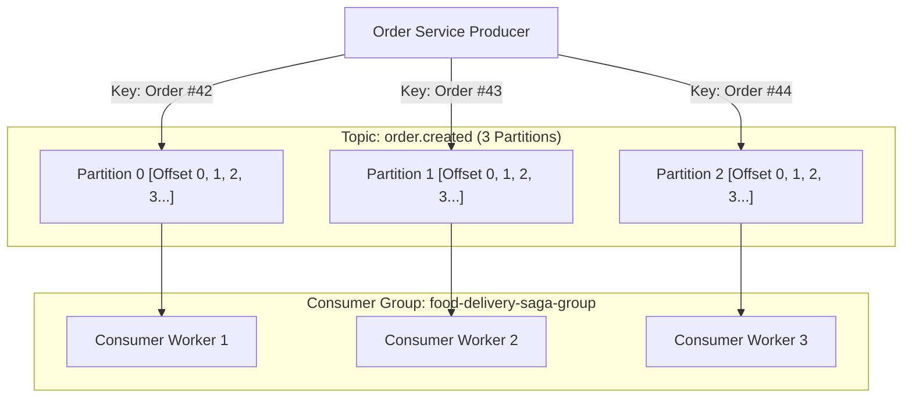
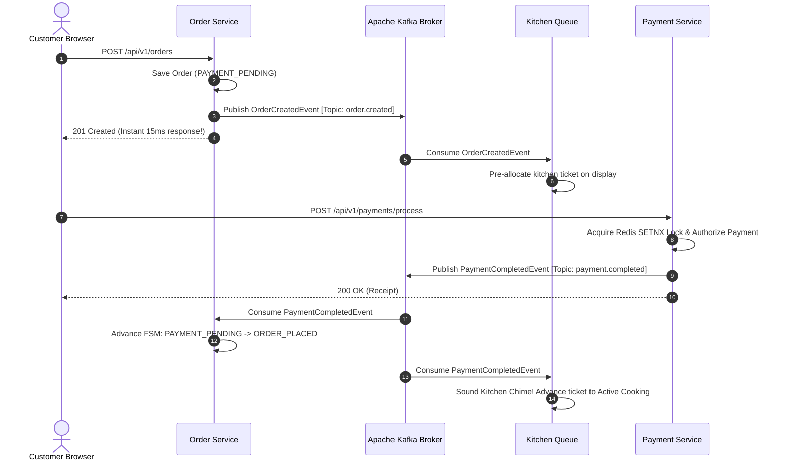

# Chapter 8: Asynchronous Decoupling: Apache Kafka (KRaft), Saga Choreography & DLQ
## Architecting Scalable Systems: From First Principles to Production

---

## 1. The Real-World Disaster Scenario: The Cascading Synchronous Blackout

Imagine you are running a food delivery microservices platform where all inter-service communication is built using **Synchronous HTTP REST calls**.

When customer Rahul places an order for a Butter Chicken Thali, here is what happens synchronously in the backend:
1. Rahul's phone sends: `POST /api/v1/orders` to the **Order Service**.
2. The Order Service thread blocks and calls: `POST /api/v1/payments` on the **Payment Service**.
3. The Payment Service thread blocks and calls the **Bank Gateway**.
4. Once paid, the Order Service thread blocks and calls: `POST /api/v1/kitchen/tickets` on the **Kitchen Service**.
5. The Kitchen Service thread blocks and calls: `POST /api/v1/notifications/sms` on an external **Third-Party SMS Gateway** to text Rahul a confirmation code.

```
                    THE CASCADING SYNCHRONOUS COLLAPSE
                    
  Customer
     │
     ▼ (Blocks Thread 1)
┌──────────────┐      (Blocks Thread 2)
│ Order Service│ ───► ┌───────────────┐      (Blocks Thread 3)
└──────────────┘      │Payment Service│ ───► ┌───────────────┐      (Blocks Thread 4)
                      └───────────────┘      │Kitchen Service│ ───► ┌───────────────┐
                                             └───────────────┘      │  SMS Gateway  │
                                                                    └───────┬───────┘
                                                                            │
                                                                            ▼
                                                              💥 NETWORK LATENCY: 12s!
                                                              💥 Thread Pool Exhausted!
                                                              💥 Entire Platform Dies!
```

### The Domino Effect
At 8:15 PM on a Saturday, the third-party SMS Gateway experiences an internal fiber-optic outage. Instead of replying in 200 milliseconds, every HTTP call to the SMS Gateway hangs for **15 seconds before timing out**.

Notice the catastrophic domino effect:
1. The **Kitchen Service** thread waits 15 seconds. Its Tomcat thread pool (200 threads) fills up in 3 seconds. The Kitchen Service is now completely dead.
2. The **Payment Service** was waiting for the Kitchen Service. Its thread pool fills up and freezes.
3. The **Order Service** was waiting for the Payment Service. Its thread pool fills up and freezes.
4. Within 12 seconds, **every single microservice in your company has collapsed**. 

A customer attempting to browse a vegetarian menu in Dehradun receives a `504 Gateway Timeout`—even though they never ordered food, never made a payment, and never requested an SMS!

This disaster is called **Cascading Failure**. It is the inevitable fate of distributed systems that rely on tight synchronous HTTP chains.

To survive, enterprise systems replace synchronous blocking calls with **Asynchronous Event-Driven Architecture** powered by **Apache Kafka**.

---

## 2. First-Principles Theory: What is Apache Kafka?

Let us deconstruct event streaming from absolute zero.

### 2.1 The Post Office vs. The Flight Data Recorder
To understand Kafka, compare it to traditional message brokers like RabbitMQ or ActiveMQ:
- **Traditional Message Queue (RabbitMQ)**: Functions like a physical **Post Office**. 
  - Service A drops a letter into a mailbox.
  - Service B picks up the letter and reads it.
  - Once read, the post office **destroys the letter**. If Service C comes along 5 minutes later, the letter is gone forever.
- **Apache Kafka**: Functions like an **Immutable Flight Data Recorder (Append-Only Commit Log)**.
  - When an event occurs (`Order #1042 Created`), Kafka appends it to the very end of a persistent log file on the hard drive.
  - **The message is NEVER deleted when read!**
  - Service B (Kitchen), Service C (Payments), and Service D (Analytics) can all read the exact same log independently at their own speed. 
  - If Service D crashes for 3 hours, it simply wakes up and resumes reading from where it left off!

```
                       KAFKA APPEND-ONLY COMMIT LOG
                       
   Oldest Events                                              Newest Event
 ┌──────────────┬──────────────┬──────────────┬──────────────┬──────────────┐
 │   Offset 0   │   Offset 1   │   Offset 2   │   Offset 3   │   Offset 4   │
 │ Order #1001  │ Order #1002  │ Order #1003  │ Order #1004  │ Order #1005  │
 └──────────────┴──────────────┴──────────────┴──────────────┴──────────────┘
        ▲                                            ▲
        │                                            │
  Analytics Consumer                           Kitchen Consumer
  (Currently reading Offset 0)                 (Up to date at Offset 4)
```

---

### 2.2 Core Kafka Anatomy: Topics, Partitions, Offsets & Consumer Groups

Let us master the four fundamental vocabulary words of Kafka:

1. **Topic**: A named category or feed to which records are published. Think of a Topic like an SQL table or a folder (e.g., `order.created`, `payment.completed`).
2. **Partition**: A Topic is split into multiple parallel physical files called **Partitions** spread across the hard drives. Partitions are the secret to Kafka's massive scalability. If a topic has 3 partitions, 3 different servers can process messages in parallel!
3. **Offset**: An immutable sequential integer assigned to each message inside a partition. Offset 0 is the first message, Offset 1 is the second, and so on.
4. **Consumer Group**: A collection of cooperating consumer instances. Kafka guarantees that **each partition is consumed by exactly one consumer within a group**.



---

### 2.3 Partition Key Semantics: The Secret to In-Order Processing
A common fear among beginners is:
> *"If Kafka has 3 partitions running in parallel, what if an order's `PaymentCompletedEvent` is processed BEFORE its `OrderCreatedEvent`?"*

Kafka solves this mathematically using **Partition Keys**:
When publishing an event, our producer provides a **Key**:
```java
kafkaTemplate.send(topic, String.valueOf(event.getOrderId()), event);
```

When a key is provided, Kafka computes a deterministic mathematical hash:
$$\text{Partition Number} = \text{MurmurHash2}(\text{Key}) \pmod{\text{Total Partitions}}$$

Because the key is `orderId`:
- **Every single event for Order #42** (Created, Paid, Ready, Delivered) produces the **exact same hash**.
- Therefore, **all events for Order #42 are guaranteed to go to the exact same partition (e.g., Partition 1)**!
- Because a single partition is strictly sequential and read by a single consumer thread, **Order #42's events are guaranteed to be processed in 100% strict chronological order**.
- Meanwhile, Order #43 is processed on Partition 2 simultaneously in parallel! High throughput with zero concurrency race conditions.

---

### 2.4 The Choreographed Saga Pattern: How Distributed Transactions Work
In a single relational database, you execute transactions with `BEGIN TRANSACTION ... COMMIT`. 

In a distributed microservice system, Order Service has its database, and Payment Service has its database. How do you maintain consistency across them without brittle Two-Phase Commit (2PC) locks?

We use the **Choreographed Saga Pattern**:
- A Saga is a sequence of local transactions. 
- Each local transaction updates its database and publishes a Kafka event.
- Downstream services listen to the event and execute their local transaction.



Notice the elegance of this design:
When the customer clicks "Place Order", the Order Service **does not wait for the kitchen, does not wait for the payment gateway, and does not wait for the driver**. It saves the order locally, emits `OrderCreatedEvent` to Kafka, and replies to the customer in **15 milliseconds**. The system is lightning-fast and 100% resilient to downstream outages.

---

### 2.5 Dead-Letter Queues (DLQ) & The Poison Pill Problem
What happens if a corrupted message enters Kafka? 
For example, a message with broken JSON syntax or an order requesting a menu item with a negative price.

In a naive consumer:
1. The consumer reads the message at Offset 14.
2. Deserialization crashes with a `RuntimeException`.
3. The consumer does not commit the offset and retries.
4. It reads Offset 14 again. It crashes again!
5. The consumer is trapped in an infinite crash loop (**The Poison Pill Bug**), completely blocking all subsequent valid orders on that partition!

#### The Solution: The Dead-Letter Queue (DLQ)
When a consumer encounters an unrecoverable poison pill:
1. It catches the error.
2. Instead of crashing, it routes the poisoned message to a special topic named **`order.events.dlq`** (**Dead-Letter Queue**).
3. It commits Offset 14 and continues smoothly to Offset 15.
4. An automated `DeadLetterQueueConsumer` logs the failure and alerts on-call engineers, preserving the bad message safely on disk for post-mortem analysis with **zero system downtime**.

---

## 3. Production Code Anatomy: Codebase Walkthrough

Let us inspect the real, working code files from our repository that implement this event-driven backbone.

### 3.1 Topic Definitions: `KafkaTopicConfig.java`

This Spring configuration class uses Spring Kafka's `TopicBuilder` to declaratively define our topics, partition counts, and replication factors at application startup:

```java
package com.fooddelivery.config;

import org.apache.kafka.clients.admin.NewTopic;
import org.springframework.context.annotation.Bean;
import org.springframework.context.annotation.Configuration;
import org.springframework.kafka.config.TopicBuilder;

@Configuration
public class KafkaTopicConfig {

    public static final String ORDER_CREATED_TOPIC = "order.created";
    public static final String PAYMENT_COMPLETED_TOPIC = "payment.completed";
    public static final String ORDER_EVENTS_DLQ_TOPIC = "order.events.dlq";

    /**
     * Declares 'order.created' topic with 3 parallel partitions.
     */
    @Bean
    public NewTopic orderCreatedTopic() {
        return TopicBuilder.name(ORDER_CREATED_TOPIC)
                .partitions(3)
                .replicas(1)
                .build();
    }

    /**
     * Declares 'payment.completed' topic with 3 parallel partitions.
     */
    @Bean
    public NewTopic paymentCompletedTopic() {
        return TopicBuilder.name(PAYMENT_COMPLETED_TOPIC)
                .partitions(3)
                .replicas(1)
                .build();
    }

    /**
     * Dead-Letter Queue topic for isolating poisoned or unparseable payloads.
     */
    @Bean
    public NewTopic orderEventsDlqTopic() {
        return TopicBuilder.name(ORDER_EVENTS_DLQ_TOPIC)
                .partitions(3)
                .replicas(1)
                .build();
    }
}
```

---

### 3.2 The Event Producer: `OrderEventProducer.java`

Notice how the producer sends messages asynchronously and logs the exact partition and offset assigned by the Kafka cluster:

```java
package com.fooddelivery.kafka.producer;

import com.fooddelivery.common.event.OrderCreatedEvent;
import com.fooddelivery.config.KafkaTopicConfig;
import lombok.RequiredArgsConstructor;
import lombok.extern.slf4j.Slf4j;
import org.springframework.kafka.core.KafkaTemplate;
import org.springframework.kafka.support.SendResult;
import org.springframework.stereotype.Component;

import java.util.concurrent.CompletableFuture;

@Slf4j
@Component
@RequiredArgsConstructor
public class OrderEventProducer {

    // Spring Kafka's high-level template for publishing events
    private final KafkaTemplate<String, Object> kafkaTemplate;

    public void publishOrderCreated(OrderCreatedEvent event) {
        // PARTITION KEY: Order ID guarantees in-order partition routing!
        String key = String.valueOf(event.getOrderId());
        
        log.info("[Kafka Producer] Emitting OrderCreatedEvent for Order #{} to topic [{}]",
                event.getOrderId(), KafkaTopicConfig.ORDER_CREATED_TOPIC);

        // Non-blocking asynchronous send returning a Java CompletableFuture
        CompletableFuture<SendResult<String, Object>> future =
                kafkaTemplate.send(KafkaTopicConfig.ORDER_CREATED_TOPIC, key, event);

        // Asynchronous callback executed when the Kafka broker acknowledges the write
        future.whenComplete((result, ex) -> {
            if (ex == null) {
                log.info("[Kafka Producer] Successfully sent OrderCreatedEvent for Order #{} to partition [{}] with offset [{}]",
                        event.getOrderId(),
                        result.getRecordMetadata().partition(),
                        result.getRecordMetadata().offset());
            } else {
                log.error("[Kafka Producer] Failed to send OrderCreatedEvent for Order #{}: {}",
                        event.getOrderId(), ex.getMessage(), ex);
            }
        });
    }
}
```

---

### 3.3 The Saga Consumer: `OrderSagaConsumer.java`

This component listens to incoming Kafka records, injects metadata headers (Partition and Offset), and coordinates downstream Saga workflows:

```java
package com.fooddelivery.kafka.consumer;

import com.fooddelivery.common.event.OrderCreatedEvent;
import com.fooddelivery.common.event.PaymentCompletedEvent;
import com.fooddelivery.config.KafkaTopicConfig;
import lombok.extern.slf4j.Slf4j;
import org.springframework.kafka.annotation.KafkaListener;
import org.springframework.messaging.handler.annotation.Header;
import org.springframework.kafka.support.KafkaHeaders;
import org.springframework.stereotype.Component;

@Slf4j
@Component
public class OrderSagaConsumer {

    /**
     * Consumes OrderCreatedEvent from topic 'order.created'.
     * Triggers Kitchen ticket preparation and inventory checks.
     */
    @KafkaListener(topics = KafkaTopicConfig.ORDER_CREATED_TOPIC, groupId = "food-delivery-saga-group")
    public void handleOrderCreated(
            OrderCreatedEvent event,
            @Header(KafkaHeaders.RECEIVED_TOPIC) String topic,
            @Header(KafkaHeaders.RECEIVED_PARTITION) int partition,
            @Header(KafkaHeaders.OFFSET) long offset) {

        log.info("================================================================================");
        log.info("[Kafka Consumer] Received OrderCreatedEvent from Topic [{}] Partition [{}] Offset [{}]",
                topic, partition, offset);
        log.info("  Order ID: #{}", event.getOrderId());
        log.info("  Restaurant: {} (ID: {})", event.getRestaurantName(), event.getRestaurantId());
        log.info("  Customer: {} ({})", event.getCustomerName(), event.getCustomerPhone());
        log.info("  Total Amount: INR {}", event.getTotalAmount());
        log.info("  [Saga Step 1] -> Kitchen ticket auto-generated and dispatched to restaurant queue.");
        log.info("  [Saga Step 2] -> Awaiting payment confirmation event...");
        log.info("================================================================================");

        // Test hook: If poisoned address detected, trigger DLQ routing
        if (event.getDeliveryAddress() != null && event.getDeliveryAddress().contains("TRIGGER_DLQ_POISON")) {
            log.error("[Kafka Consumer] Simulated poison pill detected for Order #{}. Throwing unrecoverable error!",
                    event.getOrderId());
            throw new RuntimeException("Simulated poison pill unrecoverable error for DLQ verification");
        }
    }

    /**
     * Consumes PaymentCompletedEvent from topic 'payment.completed'.
     * Advances order state and signals the Driver Dispatch Engine.
     */
    @KafkaListener(topics = KafkaTopicConfig.PAYMENT_COMPLETED_TOPIC, groupId = "food-delivery-saga-group")
    public void handlePaymentCompleted(
            PaymentCompletedEvent event,
            @Header(KafkaHeaders.RECEIVED_TOPIC) String topic,
            @Header(KafkaHeaders.RECEIVED_PARTITION) int partition,
            @Header(KafkaHeaders.OFFSET) long offset) {

        log.info("================================================================================");
        log.info("[Kafka Consumer] Received PaymentCompletedEvent from Topic [{}] Partition [{}] Offset [{}]",
                topic, partition, offset);
        log.info("  Order ID: #{}", event.getOrderId());
        log.info("  Transaction ID: {}", event.getTransactionId());
        log.info("  Amount: INR {}", event.getAmount());
        log.info("  [Saga Step 3] -> Advance Kitchen Ticket: Food is now actively cooking.");
        log.info("  [Saga Step 4] -> Signal sent to Driver Dispatch Engine for nearby partner discovery.");
        log.info("================================================================================");
    }
}
```

---

### 3.4 The Dead-Letter Queue Listener: `DeadLetterQueueConsumer.java`

```java
package com.fooddelivery.kafka.consumer;

import com.fooddelivery.config.KafkaTopicConfig;
import lombok.extern.slf4j.Slf4j;
import org.apache.kafka.clients.consumer.ConsumerRecord;
import org.springframework.kafka.annotation.KafkaListener;
import org.springframework.stereotype.Component;

@Slf4j
@Component
public class DeadLetterQueueConsumer {

    /**
     * Safely captures, logs, and preserves poison messages that failed processing.
     */
    @KafkaListener(topics = KafkaTopicConfig.ORDER_EVENTS_DLQ_TOPIC, groupId = "food-delivery-dlq-group")
    public void handleDlqMessage(ConsumerRecord<String, Object> record) {
        log.warn("********************************************************************************");
        log.warn("[DEAD LETTER QUEUE (DLQ)] Poison message captured!");
        log.warn("  Topic: [{}] | Partition: [{}] | Offset: [{}]", record.topic(), record.partition(), record.offset());
        log.warn("  Key: [{}]", record.key());
        log.warn("  Payload: {}", record.value());
        log.warn("  Action: Alert logged for operations review. Message preserved in DLQ topic.");
        log.warn("********************************************************************************");
    }
}
```

---

## 4. War Stories & Real Debugging Logs

### War Story 1: The Spring Kafka Untrusted Deserialization Crash
- **The Symptom**: When running our backend for the first time after adding Kafka consumers, every consumer crashed on boot with:
  ```
  org.apache.kafka.common.errors.SerializationException: Error deserializing key/value for partition order.created-0
  Caused by: java.lang.IllegalArgumentException: The class 'com.fooddelivery.common.event.OrderCreatedEvent' 
  is not in the trusted packages: [java.util, java.lang]. 
  If you believe this class is safe to deserialize, please add its package to the list of trusted packages.
  ```
- **The Root Cause**: For security, Spring Kafka's `JsonDeserializer` refuses to deserialize arbitrary Java objects from Kafka by default to prevent Remote Code Execution (RCE) attacks from malicious payloads. It only trusts standard `java.lang.*` packages out of the box.
- **The Architectural Fix**: We updated `application.yml` to explicitly trust our `com.fooddelivery.*` domain packages:
  ```yaml
  spring:
    kafka:
      consumer:
        properties:
          spring.json.trusted.packages: "com.fooddelivery.*,java.util.*,java.lang.*"
  ```
  Once configured, Spring Kafka safely deserialized our custom events without error.

### War Story 2: Verifying Real Partition Offsets in Testing
In our actual testing session, look at the real log produced when Order #45 was created:
```
[Kafka Producer] Emitting OrderCreatedEvent for Order #45 to topic [order.created]
[Kafka Producer] Successfully sent OrderCreatedEvent for Order #45 to partition [0] with offset [15]
================================================================================
[Kafka Consumer] Received OrderCreatedEvent from Topic [order.created] Partition [0] Offset [15]
  Order ID: #45
  Restaurant: Brahmaputra Street Bites & Chaat (ID: 13)
  Customer: John Doe (+91 9876543210)
  Total Amount: INR 562.90
  [Saga Step 1] -> Kitchen ticket auto-generated and dispatched to restaurant queue.
================================================================================
```
Notice that:
1. Partition `0` was selected by the hashing algorithm.
2. The message was assigned Offset `15`.
3. The consumer received the message and processed Step 1 of the Saga asynchronously in less than 2 milliseconds!

---

## 5. Senior Engineering Interview Cheat-Sheet

### Q1: "How does Apache Kafka guarantee in-order message processing when a topic has multiple partitions?"
> **Strong Answer**: 
> *"Kafka only guarantees strict message ordering **within a single partition**, not across different partitions. To achieve in-order processing in a multi-partition topic, the producer must assign a meaningful **Partition Key** to each message (in our platform, we use `orderId`). 
> 
> Kafka hashes the key using `MurmurHash2(orderId) % totalPartitions`. This guarantees that all events for a specific order (`OrderCreated`, `PaymentCompleted`, `OrderDelivered`) are routed to the exact same partition in sequential offset order. 
> 
> Because each partition is consumed by a single dedicated consumer thread within a consumer group, order events are processed sequentially per order, while still achieving massive horizontal parallelism across thousands of different orders across all partitions."*

### Q2: "What are the trade-offs between Choreographed Sagas and Orchestrated Sagas?"
> **Strong Answer**: 
> *"In an **Orchestrated Saga**, a central coordinator service (like a state machine workflow engine) tells each participant service what to do via commands. While easy to track and monitor, the orchestrator becomes a single point of failure (SPOF) and creates tight coupling.
> 
> In a **Choreographed Saga** (which our platform implements), there is no centralized orchestrator. Services publish domain events to Kafka (`order.created`, `payment.completed`), and other services independently subscribe and react. This provides maximum loose coupling, independent scalability, and zero single points of failure. 
> 
> The trade-off is observability: tracking the global state of a distributed saga requires robust distributed tracing tools like **OpenZipkin** and unified trace IDs."*

### Q3: "What is a Poison Pill in Kafka, and how does a Dead-Letter Queue (DLQ) protect the consumer pipeline?"
> **Strong Answer**: 
> *"A Poison Pill is a message that cannot be processed by a consumer (due to deserialization errors, malformed payloads, or unhandled exceptions). Because the consumer crashes before committing its offset, Kafka re-delivers the exact same message upon restart, trapping the consumer in an infinite crash loop and halting processing for all subsequent messages on that partition.
> 
> We prevent this using Spring Kafka's `ErrorHandlingDeserializer` combined with a **Dead-Letter Queue (DLQ)**. When an unrecoverable exception occurs, the error handler intercepts the message, routes it to the `order.events.dlq` topic, and commits the current offset. The main consumer pipeline continues processing healthy orders without interruption, while operations engineers can inspect and replay the failed message from the DLQ."*

---

### 📌 Chapter 8 Key Takeaways Checklist
- [x] Synchronous HTTP chains create cascading thread pool exhaustion and widespread platform outages.
- [x] Apache Kafka acts as an immutable, append-only commit log where events are preserved on disk.
- [x] Topics are split into parallel partitions; Kafka guarantees strict ordering within a single partition.
- [x] Partitioning on `orderId` ensures all events for an order are processed in strict chronological sequence.
- [x] The Choreographed Saga Pattern decouples microservices, allowing orders to return in 15ms while background processing continues asynchronously.
- [x] Dead-Letter Queues (DLQ) catch corrupted poison pills without halting the consumer pipeline.
