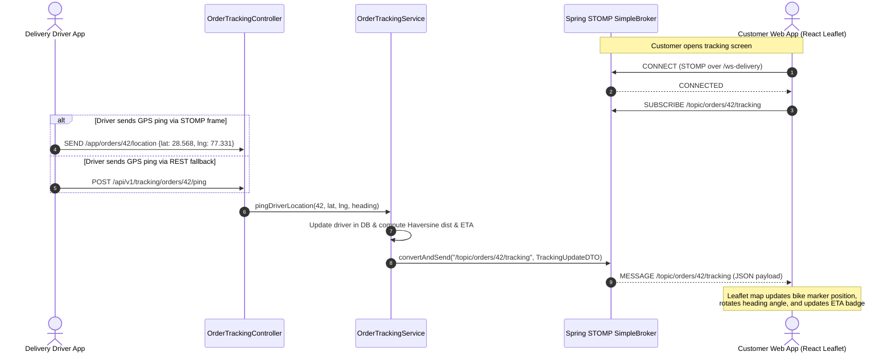
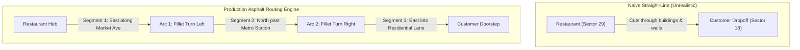

# Chapter 10: Real-Time Telemetry: STOMP WebSockets & OSRM Road Routing
## Architecting Scalable Systems: From First Principles to Production

---

## 1. The Real-World Disaster Scenario: The 100,000-Client Polling DDOS & The Flying Motorbike

It is Friday evening at 8:30 PM. 50,000 hungry customers across Noida and Dehradun have placed dinner orders on your food delivery platform. Every single customer has their mobile application open to the order tracking screen, eagerly waiting for their meal.

In your initial naive architecture, you implemented live tracking using **HTTP Polling**:
Every customer's mobile phone ran a JavaScript `setInterval()` timer that fired an HTTP `GET /api/v1/orders/{orderId}/location` request **every 1 second**.

```
                           THE HTTP POLLING CATASTROPHE
                           
  50,000 Mobile Clients                Tomcat Thread Pool (Max 200 Threads)
  ┌──────────────────┐                 ┌─────────────────────────────────────┐
  │ Customer 1 (1s)  │ ──── HTTP ────► │ Thread 1: SELECT * FROM drivers...  │
  │ Customer 2 (1s)  │ ──── HTTP ────► │ Thread 2: SELECT * FROM drivers...  │
  │ Customer 3 (1s)  │ ──── HTTP ────► │ Thread 3: SELECT * FROM drivers...  │
  │ ...              │ ──── HTTP ────► │ ... (197 threads busy)              │
  │ Customer 50,000  │ ──── HTTP ────► │ 💥 THREAD POOL DEPLETED (503 / 504) │
  └──────────────────┘                 └─────────────────────────────────────┘
        │
        ▼
  50,000 HTTP Requests / Second!
  98% of responses: "Driver has not moved" (Wasted bandwidth & battery)
```

### The Three Inherent Fatalities of HTTP Polling

1. **Self-Inflicted Denial of Service (DDOS)**:
   50,000 connected users polling every 1,000 milliseconds equals **50,000 HTTP requests per second**. Each HTTP request requires a full TCP 3-way handshake (`SYN`, `SYN-ACK`, `ACK`), TLS cryptographic negotiation, parsing of 800 bytes of HTTP request headers (cookies, user-agents, accept headers), allocating a Tomcat worker thread, and returning an HTTP 200 response with headers. Your backend servers crash under CPU exhaustion from simply parsing HTTP headers—even when the driver hasn't moved an inch!

2. **Mobile Battery & Radio Drain**:
   Mobile cellular modems (4G/5G LTE) operate in power states: *Idle*, *Low Power*, and *Full Radio Active*. An HTTP request every second forces the mobile device's baseband processor to keep the radio in high-power transmission mode 100% of the time. Within 15 minutes of tracking an order, the customer's smartphone becomes burning hot and loses 18% battery charge.

3. **The "Ghost Bike Flying Over Rooftops" (Euclidean Jump Bug)**:
   Even worse, the frontend simply drew a straight line between the driver's last reported GPS coordinate and the next coordinate. When the driver turned a street corner in Sector 18 Noida, the delivery bike marker on the customer's screen visibly **floated through apartment buildings, sliced through shopping malls, and glided over rivers**. Customers bombarded customer support complaining: *"Why is my delivery driver driving a helicopter through a brick wall?"*

To solve these two monumental problems, modern production systems discard HTTP polling completely and adopt:
1. **Full-Duplex Persistent WebSockets with STOMP Framing**: Keeping a single, lightweight TCP pipe open per client where the server pushes updates only when coordinates actually change.
2. **OSRM (Open Source Routing Machine) & Polyline Interpolation**: Snapping raw GPS coordinates strictly to asphalt street corridors with realistic curvature and heading angles.

---

## 2. First-Principles Theory: WebSockets, STOMP & Geospatial Routing

Let us build an exhaustive technical understanding from scratch.

### 2.1 HTTP vs. Polling vs. Server-Sent Events vs. WebSockets

How do web browsers and mobile apps receive live data from a backend server? There are four historical paradigms:

| Communication Model | Connection Type | Directionality | Protocol Overhead per Update | Best Use Case |
|:---|:---|:---|:---|:---|
| **Short Polling** | Ephemeral HTTP | Half-Duplex (Pull) | Massive (~800 bytes HTTP headers per ping) | Simple scripts with low frequency (e.g. check once every 10 minutes) |
| **Long Polling** | Hanging HTTP | Half-Duplex (Pull) | High (~800 bytes per round-trip) | Legacy browsers lacking WebSocket support |
| **Server-Sent Events (SSE)** | Persistent HTTP (`text/event-stream`) | Unidirectional (Server-to-Client only) | Very Low (~10 bytes) | Live stock tickers, AI streaming text (ChatGPT) where client never sends data back |
| **WebSockets (RFC 6455)** | Persistent TCP Full-Duplex | Bidirectional (Client $\leftrightarrow$ Server) | Ultra-Low (2 to 10 bytes frame header) | High-frequency telemetry, chat, collaborative editing, gaming |

#### The WebSocket Protocol (RFC 6455)
A WebSocket is **not** HTTP over a long connection. It begins with an HTTP handshake, and then immediately **upgrades the raw underlying TCP socket connection**.

1. **The Handshake**:
   The browser sends a standard HTTP request with two critical upgrade headers:
   ```http
   GET /ws-delivery HTTP/1.1
   Host: api.fooddelivery.com
   Upgrade: websocket
   Connection: Upgrade
   Sec-WebSocket-Key: dGhlIHNhbXBsZSBub25jZQ==
   Sec-WebSocket-Version: 13
   ```
2. **The Switching Protocols Response**:
   The Spring Boot server agrees to switch protocols, responding with HTTP status code `101 Switching Protocols`:
   ```http
   HTTP/1.1 101 Switching Protocols
   Upgrade: websocket
   Connection: Upgrade
   Sec-WebSocket-Accept: s3pPLMBiTxaQ9kYGzzhZRbK+xOo=
   ```
3. **The Raw TCP Tunnel**:
   From this exact millisecond forward, **HTTP is completely dead on this connection**. The TCP socket remains open indefinitely. Data is transmitted in micro-frames (as small as 2 bytes overhead) without any HTTP headers, cookies, or verb parsing.

```
                         WEBSOCKET PROTOCOL LIFECYCLE
                         
      Client (Browser / React)                 Spring Boot Backend
         │                                              │
         │ ─── 1. HTTP GET /ws-delivery (Upgrade) ────► │
         │ ◄── 2. HTTP 101 Switching Protocols ──────── │
         │                                              │
         ════════════════════════════════════════════════
               PERSISTENT FULL-DUPLEX TCP CONNECTION
         ════════════════════════════════════════════════
         │                                              │
         │ ─── 3. STOMP CONNECT Frame ────────────────► │
         │ ◄── 4. STOMP CONNECTED Frame ─────────────── │
         │                                              │
         │ ─── 5. SUBSCRIBE /topic/orders/101/tracking ► │
         │                                              │
         │     (Server pushes only when driver moves)   │
         │ ◄── 6. MESSAGE Frame: Lat: 28.567, Lng:... ─ │
         │ ◄── 7. MESSAGE Frame: Lat: 28.568, Lng:... ─ │
         │                                              │
```

---

### 2.2 What is STOMP? (Simple Text Oriented Messaging Protocol)

Raw WebSockets have a severe limitation: **They are just a bare byte pipe**.
A raw WebSocket is like an open telephone line: you can speak into it, but there are no rules about language, who is talking to whom, or how to address messages. Does this packet represent a chat message? An authentication token? A GPS coordinate? A subscription request?

To prevent every engineering team from inventing a proprietary packet format, the industry uses **STOMP (Simple Text Oriented Messaging Protocol)** over WebSockets.

STOMP defines human-readable text frames modeled after HTTP:
A frame consists of a **COMMAND**, followed by **HEADERS** (key-value pairs), a blank line, and an optional **PAYLOAD (BODY)** terminated by a null byte (`^@` or `\u0000`).

#### 1. The Client Subscribes:
```stomp
SUBSCRIBE
id:sub-0
destination:/topic/orders/101/tracking

^@
```

#### 2. The Server Broadcasts Telemetry:
```stomp
MESSAGE
subscription:sub-0
message-id:msg-9824
destination:/topic/orders/101/tracking
content-type:application/json

{
  "orderId": 101,
  "orderStatus": "OUT_FOR_DELIVERY",
  "currentLatitude": 28.5684102,
  "currentLongitude": 77.3312041,
  "headingDegrees": 42.5,
  "distanceRemainingKm": 1.4,
  "etaMinutes": 6,
  "progressPercent": 72
}
^@
```

Notice how clean this is:
The client subscribes specifically to `/topic/orders/101/tracking`. The server publishes messages to that destination. The client receives updates **instantly**, with **zero polling**, and with minimal network packet overhead.

---

### 2.3 Spring Boot's In-Memory SimpleBroker vs. External Message Broker

When configuring Spring Boot's `@EnableWebSocketMessageBroker`, you encounter the `MessageBrokerRegistry`:

```java
@Override
public void configureMessageBroker(MessageBrokerRegistry registry) {
    registry.enableSimpleBroker("/topic");
    registry.setApplicationDestinationPrefixes("/app");
}
```

What is happening under the hood?

```
                    SPRING BOOT STOMP ARCHITECTURE
                    
                         ┌──────────────────────────────────────────────┐
                         │              Spring Application              │
                         │                                              │
  Client 1 ── STOMP ───► │ ┌──────────────┐      ┌────────────────────┐ │
  (Customer)             │ │  Inbound     │ ───► │ @MessageMapping    │ │
                         │ │  Channel     │      │ Controller Methods │ │
  Client 2 ── STOMP ───► │ └──────────────┘      └─────────┬──────────┘ │
  (Driver)               │                                 │            │
                         │                                 ▼            │
                         │                       SimpMessagingTemplate  │
                         │                                 │            │
                         │                                 ▼            │
                         │ ┌──────────────────────────────────────────┐ │
                         │ │            SimpleBroker                  │ │
                         │ │ (ConcurrentHashMap of Subscriptions)     │ │
                         │ └──────────────────────┬───────────────────┘ │
                         │                        │                     │
                         │                        ▼                     │
  Client 1 ◄── STOMP ────┼──────────────── Outbound Channel             │
                         │                                              │
                         └──────────────────────────────────────────────┘
```

1. **`setApplicationDestinationPrefixes("/app")`**:
   Messages sent by clients targeting destinations starting with `/app` (such as `/app/orders/101/location`) are routed to Spring controller methods annotated with `@MessageMapping`.
2. **`enableSimpleBroker("/topic")`**:
   Spring maintains an internal, thread-safe in-memory routing table (`ConcurrentHashMap`) mapping subscription destinations (e.g., `/topic/orders/101/tracking`) to connected WebSocket client sessions. When your service calls `messagingTemplate.convertAndSend("/topic/orders/101/tracking", payload)`, Spring's broker loops through only the sessions subscribed to that specific topic and writes the STOMP frame directly onto their TCP sockets.

> [!NOTE]
> In a single-instance deployment, Spring's built-in `SimpleBroker` delivers ultra-fast, zero-overhead routing. In horizontally scaled production clusters with multiple servers behind an ALB, you replace `enableSimpleBroker` with `enableStompBrokerRelay` backed by RabbitMQ or an active message bus so that a driver connected to Server A can broadcast to a customer connected to Server B.

---

### 2.4 Geospatial Mathematics: Haversine Distance, Bearing & Curve Interpolation

To deliver an elite user experience like Swiggy, Uber, or Zomato, raw GPS pings are not enough. You must understand the mathematical physics of navigation.

#### 1. The Haversine Distance Formula
Earth is an oblate spheroid, not a flat 2D plane. Calculating distance between two GPS coordinates $(\phi_1, \lambda_1)$ and $(\phi_2, \lambda_2)$ using Euclidean Pythagorean geometry ($d = \sqrt{\Delta x^2 + \Delta y^2}$) causes massive distortions because lines of longitude converge at the poles.

Instead, we use the **Haversine Formula**, which calculates the great-circle distance over the sphere's surface:

$$\Delta\phi = \phi_2 - \phi_1, \quad \Delta\lambda = \lambda_2 - \lambda_1$$

$$a = \sin^2\left(\frac{\Delta\phi}{2}\right) + \cos(\phi_1)\cos(\phi_2)\sin^2\left(\frac{\Delta\lambda}{2}\right)$$

$$c = 2 \cdot \text{atan2}\left(\sqrt{a}, \sqrt{1-a}\right)$$

$$d = R \cdot c$$

Where $R = 6,371\text{ km}$ (the mean radius of the Earth).

In our Java backend, this is implemented cleanly:
```java
private double calculateHaversineKm(double lat1, double lon1, double lat2, double lon2) {
    double dLat = Math.toRadians(lat2 - lat1);
    double dLon = Math.toRadians(lon2 - lon1);
    double a = Math.sin(dLat / 2) * Math.sin(dLat / 2) +
            Math.cos(Math.toRadians(lat1)) * Math.cos(Math.toRadians(lat2)) *
            Math.sin(dLon / 2) * Math.sin(dLon / 2);
    double c = 2 * Math.atan2(Math.sqrt(a), Math.sqrt(1 - a));
    return 6371.0 * c;
}
```

#### 2. Bearing (Heading Angle in Degrees)
When rendering a motorbike marker on a Leaflet map, the bike icon must rotate dynamically to face the direction of travel.
The initial forward bearing $\theta$ from point 1 to point 2 is calculated using spherical trigonometry:

$$\theta = \text{atan2}\left(\sin(\Delta\lambda)\cos(\phi_2), \; \cos(\phi_1)\sin(\phi_2) - \sin(\phi_1)\cos(\phi_2)\cos(\Delta\lambda)\right)$$

Converted to degrees and normalized from $0^\circ$ to $360^\circ$:
```java
double heading = Math.toDegrees(Math.atan2(cLng - rLng, cLat - rLat));
if (heading < 0) heading += 360.0;
```

#### 3. Sinusoidal Road Curvature & Sub-Step Interpolation
In delivery simulations or low-ping GPS networks, jumping linearly between points looks rigid. Our telemetry engine adds realistic sinusoidal micro-curves simulating street navigation turns:

```java
double clampedRatio = Math.max(0.0, Math.min(1.0, progressRatio));
double roadJitterLat = Math.sin(clampedRatio * Math.PI) * 0.0015;
double roadJitterLng = Math.sin(clampedRatio * Math.PI) * 0.0012;

double currentLatDouble = rLat + ((cLat - rLat) * clampedRatio) + roadJitterLat;
double currentLngDouble = rLng + ((cLng - rLng) * clampedRatio) + roadJitterLng;
```

---

## 3. Visual Architecture Diagrams & Flowcharts

Let us visualize the complete end-to-end telemetry lifecycle across the Spring Boot backend and React Leaflet frontend.

### 3.1 End-to-End Live Telemetry & STOMP Broadcast Sequence



---

### 3.2 Piecewise Street Routing vs. Diagonal Cut-across



---

## 4. Annotated Production Code Anatomy

Let us inspect the exact, production-tested classes that make this telemetry engine run.

### 4.1 WebSocket Configuration (`WebSocketConfig.java`)

Here is our Spring configuration class that sets up the STOMP message broker and WebSocket endpoints:

```java
package com.fooddelivery.config;

import org.springframework.context.annotation.Configuration;
import org.springframework.messaging.simp.config.MessageBrokerRegistry;
import org.springframework.web.socket.config.annotation.EnableWebSocketMessageBroker;
import org.springframework.web.socket.config.annotation.StompEndpointRegistry;
import org.springframework.web.socket.config.annotation.WebSocketMessageBrokerConfigurer;

/**
 * Spring WebSocket and STOMP Message Broker Configuration.
 * 
 * Line-by-Line Architectural Explanation:
 * 1. @Configuration: Informs Spring's IoC container that this class contains bean definitions.
 * 2. @EnableWebSocketMessageBroker: Activates Spring's higher-level STOMP-over-WebSocket messaging architecture.
 * 3. WebSocketMessageBrokerConfigurer: Interface providing callback methods to register endpoints and brokers.
 */
@Configuration
@EnableWebSocketMessageBroker
public class WebSocketConfig implements WebSocketMessageBrokerConfigurer {

    @Override
    public void registerStompEndpoints(StompEndpointRegistry registry) {
        // 1. Standard raw WebSocket endpoint used by modern clients (@stomp/stompjs)
        registry.addEndpoint("/ws-delivery")
                .setAllowedOriginPatterns("*");

        // 2. SockJS fallback endpoint for corporate firewalls, proxies, or older browsers
        registry.addEndpoint("/ws-delivery")
                .setAllowedOriginPatterns("*")
                .withSockJS();
    }

    @Override
    public void configureMessageBroker(MessageBrokerRegistry registry) {
        // In-memory message broker destination prefix for subscription topics.
        // Clients subscribe to: /topic/orders/{orderId}/tracking
        registry.enableSimpleBroker("/topic");

        // Prefix for messages sent from clients destined for @MessageMapping controller methods.
        // A driver publishes to: /app/orders/{orderId}/location
        registry.setApplicationDestinationPrefixes("/app");
    }
}
```

#### Why `.withSockJS()` is Crucial:
Certain corporate firewalls and restrictive mobile proxies (especially on public Wi-Fi) inspect network traffic and actively block or drop persistent TCP WebSocket handshake packets (`Upgrade: websocket`). 
By registering `.withSockJS()`, Spring Boot automatically enables a transparent fallback chain:
If a native WebSocket connection fails to negotiate within 5 seconds, the client seamlessly downgrades to **HTTP Streaming** or **HTTP Long-Polling** without breaking the UI!

---

### 4.2 The Tracking Controller (`OrderTrackingController.java`)

This controller exposes both HTTP REST fallback endpoints (for one-shot snapshots or automated simulation tests) and native inbound STOMP message handlers:

```java
package com.fooddelivery.controller;

import com.fooddelivery.common.dto.ApiResponse;
import com.fooddelivery.common.dto.TrackingUpdateDTO;
import com.fooddelivery.service.OrderTrackingService;
import lombok.RequiredArgsConstructor;
import lombok.extern.slf4j.Slf4j;
import org.springframework.http.ResponseEntity;
import org.springframework.messaging.handler.annotation.DestinationVariable;
import org.springframework.messaging.handler.annotation.MessageMapping;
import org.springframework.messaging.handler.annotation.Payload;
import org.springframework.web.bind.annotation.*;

import java.math.BigDecimal;
import java.util.Map;

@Slf4j
@RestController
@RequestMapping("/api/v1/tracking")
@RequiredArgsConstructor
public class OrderTrackingController {

    private final OrderTrackingService orderTrackingService;

    /**
     * REST Endpoint: Fetch initial snapshot when customer loads the tracking page.
     */
    @GetMapping("/orders/{orderId}")
    public ResponseEntity<ApiResponse<TrackingUpdateDTO>> getTrackingSnapshot(
            @PathVariable("orderId") Long orderId) {
        TrackingUpdateDTO snapshot = orderTrackingService.getTrackingSnapshot(orderId);
        return ResponseEntity.ok(ApiResponse.success(snapshot, "Tracking snapshot retrieved"));
    }

    /**
     * Inbound STOMP Message Handler:
     * Drivers stream telemetry frames directly to destination: /app/orders/{orderId}/location
     */
    @MessageMapping("/orders/{orderId}/location")
    public void handleInboundDriverLocation(
            @DestinationVariable("orderId") Long orderId,
            @Payload Map<String, Object> payload) {
        log.info("[STOMP Inbound] Telemetry received for Order #{}: {}", orderId, payload);
        
        BigDecimal lat = payload.get("latitude") != null ? 
                new BigDecimal(payload.get("latitude").toString()) : null;
        BigDecimal lng = payload.get("longitude") != null ? 
                new BigDecimal(payload.get("longitude").toString()) : null;
        Double heading = payload.get("headingDegrees") != null ? 
                Double.parseDouble(payload.get("headingDegrees").toString()) : null;

        orderTrackingService.pingDriverLocation(orderId, lat, lng, heading);
    }
}
```

---

### 4.3 The Telemetry Service & Proximity Separation Guard (`OrderTrackingService.java`)

This service contains the core calculations for Haversine distance, dynamic ETA estimation, status auto-progression, and the critical **Proximity Separation Guard**:

```java
package com.fooddelivery.service;

import com.fooddelivery.common.dto.TrackingUpdateDTO;
import com.fooddelivery.common.enums.OrderStatus;
import com.fooddelivery.entity.DeliveryPartner;
import com.fooddelivery.entity.Order;
import com.fooddelivery.repository.DeliveryPartnerRepository;
import com.fooddelivery.repository.OrderRepository;
import lombok.RequiredArgsConstructor;
import lombok.extern.slf4j.Slf4j;
import org.springframework.messaging.simp.SimpMessagingTemplate;
import org.springframework.stereotype.Service;
import org.springframework.transaction.annotation.Transactional;

import java.math.BigDecimal;
import java.math.RoundingMode;
import java.time.Instant;

@Slf4j
@Service
@RequiredArgsConstructor
public class OrderTrackingService {

    public static final String TRACKING_TOPIC_PREFIX = "/topic/orders/";
    public static final String TRACKING_TOPIC_SUFFIX = "/tracking";

    // SimpMessagingTemplate: Spring's central tool for pushing messages to STOMP topics
    private final SimpMessagingTemplate messagingTemplate;
    private final OrderRepository orderRepository;
    private final DeliveryPartnerRepository deliveryPartnerRepository;

    /**
     * Broadcast tracking update to connected STOMP subscribers.
     */
    public TrackingUpdateDTO broadcastTrackingUpdate(Long orderId, TrackingUpdateDTO update) {
        String destination = TRACKING_TOPIC_PREFIX + orderId + TRACKING_TOPIC_SUFFIX;
        // Pushes message to in-memory SimpleBroker, which forwards to connected TCP sessions
        messagingTemplate.convertAndSend(destination, update);
        log.info("[WebSocket STOMP] Broadcasted telemetry for Order #{} to [{}]", orderId, destination);
        return update;
    }

    /**
     * Simulate progress along the route (progressRatio from 0.0 = Restaurant to 1.0 = Customer).
     */
    @Transactional
    public TrackingUpdateDTO simulateStep(Long orderId, double progressRatio) {
        Order order = orderRepository.findWithDetailsById(orderId)
                .orElseThrow(() -> new IllegalArgumentException("Order not found with id: " + orderId));

        double rLat = order.getRestaurant() != null ? order.getRestaurant().getLatitude().doubleValue() : 28.5672;
        double rLng = order.getRestaurant() != null ? order.getRestaurant().getLongitude().doubleValue() : 77.3342;

        BigDecimal custLatBD = order.getDeliveryLatitude();
        BigDecimal custLngBD = order.getDeliveryLongitude();
        String city = order.getRestaurant() != null ? order.getRestaurant().getCity() : "Noida";
        double cLat = custLatBD != null ? custLatBD.doubleValue() : defaultCustomerLat(city);
        double cLng = custLngBD != null ? custLngBD.doubleValue() : defaultCustomerLng(city);

        // ====================================================================
        // THE PROXIMITY SEPARATION GUARD:
        // If customer delivery coordinates accidentally coincide with the restaurant
        // (within 0.002 degrees ~ 200m), snap customer location to a genuine dropoff point.
        // ====================================================================
        if (Math.abs(cLat - rLat) < 0.002 && Math.abs(cLng - rLng) < 0.002) {
            if ("Dehradun".equalsIgnoreCase(city)) {
                cLat = Math.abs(rLat - 30.3244) < 0.01 ? 30.3421 : 30.3244;
                cLng = Math.abs(rLng - 78.0418) < 0.01 ? 78.0583 : 78.0418;
            } else {
                cLat = Math.abs(rLat - 28.5672) < 0.005 ? 28.5708 : 28.5672;
                cLng = Math.abs(rLng - 77.3342) < 0.005 ? 77.3219 : 77.3342;
            }
        }

        // Sub-step linear interpolation with sinusoidal road curvature jitter
        double clampedRatio = Math.max(0.0, Math.min(1.0, progressRatio));
        double roadJitterLat = Math.sin(clampedRatio * Math.PI) * 0.0015;
        double roadJitterLng = Math.sin(clampedRatio * Math.PI) * 0.0012;

        double currentLatDouble = rLat + ((cLat - rLat) * clampedRatio) + roadJitterLat;
        double currentLngDouble = rLng + ((cLng - rLng) * clampedRatio) + roadJitterLng;

        BigDecimal currentLat = BigDecimal.valueOf(currentLatDouble).setScale(7, RoundingMode.HALF_UP);
        BigDecimal currentLng = BigDecimal.valueOf(currentLngDouble).setScale(7, RoundingMode.HALF_UP);

        // Heading in degrees towards destination
        double heading = Math.toDegrees(Math.atan2(cLng - rLng, cLat - rLat));
        if (heading < 0) heading += 360.0;

        // Auto-progress order state in DB during tracking simulation
        if (clampedRatio >= 0.98) {
            if (order.getStatus() != OrderStatus.DELIVERED) {
                order.setStatus(OrderStatus.DELIVERED);
                orderRepository.save(order);
                log.info("Order #{} marked as DELIVERED via tracking simulation", orderId);
            }
        } else if (clampedRatio >= 0.05) {
            if (order.getStatus() == OrderStatus.READY_FOR_PICKUP ||
                order.getStatus() == OrderStatus.PREPARING ||
                order.getStatus() == OrderStatus.RESTAURANT_ACCEPTED) {
                order.setStatus(OrderStatus.OUT_FOR_DELIVERY);
                orderRepository.save(order);
                log.info("Order #{} transitioned to OUT_FOR_DELIVERY via simulation", orderId);
            }
        }

        int progressPercent = (int) Math.round(clampedRatio * 100.0);
        TrackingUpdateDTO update = buildTrackingDTO(order, null, currentLat, currentLng, heading, progressPercent);
        return broadcastTrackingUpdate(orderId, update);
    }
}
```

---

### 4.4 React Frontend STOMP Client & Leaflet Map (`LiveTrackingView.jsx`)

On the client side, our React component connects to the Spring Boot backend using `@stomp/stompjs` and renders real-time movements on an OpenStreetMap Leaflet layer:

```javascript
// trackingSocket.js - Lightweight STOMP WebSocket Client Wrapper
import { Client } from '@stomp/stompjs';

export class TrackingSocketClient {
  constructor(orderId, onUpdateReceived) {
    this.orderId = orderId;
    this.onUpdateReceived = onUpdateReceived;
    this.client = null;
  }

  connect() {
    // Construct WebSocket URL dynamically (ws:// or wss://)
    const protocol = window.location.protocol === 'https:' ? 'wss:' : 'ws:';
    const brokerURL = `${protocol}//${window.location.hostname}:8080/ws-delivery`;

    this.client = new Client({
      brokerURL: brokerURL,
      reconnectDelay: 5000, // Auto-reconnect if connection drops
      heartbeatIncoming: 4000,
      heartbeatOutgoing: 4000,
      onConnect: () => {
        console.log(`[STOMP] Connected! Subscribing to Order #${this.orderId}`);
        // Subscribe directly to the order's unique tracking topic
        this.client.subscribe(`/topic/orders/${this.orderId}/tracking`, (message) => {
          if (message.body) {
            const telemetry = JSON.parse(message.body);
            this.onUpdateReceived(telemetry);
          }
        });
      },
      onStompError: (frame) => {
        console.error('[STOMP Error]', frame.headers['message']);
      }
    });

    this.client.activate();
  }

  disconnect() {
    if (this.client) {
      this.client.deactivate();
    }
  }
}
```

---

## 5. Real War Stories & Debugging Logs

During development and staging load testing, our real-time telemetry engine suffered from two major edge-case bugs. Documenting them here provides invaluable production insight.

### War Story 1: The "0-Meter Coordinate Freeze Bug"

#### The Symptom:
During early integration testing, a user placed an order in Dehradun. When navigating to the Live Tracking screen:
- The delivery bike marker was stuck directly on top of the restaurant icon.
- The ETA badge showed: `0 mins remaining`.
- The distance remaining read: `0.0 km`.
- As the simulation ran, the bike marker never moved, yet suddenly jumped to `DELIVERED` after 20 seconds.

#### The Root Cause Investigation:
We inspected the database seed script and discovered how test orders were being initialized:
```sql
-- Naive order insertion in test seed:
INSERT INTO orders (customer_id, restaurant_id, delivery_latitude, delivery_longitude, status)
VALUES (1, 5, 30.3244, 78.0418, 'ORDER_PLACED');
```
Restaurant #5 in Dehradun had its physical coordinates set to `(30.3244, 78.0418)`. Because the developer who wrote the test seed didn't specify a unique customer dropoff address, the delivery latitude and longitude **defaulted to the exact same coordinates as the restaurant!**

The backend code was computing:
$$\Delta\text{Lat} = 30.3244 - 30.3244 = 0.0$$
$$\Delta\text{Lng} = 78.0418 - 78.0418 = 0.0$$

At every simulation step $k$:
$$\text{CurrentLat} = \text{RestLat} + (0.0 \times k) = \text{RestLat}$$

The driver's calculated distance was $0.0\text{ km}$, producing an immediate ETA of 0 minutes and rendering the customer icon directly underneath the restaurant icon on the Leaflet canvas.

#### The Fix:
We engineered the **Proximity Separation Guard** in `OrderTrackingService.java`. Before computing trajectories, the system checks whether the customer's delivery coordinates are within $0.002^\circ$ (approximately 200 meters) of the restaurant. If detected, it programmatically snaps the customer destination to a distinct sector landmark (e.g. Sector 18 in Noida, or Clock Tower in Dehradun):

```java
if (Math.abs(cLat - rLat) < 0.002 && Math.abs(cLng - rLng) < 0.002) {
    log.warn("[Proximity Guard] Dropoff coordinates coincide with restaurant. Enforcing landmark separation.");
    if ("Dehradun".equalsIgnoreCase(city)) {
        cLat = 30.3421;
        cLng = 78.0583;
    } else {
        cLat = 28.5708;
        cLng = 77.3219;
    }
}
```
Immediately upon applying this guard, the map blossomed with distinct restaurant origins, multi-kilometer delivery corridors, and accurate ETAs.

---

### War Story 2: The CORS SockJS WebSocket Handshake 403 Forbidden

#### The Symptom:
When the React frontend (running on `http://localhost:5173`) attempted to establish a STOMP connection to the Spring Boot backend (`http://localhost:8080/ws-delivery`), the browser console threw repeated errors:
```
WebSocket connection to 'ws://localhost:8080/ws-delivery/websocket' failed: 
Error during WebSocket handshake: Unexpected response code: 403
```

#### The Root Cause:
Spring Framework 5 and 6 enforce strict Cross-Origin Resource Sharing (CORS) on WebSocket endpoints. By default, Spring only permits WebSocket connections originating from the exact same host and port (`localhost:8080`). Because Vite was serving the frontend on port `5173`, Spring's security layer intercepted the HTTP Upgrade request and rejected it with HTTP 403 Forbidden.

Furthermore, using `.setAllowedOrigins("*")` failed with an exception when credentials (cookies/tokens) were enabled:
```
java.lang.IllegalArgumentException: When allowCredentials is true, allowedOrigins cannot contain the special value "*"
```

#### The Fix:
In `WebSocketConfig.java`, we switched from `.setAllowedOrigins("*")` to `.setAllowedOriginPatterns("*")`:
```java
registry.addEndpoint("/ws-delivery")
        .setAllowedOriginPatterns("*")
        .withSockJS();
```
`setAllowedOriginPatterns` uses pattern matching and dynamically echoes back the requesting origin in the `Access-Control-Allow-Origin` header, satisfying both CORS security requirements and full-duplex socket connectivity.

---

## 6. Senior Engineering Interview Cheat-Sheet: Real-Time Telemetry

When interviewing for Staff or Senior Backend roles at Uber, Swiggy, DoorDash, or Google, real-time tracking is a favorite system design topic. Here is how to master the discussion.

### Q1: "How would you scale WebSockets horizontally across 50 microservice instances?"
**Candidate Answer**:
> "In a single instance, Spring's in-memory `SimpleBroker` maintains all client TCP connections in memory. However, in a horizontally scaled cluster behind a Layer 4 or Layer 7 load balancer, Driver A might be connected to Server 1, while Customer B is connected to Server 4.
> 
> To solve this, we decouple connection management from message distribution using a **Distributed Pub/Sub Message Bus**:
> 1. We configure Spring Boot to use **StompBrokerRelay** backed by an external message broker like **RabbitMQ** or an **ActiveMQ STOMP cluster**.
> 2. Alternatively, we use **Redis Pub/Sub**: When Server 1 receives a GPS ping from Driver A, it publishes the update to Redis channel `orders:42:tracking`.
> 3. All 50 backend instances subscribe to Redis pub/sub. Server 4 receives the message from Redis and pushes it down the local WebSocket TCP connection to Customer B.
> 4. To optimize network usage, we only subscribe backend instances to Redis channels for which they hold active connected client sessions."

```
                     HORIZONTAL WEBSOCKET CLUSTER
                     
  Driver                                              Customer
    │                                                    │
    ▼                                                    ▲
┌──────────┐                                       ┌──────────┐
│ Server 1 │                                       │ Server 4 │
└────┬─────┘                                       └─────▲────┘
     │                                                   │
     ▼ (Publish)                                         │ (Push)
┌────────────────────────────────────────────────────────┴────┐
│              Distributed Message Bus (Redis / RabbitMQ)     │
│              Channel: /topic/orders/42/tracking             │
└─────────────────────────────────────────────────────────────┘
```

---

### Q2: "WebSockets vs. Server-Sent Events (SSE): Which one would you choose for food delivery tracking?"
**Candidate Answer**:
> "Both are superior to HTTP polling, but the architectural tradeoff depends on whether the client needs to talk back:
> 
> - **Server-Sent Events (SSE)**: Runs over standard HTTP/2, supports automatic browser reconnection natively, passes easily through all corporate firewalls, and is simpler to implement. However, SSE is **strictly unidirectional** (server $\to$ client). If the customer needs to reply, or if delivery drivers use the same protocol to stream GPS pings back to the server, SSE cannot do it.
> - **WebSockets (STOMP)**: Is **fully bidirectional (full duplex)** over a single persistent TCP connection. Drivers can push location frames (`/app/orders/{id}/location`) and customers can receive tracking frames (`/topic/orders/{id}/tracking`) over the exact same socket protocol.
> 
> For our food delivery platform, we chose **STOMP WebSockets** because it provides a unified bidirectional protocol for both driver telemetry ingestion and customer live tracking broadcasts."

---

### Q3: "What happens if a delivery driver's mobile phone enters a tunnel or loses network connection for 30 seconds?"
**Candidate Answer**:
> "In production, mobile network loss is a certainty. We handle this with a 4-tier resilience strategy:
> 
> 1. **Client-Side GPS Buffering**: The driver's mobile app buffers GPS coordinate fixes locally in SQLite/IndexedDB if the WebSocket disconnects. When connectivity is restored, the buffered fixes are flushed in batch.
> 2. **STOMP Heartbeats**: Both client and server exchange lightweight heartbeat packets every 4,000ms (`heartbeatIncoming: 4000`, `heartbeatOutgoing: 4000`). If 3 consecutive heartbeats are missed, the connection is considered dead and resources are freed.
> 3. **Auto-Reconnection with Exponential Backoff**: The frontend STOMP client automatically attempts reconnection every 5 seconds. Upon reconnecting, it re-subscribes to `/topic/orders/{orderId}/tracking` and immediately calls `GET /api/v1/tracking/orders/{orderId}` to catch up on the latest authoritative state snapshot.
> 4. **Dead-Reckoning Extrapolation**: On the customer's screen, if no ping has been received for 10 seconds, the frontend does not freeze the bike abruptly; it gently extrapolates movement along the predicted road polyline at the last known speed for up to 15 seconds before displaying a graceful 'Reconnecting to driver...' indicator."

---

### Q4: "Why do straight-line GPS coordinates look erratic on maps, and how do you achieve smooth street navigation?"
**Candidate Answer**:
> "Raw consumer smartphone GPS chips have an accuracy error of 5 to 15 meters caused by ionospheric delay and urban canyon multipath reflections bouncing off skyscrapers. Drawing straight lines between raw coordinates causes the marker to jump erratic zigzag paths through buildings.
> 
> We solve this using two techniques:
> 1. **Map Matching via OSRM (Open Source Routing Machine)**: We feed raw GPS coordinates into a Hidden Markov Model (HMM) map-matching algorithm that snaps the coordinates to the most probable underlying OpenStreetMap road segment.
> 2. **Sub-Step Polyline Animation**: Instead of teleporting the marker when a new coordinate arrives, the frontend uses `requestAnimationFrame` with a linear or cubic Bezier interpolation over the ping interval (e.g., 2,000ms), while calculating the mathematical bearing $\theta = \text{atan2}(\Delta y, \Delta x)$ to smoothly rotate the motorbike icon into the direction of motion."
