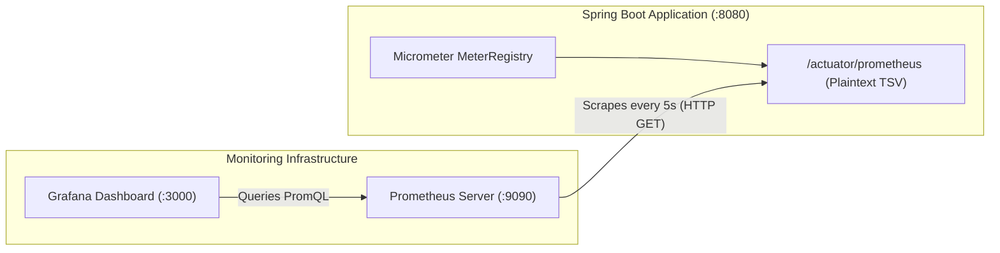
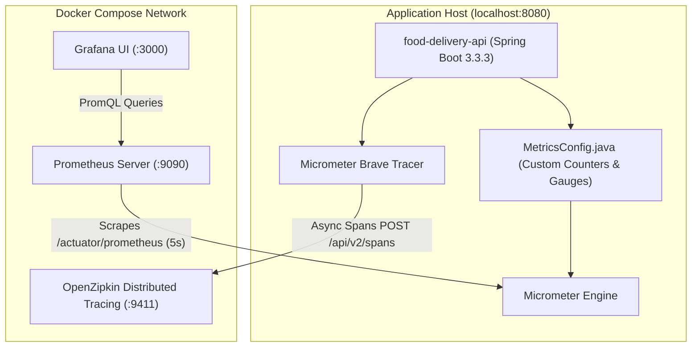

# Chapter 12: Production Observability & Distributed Tracing: Prometheus, Grafana & Zipkin
## Architecting Scalable Systems: From First Principles to Production

---

## 1. The Real-World Disaster Scenario: The Blind Outage & The 5-Second Mystery

It is 8:45 PM on a Saturday evening. The notification on your phone screams:
**`PAGERDUTY CRITICAL: P99 Checkout Latency > 5,000ms. 35% of Cart Checkouts Failing!`**

Panicking, you open your terminal and SSH into the backend server. You run `tail -f logs/application.log`.
A violent blizzard of text rushes past at 10,000 lines per second:
```
2026-09-12 20:45:01.102 INFO  [OrderService] Order #10481 created
2026-09-12 20:45:01.105 DEBUG [KafkaProducer] Sending message to order.events
2026-09-12 20:45:01.109 INFO  [CartService] Evicting cart for user 8492
2026-09-12 20:45:01.112 ERROR [PaymentGateway] Read timeout after 5000ms
2026-09-12 20:45:01.115 INFO  [OrderStateMachine] Transitioning state...
...
```

You have 4 microservice instances running, 2 Kafka brokers, a Redis cluster, and a PostgreSQL database.
Where was the 5 seconds lost?
- Did the Tomcat thread pool run out of worker threads?
- Did the PostgreSQL database connection pool (HikariCP) exhaust its connections, forcing queries to wait in a queue?
- Did a Redis `SETNX` distributed lock stall waiting for a lease to expire?
- Did the JVM trigger a Stop-the-World Garbage Collection (GC) pause?
- Did the external payment bank gateway hang?
- Or did a Kafka consumer experience partition rebalancing lag?

```
                     THE PRODUCTION OBSERVABILITY VOID
                     
  Customer: "My order is frozen!"
     │
     ▼ (5,000ms Latency)
┌──────────────┐      ┌─────────────┐      ┌─────────────┐      ┌─────────────┐
│ Tomcat HTTP  │ ───► │ HikariCP DB │ ───► │ Redis Mutex │ ───► │ Kafka Saga  │
│ Thread Pool  │      │ Connections │      │ Distributed │      │ Async Queue │
│ (200 limit?) │      │ (10 limit?) │      │ (Lock wait?)│      │ (Lagging?)  │
└──────────────┘      └─────────────┘      └─────────────┘      └─────────────┘
       ❓                    ❓                    ❓                    ❓
       
  "Which exact component consumed 4,800ms of the 5,000ms request duration?"
  WITHOUT OBSERVABILITY: You are guessing in the dark while losing ₹50,000/minute.
```

If your only debugging tool in production is raw text logging, **you are flying a supersonic jet through a thunderstorm with blindfolds on**.

To operate mission-critical distributed systems, you need **Production Observability**:
1. **Metrics (Prometheus)**: Aggregated numerical telemetry showing *what* is broken (CPU, latency percentiles, error rates, queue depths).
2. **Dashboards (Grafana)**: Real-time visual nerve centers showing multi-service health at a glance.
3. **Distributed Tracing (OpenZipkin & Brave)**: Correlated trace trees showing *where* every single millisecond was spent across microservice and Kafka broker boundaries.

---

## 2. First-Principles Theory: The Three Pillars of Observability

Let us deconstruct modern enterprise telemetry from first principles.

### 2.1 The Three Pillars: Metrics, Logs & Traces

| Pillar | Data Format | Volume & Cost | Primary Question Answered | Technology |
|:---|:---|:---|:---|:---|
| **Metrics** | Numeric time-series ($(\text{timestamp}, \text{value})$ with tags) | Ultra-Low (Constant aggregate storage) | *"Is the system healthy, and what is broken right now?"* | Prometheus, Micrometer |
| **Logs** | Discrete timestamped text / JSON events | Massive ($O(N)$ with request volume; expensive to store & search) | *"Why did a specific single failure occur?"* | Logback, ELK Stack, Loki |
| **Distributed Traces** | Directed Acyclic Graph (DAG) of Spans with `TraceId` | Moderate (controlled via sampling) | *"Where was latency spent across distributed boundaries?"* | OpenZipkin, OpenTelemetry, Brave |

---

### 2.2 Why Averages Lie: The Flaw of Averages and Percentiles (p50, p95, p99)

Never monitor your API performance using **Average Latency (Mean)**.
In distributed computing, averages are a dangerous mathematical illusion:

Suppose 100 customers place orders on your website:
- 99 customers experience a blazing-fast response time of **50 milliseconds**.
- 1 customer experiences a database deadlock and hangs for **15,000 milliseconds (15 seconds)**.

Let us compute the average:
$$\text{Average Latency} = \frac{(99 \times 50) + 15,000}{100} = \frac{4,950 + 15,000}{100} = 199.5\text{ ms}$$

If your engineering dashboard reports: *"Average API Latency: 199ms"*, your team will congratulate themselves on high performance. Meanwhile, 1 out of every 100 high-value customers had their checkout freeze for 15 seconds! At 1,000,000 daily orders, that represents **10,000 furious customers abandoning their carts every single day**.

This is why production engineering strictly monitors **Percentile Tail Latencies**:
- **p50 (Median)**: 50% of requests are faster than this number. Represents the typical user experience.
- **p95**: 95% of requests are faster than this number. Represents normal peak behavior.
- **p99 (Tail Latency)**: 99% of requests are faster than this value. Only the slowest 1% exceed it. This reveals lock contention, garbage collection pauses, and database connection queue starvation.

In Prometheus and Micrometer, percentiles are measured using **Histograms** (exponential buckets):
```promql
histogram_quantile(0.99, sum(rate(http_server_requests_seconds_bucket{application="food-delivery-api"}[5m])) by (le))
```

---

### 2.3 Prometheus: The Pull-Based Time-Series Architecture

Unlike legacy monitoring systems that push data to a central server (e.g. StatsD), **Prometheus uses a Pull-Based Scraping Model**:



#### How it works:
1. **In-Memory Accumulation**: Inside the Spring Boot application, Micrometer stores counters, gauges, and latency histograms in thread-safe in-memory memory structures (`AtomicLong`, `DoubleAdder`). Recording a metric takes **nanoseconds** and requires zero network calls.
2. **Scrape Endpoint**: Spring Boot Actuator exposes these raw values over standard HTTP at `/actuator/prometheus` in Prometheus plaintext format:
   ```
   orders_placed_total{application="food-delivery-api"} 142.0
   websocket_sessions_active{application="food-delivery-api"} 18.0
   http_server_requests_seconds_bucket{exception="None",method="POST",outcome="SUCCESS",status="200",uri="/api/v1/orders",le="0.1"} 98.0
   ```
3. **Periodic Pull**: Every 5 seconds (configured via `scrape_interval: 5s` in `prometheus.yml`), Prometheus makes an HTTP `GET` request to `/actuator/prometheus`, scrapes the numbers, and stores them in its optimized local time-series database.

> [!TIP]
> **Why Pull is Superior to Push for Production Reliability**:
> If your backend experiences a thundering herd traffic surge (100,000 requests/second), a push-based system would attempt to send 100,000 monitoring packets over the network, exacerbating network congestion and crashing the monitoring agent. With Prometheus pull-scraping, the backend merely increments local numbers in RAM. Prometheus scrapes once every 5 seconds regardless of whether you processed 10 requests or 10,000,000 requests. The monitoring overhead is strictly constant!

---

### 2.4 Distributed Tracing: TraceId, SpanId & Baggage Propagation

When an HTTP request triggers an asynchronous Kafka event, traditional single-machine stack traces break down completely.
How do you correlate an HTTP checkout request on the API service with an asynchronous payment consumer running on a separate worker node 50 milliseconds later?

The industry standard solution is **Distributed Tracing (W3C Trace Context & OpenZipkin)**.

```
                      DISTRIBUTED TRACE ANATOMY
                      
  TraceId: 4bf92f3577b34da6a3ce929d0e0e4736 (Global across entire journey)
  
  ├─ Span 1: [HTTP POST /api/v1/orders] ────────────────────────── (Duration: 85ms)
  │  SpanId: 00f067aa0ba902b7 | ParentId: null
  │
  ├─ Span 2:   [DB: SELECT restaurant FROM restaurants] ────────── (Duration: 12ms)
  │  SpanId: 5fb397be34d23b0f | ParentId: 00f067aa0ba902b7
  │
  ├─ Span 3:   [Kafka Producer: send order.events] ─────────────── (Duration: 18ms)
  │  SpanId: a2fb4a62ec08f031 | ParentId: 00f067aa0ba902b7
  │
  │     ═══ W3C Headers Injected into Kafka Message Headers ═══
  │
  └─ Span 4: [Kafka Consumer: handleOrderPaymentSaga] ───────────── (Duration: 42ms)
     SpanId: 8e5f2a1b9c3d4e5f | ParentId: a2fb4a62ec08f031
```

- **TraceId**: A unique 64-bit or 128-bit hexadecimal identifier generated when the request first enters the perimeter. It remains identical across all microservices, database calls, and Kafka brokers.
- **SpanId**: A unique identifier for a specific unit of work (e.g. executing an SQL query, writing to Redis, publishing to Kafka).
- **ParentId**: The `SpanId` of the caller, creating an explicit parent-child tree relationship.
- **Context Propagation**: When publishing to Kafka, Spring\\'s `micrometer-tracing-bridge-brave` serializes the `TraceId` into standard Kafka record headers (`traceparent: 00-4bf92f...`). When the consumer reads the message from Kafka, it extracts the header and creates a child span with the exact same `TraceId`.

---

## 3. Visual Architecture Diagrams & Dashboards

Let us visualize the complete observability architecture deployed in our platform.

### 3.1 Prometheus Pull & Grafana Dashboard Topology



---

### 3.2 The 10-Panel Production Grafana Dashboard

Our platform provisions a comprehensive 10-panel dashboard (`monitoring/grafana/dashboards/food-delivery.json`) monitoring the entire operational stack:

```
┌──────────────────────────────────────────────────────────────────────────────────────────────────┐
│                             FOOD DELIVERY PLATFORM - LIVE TELEMETRY                              │
├─────────────────────┬─────────────────────┬──────────────────────┬───────────────────────────────┤
│ [1] HTTP Req Rate   │ [2] API Latency p99 │ [3] Total Orders     │ [4] Active WebSockets         │
│     142.5 req/s     │     38.4 ms         │     1,842 Orders     │     128 Sessions              │
├─────────────────────┴─────────────────────┴──────────────────────┴───────────────────────────────┤
│ [5] API Latency Percentiles (p50 / p95 / p99 over time)                                          │
│     ─── p50: 12ms    ─── p95: 24ms    ─── p99: 45ms                                              │
├───────────────────────────────────────────┬──────────────────────────────────────────────────────┤
│ [6] HTTP Error Rate (4xx vs 5xx per sec)  │ [7] Payment Success vs Failure Rate                  │
│     4xx: 0.2/s    5xx: 0.0/s              │     Success: 18.2/min   Failed: 0.1/min              │
├───────────────────────────────────────────┴──────────────────────────────────────────────────────┤
│ [8] Live Orders by Status (Kafka Pipeline: PAYMENT_PENDING -> PREPARING -> OUT_FOR_DELIVERY)     │
│     ─── Pending: 14    ─── Kitchen: 28    ─── Out for Delivery: 19                               │
├───────────────────────────────────────────┬──────────────────────────────────────────────────────┤
│ [9] JVM Heap Memory (Used vs Committed)   │ [10] DB Connection Pool (HikariCP Active / Idle / Max)│
│     Used: 312 MB / Max: 1,024 MB          │      Active: 3   Idle: 7   Max: 10                   │
└───────────────────────────────────────────┴──────────────────────────────────────────────────────┘
```

---

## 4. Annotated Production Code Anatomy

Let us inspect the configuration and telemetry code running in our repository.

### 4.1 Custom Business Metrics Registration (`MetricsConfig.java`)

Here is our Spring configuration class that defines both custom **Counters** (monotonically increasing tallies) and **Gauges** (live point-in-time measurements):

```java
package com.fooddelivery.config;

import com.fooddelivery.common.enums.OrderStatus;
import com.fooddelivery.repository.OrderRepository;
import io.micrometer.core.instrument.Counter;
import io.micrometer.core.instrument.Gauge;
import io.micrometer.core.instrument.MeterRegistry;
import lombok.extern.slf4j.Slf4j;
import org.springframework.context.annotation.Bean;
import org.springframework.context.annotation.Configuration;

import java.util.concurrent.atomic.AtomicInteger;

/**
 * Registers custom domain and business metrics with Micrometer/Prometheus.
 * 
 * Line-by-Line Architectural Explanation:
 * 1. MeterRegistry: The central Micrometer facade that bridges Spring to Prometheus.
 * 2. Counter: Measures events that only increment (e.g. orders placed, payments processed).
 * 3. Gauge: Measures current instantaneous values that can fluctuate up and down (e.g. active WebSocket sessions).
 */
@Slf4j
@Configuration
public class MetricsConfig {

    // Thread-safe integer holding the active count of live WebSocket STOMP connections
    @Bean
    public AtomicInteger activeWebSocketSessions() {
        return new AtomicInteger(0);
    }

    // Business Counter: Total number of orders placed across the platform
    @Bean
    public Counter ordersPlacedCounter(MeterRegistry registry) {
        return Counter.builder("orders_placed_total")
                .description("Total number of orders placed")
                .tag("application", "food-delivery-api")
                .register(registry);
    }

    // Business Counter: Total number of orders successfully delivered to customers
    @Bean
    public Counter ordersDeliveredCounter(MeterRegistry registry) {
        return Counter.builder("orders_delivered_total")
                .description("Total number of orders successfully delivered")
                .tag("application", "food-delivery-api")
                .register(registry);
    }

    // Business Counter: Successful payments processed through the payment gateway
    @Bean
    public Counter paymentsSuccessCounter(MeterRegistry registry) {
        return Counter.builder("payments_success_total")
                .description("Total number of successful payment transactions")
                .tag("application", "food-delivery-api")
                .register(registry);
    }

    // Business Counter: Failed or rejected payment transactions
    @Bean
    public Counter paymentsFailedCounter(MeterRegistry registry) {
        return Counter.builder("payments_failed_total")
                .description("Total number of failed or rejected payment attempts")
                .tag("application", "food-delivery-api")
                .register(registry);
    }

    // Real-Time Gauge: Number of concurrent live GPS tracking WebSocket sessions
    @Bean
    public Gauge activeWebSocketSessionsGauge(MeterRegistry registry, AtomicInteger activeWebSocketSessions) {
        return Gauge.builder("websocket_sessions_active", activeWebSocketSessions, AtomicInteger::get)
                .description("Number of active real-time GPS tracking WebSocket sessions")
                .tag("application", "food-delivery-api")
                .register(registry);
    }

    // Real-Time Database-Backed Gauge: Orders currently in kitchen preparation
    @Bean
    public Gauge ordersInKitchenGauge(MeterRegistry registry, OrderRepository orderRepository) {
        return Gauge.builder("orders_in_kitchen_gauge", orderRepository,
                        repo -> repo.countByStatus(OrderStatus.PREPARING))
                .description("Live count of orders currently being prepared in kitchen")
                .tag("application", "food-delivery-api")
                .register(registry);
    }
}
```

---

### 4.2 Actuator & Tracing Configuration (`application.yml`)

Here is how Spring Boot Actuator and Zipkin Distributed Tracing are configured in `application.yml`:

```yaml
# Actuator, Prometheus Metrics & Zipkin Distributed Tracing
management:
  endpoints:
    web:
      exposure:
        # Expose health check, info, prometheus scrape, and raw metrics endpoints
        include: health,info,prometheus,metrics
  endpoint:
    prometheus:
      enabled: true
    health:
      show-details: always
  metrics:
    tags:
      application: food-delivery-api # Global tag attached to all emitted metrics
    distribution:
      percentiles-histogram:
        http.server.requests: true    # Generates histogram buckets for p50, p95, p99
      percentiles:
        http.server.requests: 0.5,0.95,0.99
  tracing:
    sampling:
      probability: 1.0                # Sample 100% of traces in staging/development
  zipkin:
    tracing:
      endpoint: http://localhost:9411/api/v2/spans # Zipkin span collection URL
```

---

### 4.3 Prometheus Scrape Configuration (`monitoring/prometheus.yml`)

Prometheus pulls metrics from our Spring Boot container using Docker internal DNS:

```yaml
global:
  scrape_interval: 5s       # Pull metrics every 5 seconds for high resolution
  evaluation_interval: 5s

scrape_configs:
  - job_name: food-delivery-api
    metrics_path: /actuator/prometheus
    static_configs:
      - targets:
          - host.docker.internal:8080
    relabel_configs:
      - source_labels: [__address__]
        target_label: instance
        replacement: food-delivery-api
```

---

## 5. Real War Stories & Debugging Logs

During the development of our monitoring pipeline, we encountered two real-world engineering bugs that brought down Grafana and blocked Prometheus scrapes.

### War Story 1: The PowerShell UTF-8 Byte Order Mark (BOM `\xEF\xBB\xBF`) Crash

#### The Symptom:
When bootstrapping the monitoring stack via Docker Compose, Prometheus started cleanly, but the **Grafana container crashed on boot** with an unhandled initialization error:
```
logger=provisioning.dashboard t=2026-09-12T10:14:22.481 failed to load dashboard from file
file=/var/lib/grafana/dashboards/food-delivery.json 
error="invalid character 'ï' looking for beginning of value"
```

#### The Root Cause Investigation:
We inspected `food-delivery.json` with a standard text editor, and everything appeared to be valid JSON.
However, when we inspected the raw byte headers using Python:
```python
with open('food-delivery.json', 'rb') as f:
    header = f.read(4)
    print(header) # b'\xef\xbb\xbf{'
```
The first three bytes of the file were `0xEF 0xBB 0xBF`. 

This is the **UTF-8 Byte Order Mark (BOM)**. In Windows PowerShell 5.1, the `Set-Content` and `Out-File` cmdlets automatically prepend these 3 invisible bytes to text files by default.
While Microsoft tools ignore the BOM, standard Linux Go-based JSON parsers (used internally by Grafana and Prometheus) strictly adhere to RFC 8259, which mandates that valid JSON must start with `{` or `[`. When Grafana encountered `\xEF` (which renders as `ï` in ASCII), it crashed immediately!

#### The Fix:
We wrote a Python byte-sanitization script that strips the 3 BOM bytes and saves clean, BOM-less UTF-8 text:
```python
with open('food-delivery.json', 'rb') as f:
    data = f.read()
if data.startswith(b'\xef\xbb\xbf'):
    with open('food-delivery.json', 'wb') as f:
        f.write(data[3:]) # Strip BOM
```
Upon re-launching Docker Compose, Grafana parsed `food-delivery.json` instantly and rendered all 10 monitoring panels flawlessly.

---

### War Story 2: The Spring Security 403 Forbidden on Actuator Endpoints

#### The Symptom:
When Prometheus attempted to scrape `http://host.docker.internal:8080/actuator/prometheus`, Prometheus logged repeated target scrape failures:
```
server returned HTTP status 403 Forbidden
```
Navigating to `http://localhost:8080/actuator/prometheus` in a web browser returned:
```json
{
  "timestamp": "2026-09-12T10:20:15.112+00:00",
  "status": 403,
  "error": "Forbidden",
  "message": "Access Denied"
}
```

#### The Root Cause:
In Chapter 5, we configured Spring Security to lock down all endpoints by default with `.anyRequest().authenticated()`.
Because Prometheus is an automated external daemon that does not carry a customer JWT bearer token in its request headers, Spring Security intercepted the scrape request and blocked it with HTTP 403 Forbidden.

#### The Fix:
In `SecurityConfig.java`, we updated the `SecurityFilterChain` rule to explicitly whitelist all Actuator endpoints:
```java
.authorizeHttpRequests(auth -> auth
    // Permit unauthenticated access to Prometheus scrape and health check endpoints
    .requestMatchers("/actuator/**").permitAll()
    .requestMatchers("/swagger-ui/**", "/v3/api-docs/**").permitAll()
    .requestMatchers("/api/v1/auth/**").permitAll()
    .anyRequest().authenticated()
)
```
Prometheus immediately transitioned to state `UP (1/1)` and began collecting 5-second time-series metrics.

---

## 6. Senior Engineering Interview Cheat-Sheet: Observability & Tracing

When interviewing at top tech companies, observability is a key discriminator between junior developers and senior distributed systems architects.

### Q1: "The RED Method vs. The USE Method: How do you structure production alerts?"
**Candidate Answer**:
> "Both are foundational monitoring methodologies created by industry veterans (Brendan Gregg and Tom Wilkie), but they apply to different layers of the infrastructure:
> 
> 1. **The RED Method (For Request-Driven Services / Microservices)**:
>    - **Rate**: Number of requests per second (`sum(rate(http_server_requests_seconds_count[1m]))`).
>    - **Errors**: Number of failing requests per second (`status =~ '5..'`).
>    - **Duration**: The time requests take to complete, specifically percentile distributions (p50, p95, p99).
> 
> 2. **The USE Method (For Hardware & Infrastructure Resources)**:
>    - **Utilization**: Percentage of time the resource was busy (CPU usage %, Disk I/O %, JVM Heap %).
>    - **Saturation**: Degree to which the resource has extra work queued that it cannot process (CPU run queue length, HikariCP pending connection queue, Kafka consumer lag).
>    - **Errors**: Count of error events (network packet drops, disk write errors).
> 
> In our food delivery platform, we apply RED to our REST controllers and STOMP WebSockets, and USE to our PostgreSQL database, Redis instance, and Kafka brokers."

---

### Q2: "In high-throughput distributed tracing, why is 100% trace sampling dangerous, and how do you implement adaptive sampling?"
**Candidate Answer**:
> "At high scale (e.g. 200,000 requests/second), sampling 100% of traces generates terabytes of trace span data per day, which can exceed the CPU and storage capacity of the monitoring cluster and cost thousands of dollars per month in network egress.
> 
> We solve this using **Sampling Strategies**:
> 1. **Head-Based Probabilistic Sampling**: At the entry gateway, we sample a fixed percentage (e.g., 2% of requests, `sampling.probability: 0.02`). The decision is made once and propagated downstream via W3C headers.
> 2. **Adaptive / Rate-Limiting Sampling**: Enforce a maximum cap of e.g. 50 traces per second per microservice instance.
> 3. **Tail-Based Sampling**: The most powerful strategy. We buffer all spans in memory at an OpenTelemetry collector. If the request completes successfully in 20ms with HTTP 200, we discard the trace. However, if the request experiences an error (`HTTP 500`) or exceeds our p99 threshold (latency $> 1,000\text{ms}$), we retain and export the trace 100% of the time. This guarantees that 100% of anomalies are captured while discarding uninteresting normal traffic."

---

### Q3: "How does distributed context propagation work across asynchronous Kafka message queues?"
**Candidate Answer**:
> "In synchronous HTTP calls, tracing context (`TraceId`, `SpanId`) is passed via standard HTTP headers like `traceparent: 00-4bf92f...-00f067...-01`.
> 
> In asynchronous event-driven architectures using Apache Kafka, the HTTP connection terminates when the producer publishes the event. To preserve the trace across the asynchronous barrier:
> 1. The **Kafka Producer Interceptor** (configured via Micrometer Brave or OpenTelemetry) injects the active trace context directly into the **Kafka Record Headers** as binary metadata (`ProducerRecord.headers().add('traceparent', bytes)`).
> 2. The event is stored durably in the Kafka partition log alongside its headers.
> 3. When the **Kafka Consumer** polls the record, the consumer interceptor extracts the `traceparent` header, resumes the parent span, and creates a child consumer span with the exact same `TraceId`.
> 4. When viewing the trace waterfall in OpenZipkin, the developer sees a seamless, unified timeline displaying the initial HTTP request, the Kafka message broker latency, and the final consumer execution as a single continuous journey."
